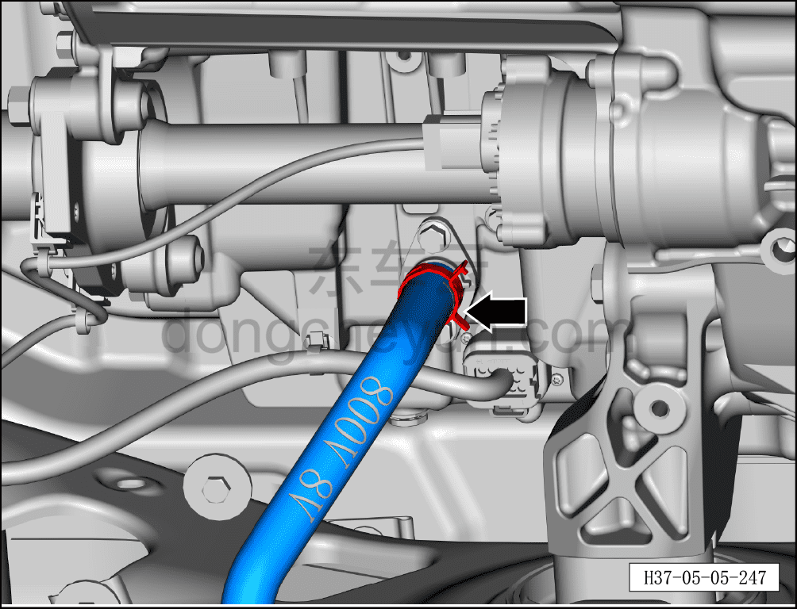
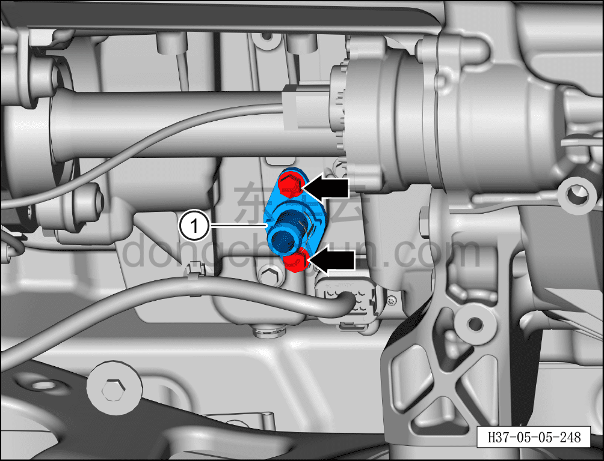

# Снятие и установка впускного водяного патрубка (800 В)

> Силовая система на новых источниках энергии › Система электропривода › Задняя система электропривода  
> Оригинал: `拆卸与安装入水接口（800V）` · [dongcheyun 56746](https://dongcheyun.com/p/56746), страница `c28a3987f9da4568ab1b84d190568107` · [оглавление](../README.md)

**Порядок снятия**

**Примечание:**

**- Обратите внимание на предупреждения и указания по ремонту высоковольтной системы, подробнее см. [5.1.1 Меры предосторожности](001-указания.md)**

**- Перед ремонтом убедитесь, что температура охлаждающей жидкости снизилась.**

1. Выключить все электроприборы, обесточить автомобиль.

2. Выполните обесточивание автомобиля для ремонта. См. [3.1.4.1 Обесточивание автомобиля](../03-техническое-обслуживание/005-обесточивание-автомобиля.md)

3. Снимите заднюю нижнюю защитную панель, см. [8.6.4.4 Снятие и установка задней нижней защитной панели](../08-внутренняя-и-внешняя-отделка/194-снятие-и-установка-заднего-нижнего-защитного-щитка.md)

4. Снимите дополнительный кронштейн задней нижней защитной панели, см. [8.6.4.5 Снятие и установка кронштейна передней нижней защитной панели](../08-внутренняя-и-внешняя-отделка/195-снятие-и-установка-кронштейна-переднего-нижнего.md)

5. Слейте охлаждающую жидкость тягового электродвигателя. См. [3.1.5.1 Замена охлаждающей жидкости тягового электродвигателя и тяговой батареи](../03-техническое-обслуживание/006-замена-охлаждающей-жидкости-тягового-электродвигателя.md)

6. Снятие впускного водяного патрубка.

a. Используя клещи для хомутов, сместите хомут патрубка с монтажного положения, отсоедините патрубок от впускного водяного патрубка.

**Внимание:**

**- Перед отсоединением патрубка подставьте под него ёмкость для сбора жидкости, чтобы собрать остатки охлаждающей жидкости в трубопроводе.**

**- После отсоединения трубопровода вытрите вытекшую вокруг трубопровода охлаждающую жидкость чистой ветошью, чтобы после завершения установки было удобно проверить трубопровод на утечки.**

b. Используя торцевую головку на 10 мм, выверните крепёжный болт впускного водяного патрубка, поворачивая влево-вправо и покачивая, снимите впускной водяной патрубок① и уплотнительное кольцо.

Момент затяжки составляет: 10±1 Н·м

**Внимание:**

**- Снятое уплотнительное кольцо необходимо утилизировать, повторное использование не допускается.**

Порядок установки

Установка выполняется в обратном порядке.

**Внимание:**

**- При установке впускного водяного патрубка проверьте, не отсутствует ли уплотнительное кольцо; при необходимости замените на новое.**

**- После завершения установки подключите минусовой провод аккумуляторной батареи, залейте охлаждающую жидкость указанной производителем марки и выполните удаление воздуха из системы охлаждения.**

**- После завершения установки проверьте надёжность установки водяного патрубка и штуцера охлаждающей жидкости, отсутствие утечек.**
