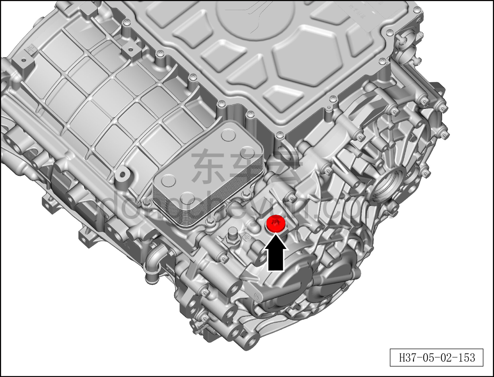

# Снятие и установка маслозаливного винта заднего тягового электродвигателя (800 В)

> Силовая система на новых источниках энергии › Система электропривода › Задняя система электропривода  
> Оригинал: `拆卸与安装后驱动电机加油螺（800V）` · [dongcheyun 56746](https://dongcheyun.com/p/56746), страница `cddc349fe206442e857c2ea94a546a3b` · [оглавление](../README.md)

**Порядок снятия**

**Примечание:**

**- Обратите внимание на предупреждения и указания по ремонту высоковольтной системы, подробности см. [5.1.1 Указания](001-указания.md)**

1. Выключите все электроприборы, отключите питание.

2. Выполните обесточивание автомобиля для ремонта. См. [3.1.4.1 Обесточивание автомобиля](../03-техническое-обслуживание/005-обесточивание-автомобиля.md)

3. Слейте охлаждающую жидкость. См. [3.1.5.1 Замена охлаждающей жидкости тягового электродвигателя и тяговой батареи](../03-техническое-обслуживание/006-замена-охлаждающей-жидкости-тягового-электродвигателя.md)

4. Снимите левый задний приводной вал. См. [6.7.12.1 Снятие и установка левого заднего приводного вала в сборе](../06-система-шасси/124-снятие-и-установка-левого-заднего-приводного-вала.md)

5. Снимите правый задний приводной вал. См. [6.7.12.2 Снятие и установка правого заднего приводного вала в сборе](../06-система-шасси/125-снятие-и-установка-правого-заднего-приводного-вала.md)

6. Снимите задний стабилизатор поперечной устойчивости. См. [6.3.8.1 Снятие и установка заднего стабилизатора поперечной устойчивости в сборе](../06-система-шасси/037-снятие-и-установка-заднего-стабилизатора-поперечной.md)

7. Отсоедините разъём высоковольтного жгута заднего электродвигателя. См. [5.1.6.3 Снятие и установка тяговой батареи (800 В)](012-снятие-и-установка-тяговой-батареи-800-в.md)

8. Снимите задний тяговый электродвигатель (800 В). См. [5.2.7.2 Снятие и установка заднего тягового электродвигателя (800 В)](024-снятие-и-установка-заднего-тягового-электродвигателя.md)

9. Снятие маслозаливной пробки заднего тягового электродвигателя (800 В).

a. Выверните маслозаливную пробку узла заднего тягового электродвигателя, закройте отверстие пробки чистой ветошью, чтобы предотвратить попадание посторонних предметов.

b. Установите новую маслозаливную пробку.

Момент затяжки маслозаливного болта: 7±1 Н·м

**Внимание**

**-Заливная пробка является одноразовой деталью, повторно не использовать.**

**-В процессе работы масло должно храниться надлежащим образом, не допускать проливания, разбрызгивания, что может привести к травмам.**

**Порядок установки**

Установка выполняется в обратном порядке.

**Внимание:**

**- При работе с высоковольтными компонентами обязательно используйте изолирующие перчатки и изолирующий инструмент.**

**- Согласно стандартным параметрам тягового электродвигателя, залейте новое смазочное масло редуктора тягового электродвигателя.**

**- Охлаждающую жидкость нельзя использовать повторно, смешивать, а также нельзя заменять охлаждающей жидкостью другого цвета.**

**- После завершения установки подключите диагностический сканер, проверьте наличие кодов неисправностей; при их наличии устраните причину и удалите коды неисправностей.**

**- Запустите автомобиль, убедитесь, что электродвигатель работает без отклонений.**

**- После завершения установки всех узлов необходимо выполнить регулировку развал-схождения и провести дорожное испытание автомобиля, убедиться в отсутствии увода и посторонних шумов.**

**- После завершения испытательной поездки поднимите автомобиль на подъёмнике и убедитесь в отсутствии утечек масла.**
