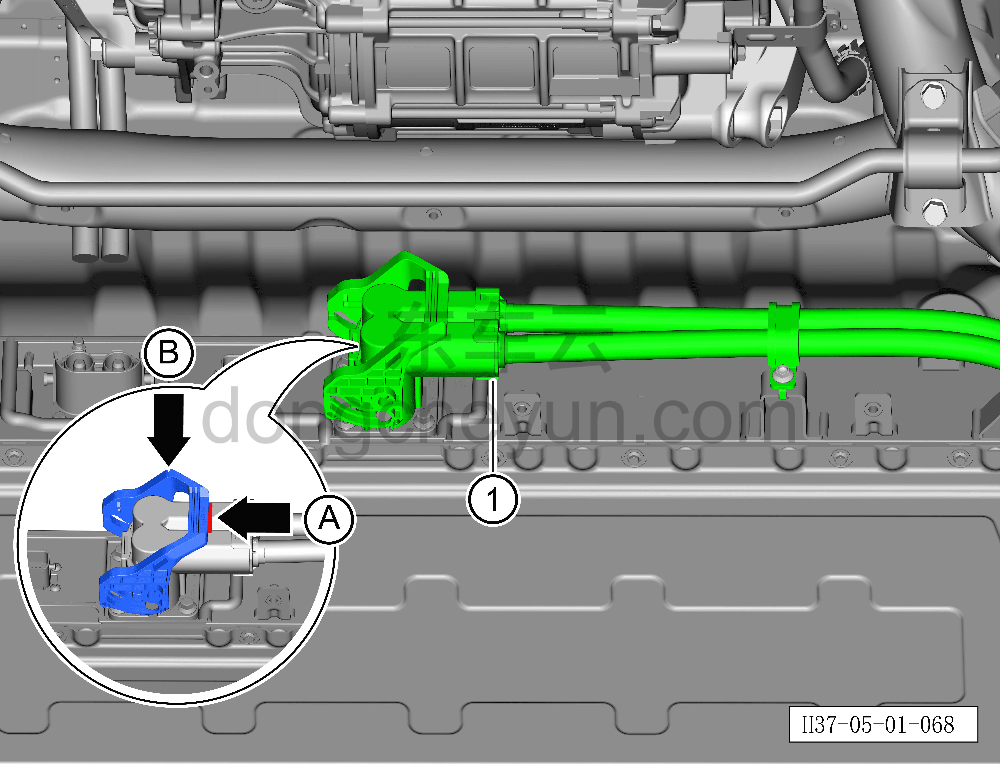
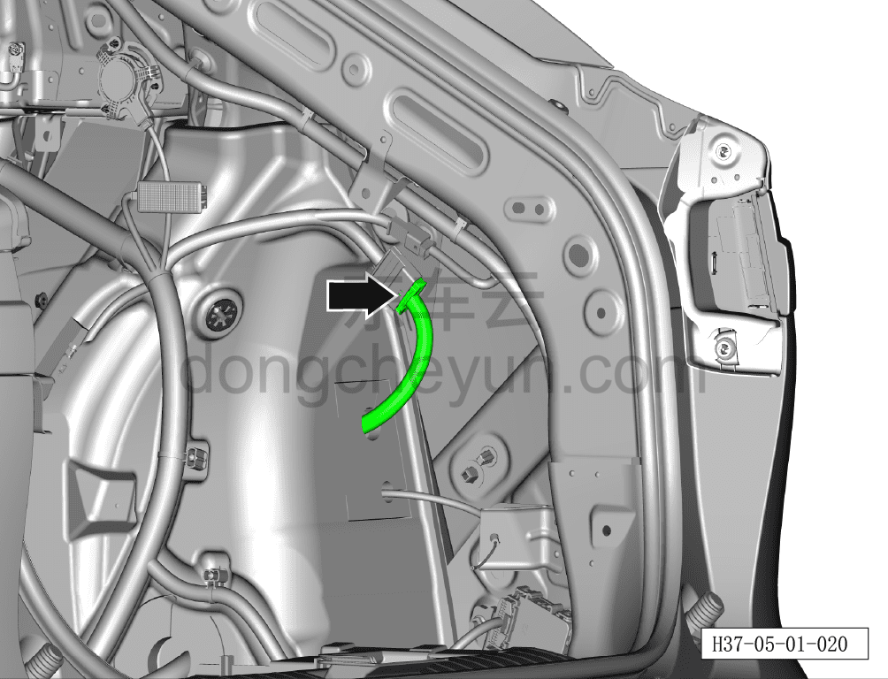
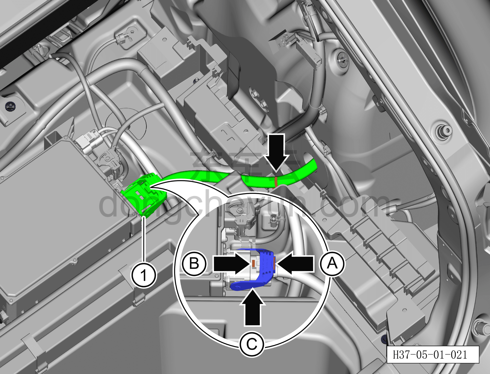
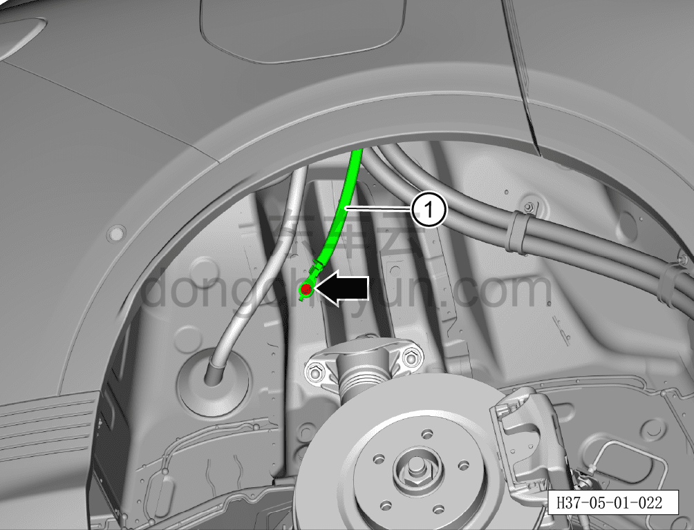
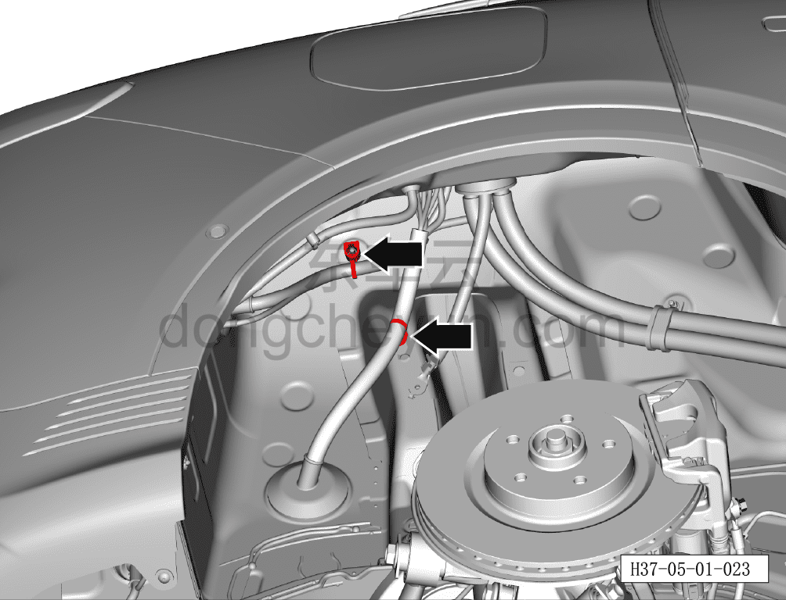
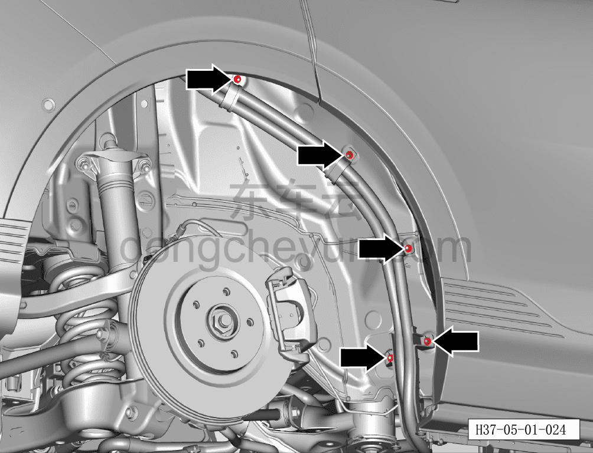
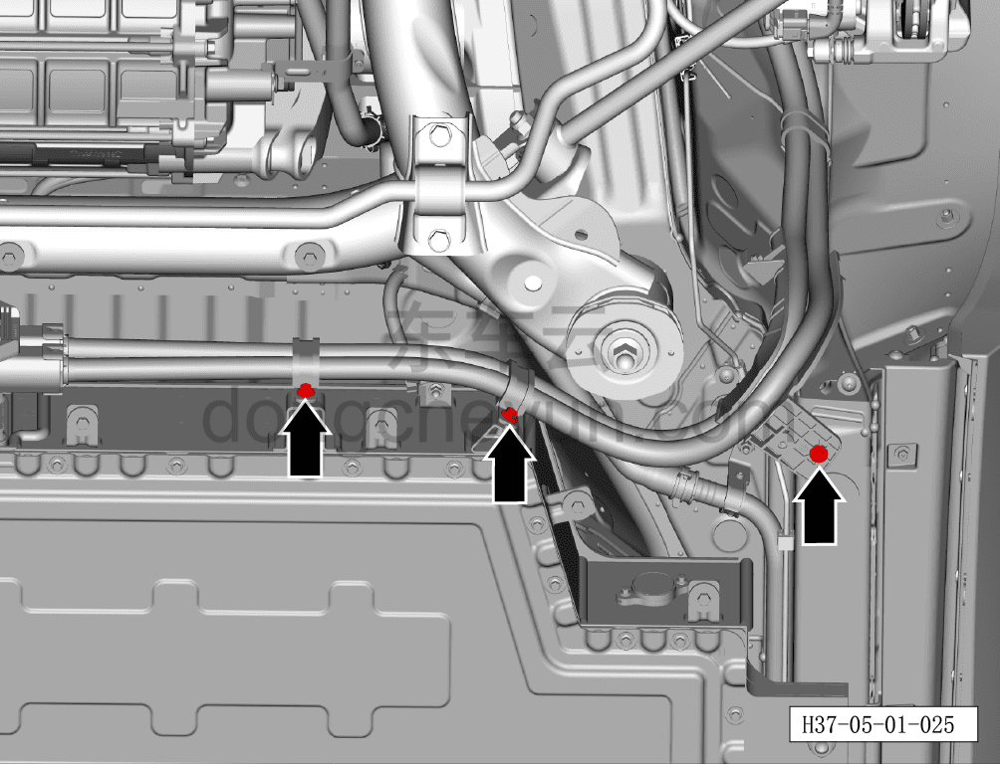
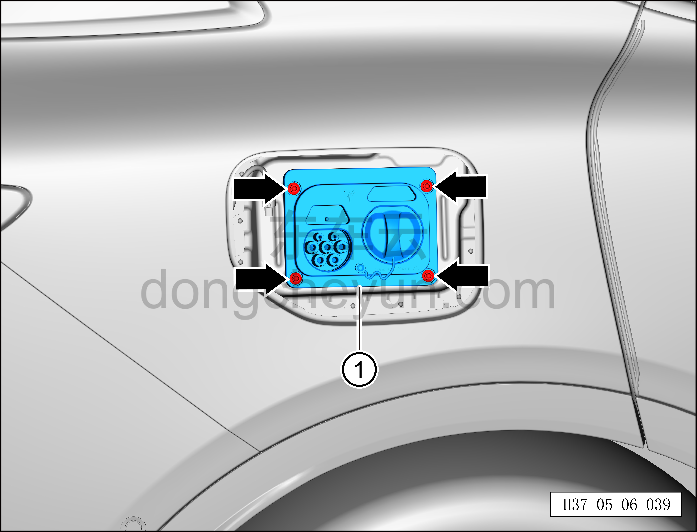

# Снятие и установка комбинированного разъёма быстрой/медленной зарядки

> Силовая система на новых источниках энергии › Система высоковольтных компонентов › Зарядный разъём  
> Оригинал: `拆卸与安装快慢充一体式充电插座` · [dongcheyun 56746](https://dongcheyun.com/p/56746), страница `aafaa8cdd14a4676b2569b3ce9f80019` · [оглавление](../README.md)

**Порядок снятия**

**Примечание:**

**- Обратите внимание на предупреждения и указания по ремонту высоковольтной системы, подробнее см. [5.1.1 Меры предосторожности](001-указания.md)**

1. Выключите все электроприборы, отключите питание.

2. Выполните обесточивание автомобиля для ремонта. См. [3.1.4.1 Обесточивание автомобиля](../03-техническое-обслуживание/005-обесточивание-автомобиля.md)

3. Снимите крышку багажника. См. [8.5.8.2 Снятие и установка крышки багажника](../08-внутренняя-и-внешняя-отделка/147-снятие-и-установка-крышки-пола-багажника.md)

4. Снимите подкрылок правого заднего колеса. См. [8.6.4.2 Снятие и установка подкрылка левого заднего колеса](../08-внутренняя-и-внешняя-отделка/192-снятие-и-установка-левого-подкрылка-задней-колёсной.md)

5. Снимите правую внутреннюю обивку боковины багажного отделения. См. [8.5.5.6 Снятие и установка левой внутренней обивки боковины багажного отделения](../08-внутренняя-и-внешняя-отделка/136-снятие-и-установка-левой-обивки-задней-боковины.md)

6. Снимите корпус лючка зарядного порта. См. [7.6.3.2 Снятие и установка корпуса лючка зарядного порта](../07-открывающиеся-элементы-кузова/071-снятие-и-установка-корпуса-лючка-зарядного-порта.md)

7. Снятие комбинированного разъёма быстрой/медленной зарядки.

a. Вытяните фиксатор разъёма A для разблокировки, поверните рукоятку разъёма B, отсоедините разъём① высоковольтного жгута комбинированного разъёма быстрой/медленной зарядки (со стороны тяговой батареи).

**Внимание:**

**- При работе с высоковольтными компонентами обязательно используйте изолирующие перчатки и изолирующий инструмент.**

**- После снятия закройте высоковольтный порт, к которому подключается высоковольтный жгут комбинированного разъёма быстрой/медленной зарядки (со стороны тяговой батареи), чистой изолирующей защитной крышкой, чтобы предотвратить попадание посторонних предметов или случайное касание.**

b. Используя инструмент для снятия элементов обивки, отсоедините разъём жгута на комбинированном разъёме быстрой/медленной зарядки.

c. Используя инструмент для снятия элементов обивки, отсоедините фиксирующую клипсу жгута, соединённого с бортовым зарядным устройством.

d. Вытяните фиксатор разъёма A для разблокировки, удерживая кнопку фиксации разъёма B, поверните рукоятку разъёма C, отсоедините разъём① высоковольтного жгута бортового зарядного устройства (со стороны бортового зарядного устройства).

**Внимание:**

**- После снятия закройте высоковольтный порт, к которому подключается высоковольтный жгут бортового зарядного устройства (со стороны бортового зарядного устройства), чистой изолирующей защитной крышкой, чтобы предотвратить попадание посторонних предметов или случайное касание.**

e. Используя торцевую головку на 10 мм, выверните крепёжный болт провода заземления, отсоедините жгут заземления①.

Момент затяжки болта: 8±1 Н·м

f. Используя инструмент для снятия элементов обивки, отсоедините 2 фиксирующие клипсы жгута.

g. Используя торцевую головку на 10 мм, выверните 5 крепёжных болтов высоковольтного жгута.

Момент затяжки болта: 8±1 Н·м

h. Используя торцевую головку на 10 мм, выверните 3 крепёжных болта высоковольтного жгута.

Момент затяжки болта: 8±1 Н·м

i. Используя торцевую головку на 8 мм, выверните 4 крепёжных болта комбинированного разъёма быстрой/медленной зарядки.

Момент затяжки болта: 8±1 Н·м

j. Извлеките комбинированный разъём быстрой/медленной зарядки①.

**Порядок установки**

Установка выполняется в обратном порядке.

**Внимание:**

**- При работе с высоковольтными компонентами необходимо использовать изолирующие перчатки и изолирующие инструменты.**

**- После завершения установки проверьте отсутствие помех и скручивания жгута; потяните штекер высоковольтного жгута наружу с усилием не более 20 Н (не тянуть за жгут); штекер высоковольтного жгута не должен выниматься — убедитесь, что соединение выполнено правильно, затем повторно довставьте штекер высоковольтного жгута строго перпендикулярно внутрь, чтобы предотвратить некачественное соединение из-за обратного вытягивания.**

**- После завершения установки подключите диагностический сканер, проверьте наличие кодов неисправностей; при их наличии устраните причину и удалите коды неисправностей.**

**- После завершения установки проведите испытание зарядки, убедитесь, что система зарядки функционирует нормально.**
