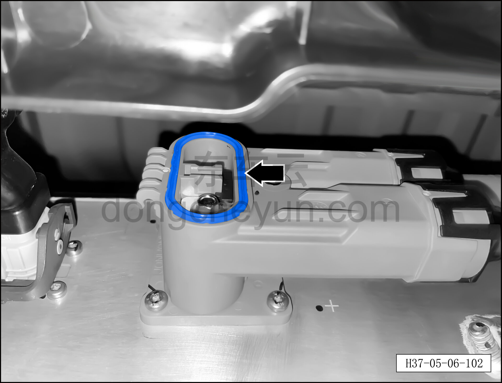
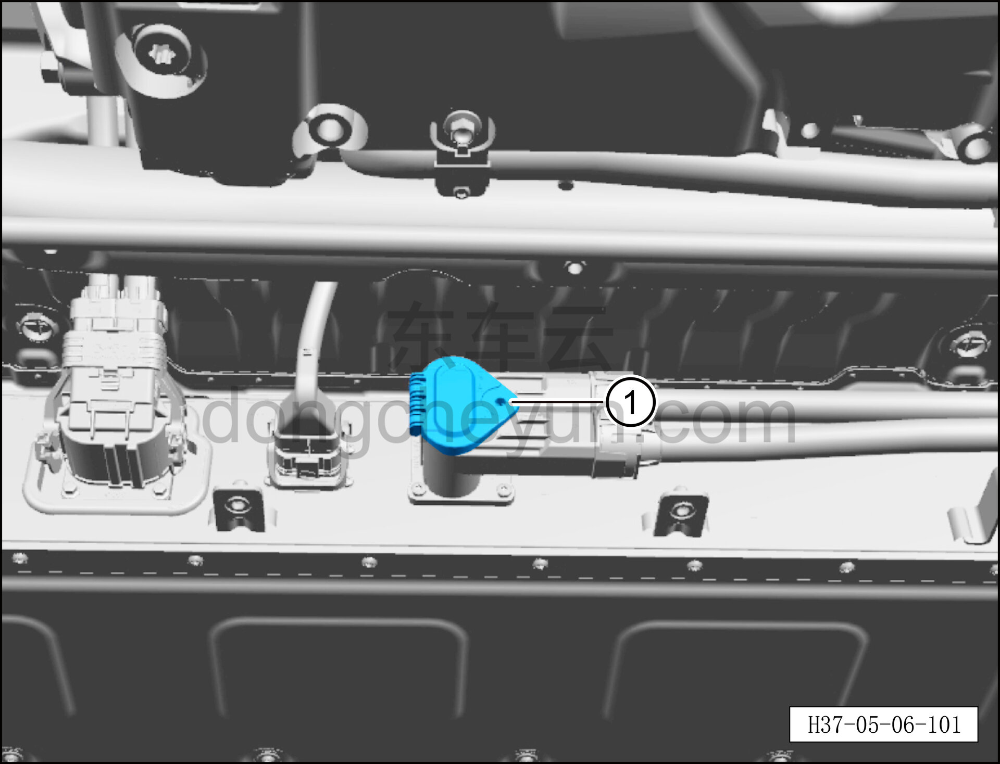
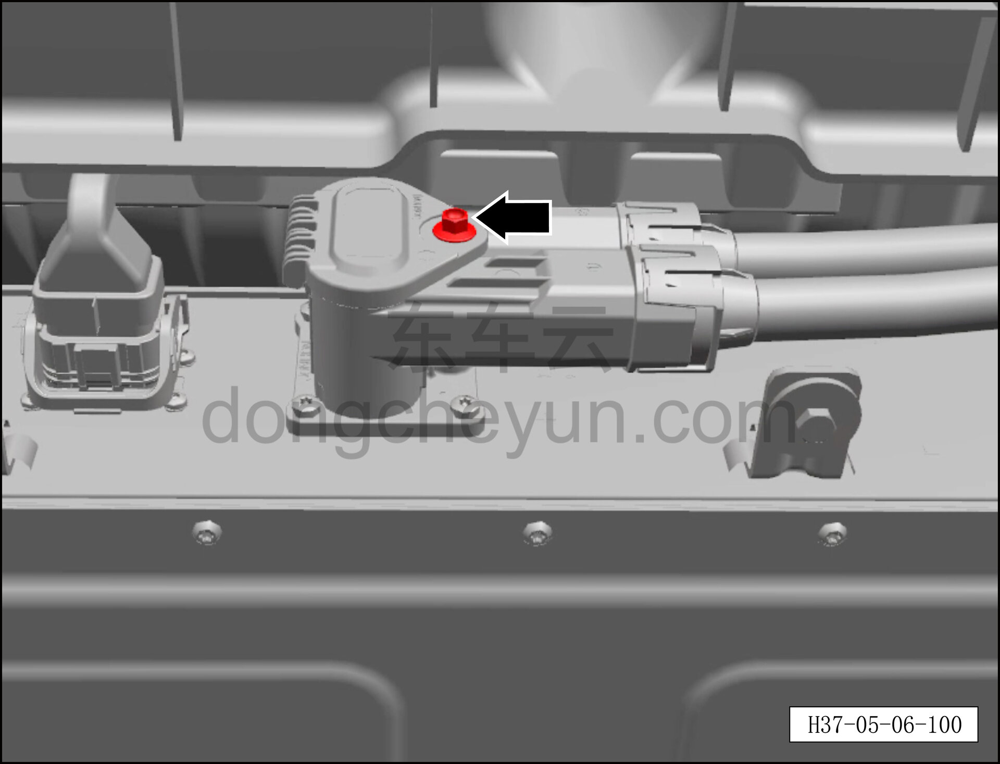

# Снятие и установка верхней крышки комбинированного разъёма быстрой/медленной зарядки (800 В)

> Силовая система на новых источниках энергии › Система высоковольтных компонентов › Зарядный разъём  
> Оригинал: `拆卸与安装快慢充一体式充电插座上盖（800V）` · [dongcheyun 56746](https://dongcheyun.com/p/56746), страница `724c9d6536ae48af8e697b094b3e2c02` · [оглавление](../README.md)

**Порядок снятия**

**Примечание:**

**- Обратите внимание на предупреждения и указания по ремонту высоковольтной системы, подробнее см. [5.1.1 Меры предосторожности](001-указания.md)**

1. Выключить все электроприборы, обесточить автомобиль.

2. Снятие высокого напряжения автомобиля. См. [3.1.4.1 Обесточивание автомобиля](../03-техническое-обслуживание/005-обесточивание-автомобиля.md)

3. Снимите заднюю нижнюю защитную панель. См. [8.6.4.4 Снятие и установка задней нижней защитной панели](../08-внутренняя-и-внешняя-отделка/194-снятие-и-установка-заднего-нижнего-защитного-щитка.md)

4. Снятие верхней крышки комбинированного разъёма быстрой/медленной зарядки.

a. Используя торцевую головку на 10 мм, снимите крепёжные болты верхней крышки.

**Внимание:**

**-При работе с высоковольтными компонентами обязательно используйте изолирующие перчатки и изолирующий инструмент.**

b. Отверните и снимите верхнюю крышку①.

**Внимание:**

**- Если верхняя крышка не будет установлена обратно немедленно, закройте разъём изолирующей защитной крышкой, чтобы предотвратить загрязнение разъёма и поражение электрическим током.**

**Порядок установки**

1. Установка верхней крышки комбинированного разъёма быстрой/медленной зарядки.

a. Проверьте уплотнительное кольцо разъёма на наличие повреждений, отсутствие или отслоение.

**Внимание:**

**- При отсутствии или повреждении уплотнительного кольца необходимо заменить весь узел комбинированного разъёма быстрой/медленной зарядки целиком.**

b. Установите верхнюю крышку① на разъём.

**Внимание:**

**- После завершения установки проверьте, что верхняя крышка отворачивается нормально, без люфта.**

c. Установите крепёжные болты верхней крышки и затяните торцевой головкой на 10 мм, момент затяжки составляет 9±1 Н·м.

2. Установите заднюю нижнюю защитную панель. См. [8.6.4.4 Снятие и установка задней нижней защитной панели](../08-внутренняя-и-внешняя-отделка/194-снятие-и-установка-заднего-нижнего-защитного-щитка.md)

3. Выполните операцию включения питания автомобиля, см. [3.1.4.1 Обесточивание автомобиля](../03-техническое-обслуживание/005-обесточивание-автомобиля.md)

**Внимание:**

**- После завершения установки подключите диагностический сканер, проверьте наличие кодов неисправностей; при их наличии устраните причину и удалите коды неисправностей.**

**- После завершения установки подключите зарядный кабель, убедитесь, что система зарядки автомобиля работает нормально и автомобиль функционирует исправно.**
