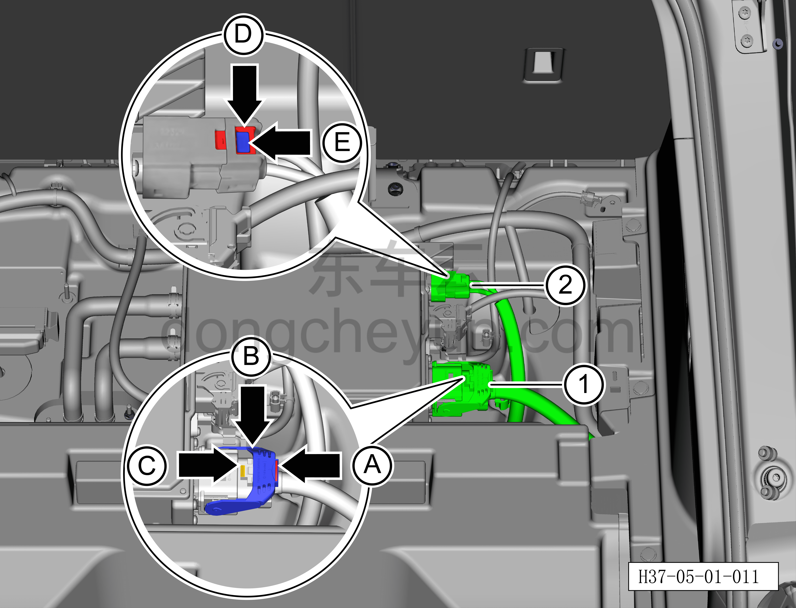
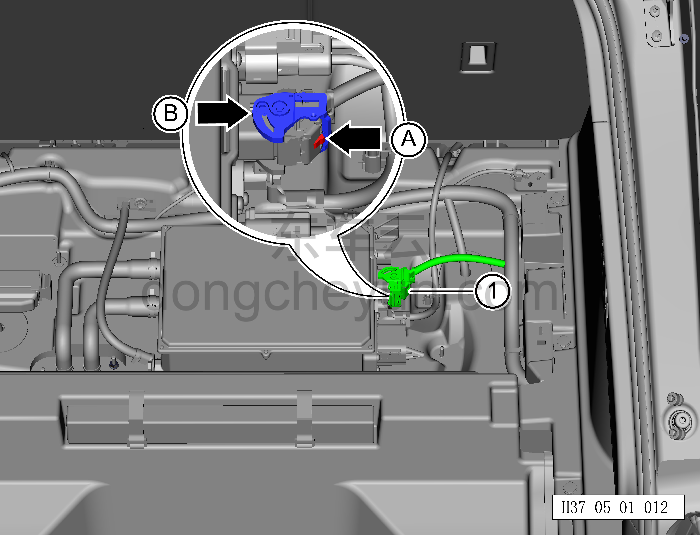
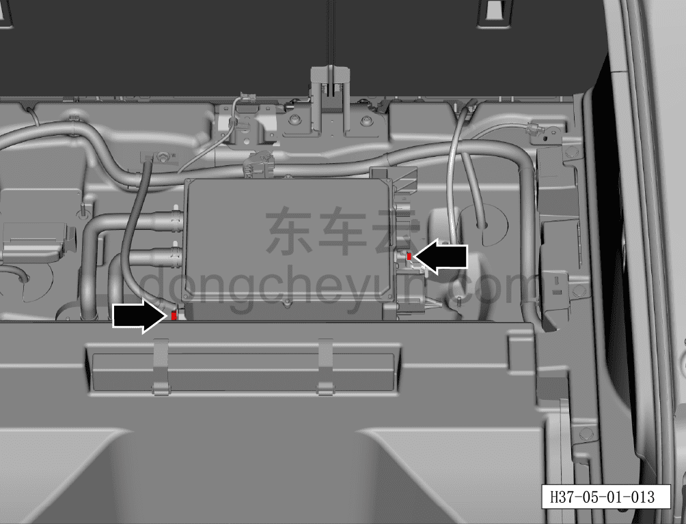
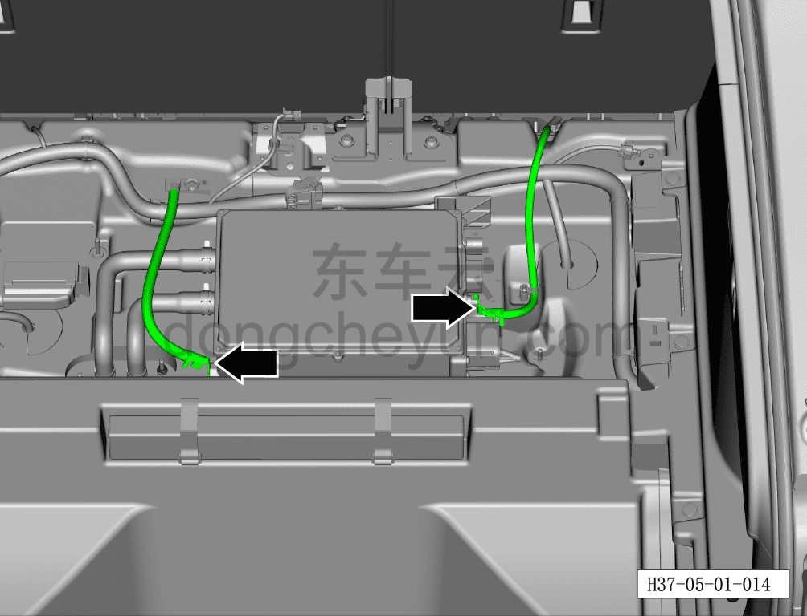
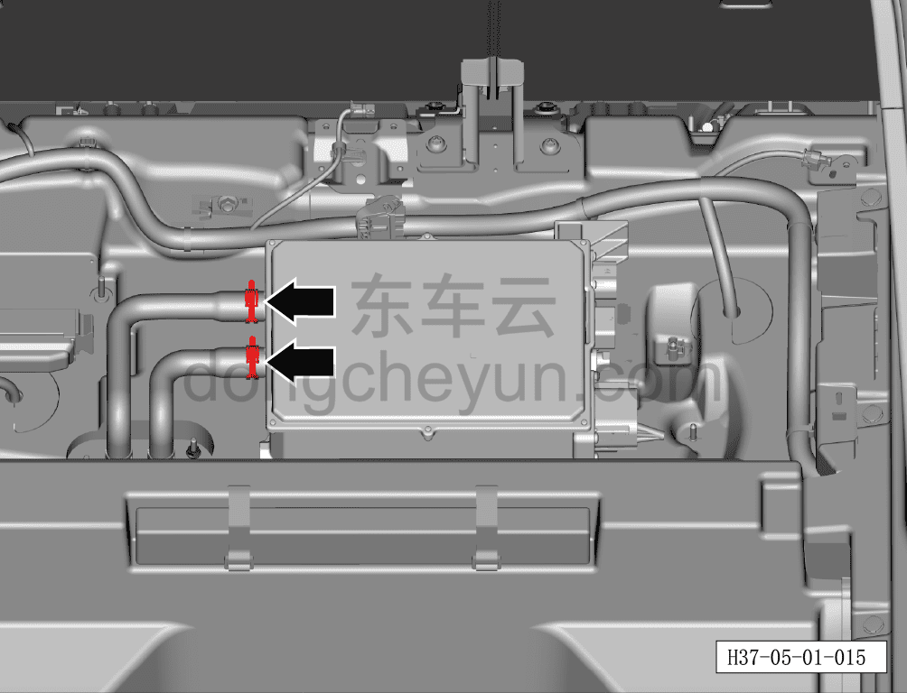
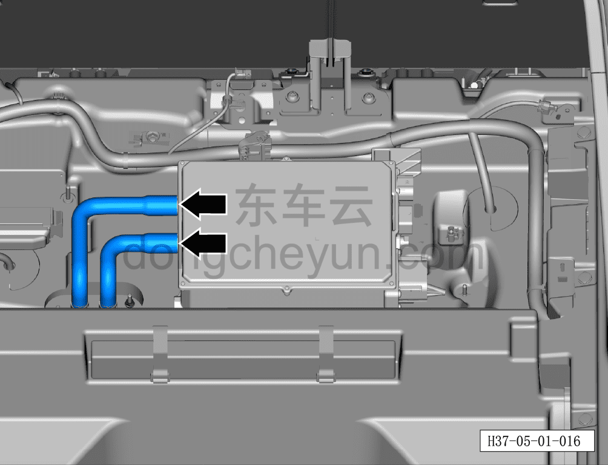
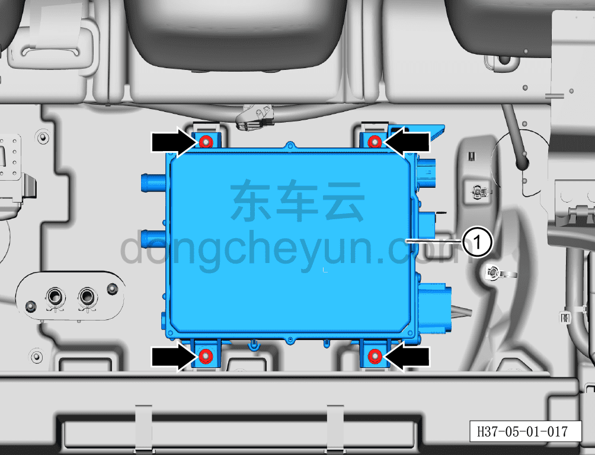

# Снятие и установка бортового зарядного устройства (400 В)

> Силовая система на новых источниках энергии › Система высоковольтных компонентов › Бортовое зарядное устройство (OBC)  
> Оригинал: `拆卸与安装车载充电机（400V）` · [dongcheyun 56746](https://dongcheyun.com/p/56746), страница `bf60527c33d74d159058f70a6a5b8626` · [оглавление](../README.md)

**Порядок снятия**

**Примечание:**

**- Обратите внимание на предупреждения и указания по ремонту высоковольтной системы, подробнее см. [5.1.1 Меры предосторожности](001-указания.md)**

**- Здесь описано снятие и установка бортового зарядного устройства версии 400 В; для версии 800 В можно руководствоваться этим же порядком, что и для 400 В.**

1. Выключите все электроприборы, отключите питание.

2. Выполните обесточивание автомобиля для ремонта. См. [3.1.4.1 Обесточивание автомобиля](../03-техническое-обслуживание/005-обесточивание-автомобиля.md)

3. Снимите крышку багажника. См. [8.5.8.2 Снятие и установка крышки багажника](../08-внутренняя-и-внешняя-отделка/147-снятие-и-установка-крышки-пола-багажника.md)

4. Слейте охлаждающую жидкость. См. [3.1.5.1 Замена охлаждающей жидкости тягового электродвигателя и тяговой батареи](../03-техническое-обслуживание/006-замена-охлаждающей-жидкости-тягового-электродвигателя.md)

5. Снятие бортового зарядного устройства (400 В).

a. Вытяните фиксатор разъёма A для разблокировки, удерживая кнопку фиксации разъёма B, поверните рукоятку разъёма C, отсоедините разъём① высоковольтного жгута бортового зарядного устройства (со стороны бортового зарядного устройства).

b. Вытяните фиксатор разъёма D для разблокировки, удерживая кнопку фиксации разъёма E, отсоедините разъём② высоковольтного жгута бортового зарядного устройства.

**Внимание:**

**- После снятия закройте высоковольтный порт, к которому подключается высоковольтный жгут бортового зарядного устройства (со стороны бортового зарядного устройства), чистой изолирующей защитной крышкой, чтобы предотвратить попадание посторонних предметов или случайное касание.**

c. Нажмите на кнопку фиксации разъёма A, поверните рукоятку разъёма B, отсоедините низковольтный разъём① бортового зарядного устройства.

d. Используя торцевую головку на 10 мм, выверните 2 крепёжных болта проводов заземления бортового зарядного устройства.

Момент затяжки болта: 8±1 Н·м

e. Отсоедините 2 жгута заземления бортового зарядного устройства.

f. Используя клещи для хомутов шлангов, сместите фиксирующие хомуты патрубков подачи и обратки бортового зарядного устройства с монтажного положения.

g. Поворачивая влево-вправо, извлеките и отсоедините патрубки подачи и обратки бортового зарядного устройства.

h. Используя торцевую головку на 13 мм, выверните 4 крепёжные гайки бортового зарядного устройства.

Момент затяжки болтов: 20±3 Н·м

i. Извлеките бортовое зарядное устройство①.

**Порядок установки**

Установка выполняется в обратном порядке.

**Примечание:**

**После завершения замены необходимо выполнить следующие операции с помощью диагностического сканера или удалённой диагностики:**

**- Сначала прошить программное обеспечение до последней версии;**

**- После успешного обновления программного обеспечения выполнить процедуру замены детали для контроллера.**

**Внимание:**

**- До и после ремонта высоковольтной системы необходимо использовать измеритель сопротивления изоляции для проверки высоковольтных компонентов на утечку тока, иначе выполнять операции запрещается.**

**- При работе с высоковольтными компонентами необходимо использовать изолирующие перчатки и изолирующие инструменты.**

**- Охлаждающую жидкость нельзя использовать повторно, смешивать, а также нельзя заменять охлаждающей жидкостью другого цвета.**

**- Залейте охлаждающую жидкость до требуемого уровня и закройте крышку расширительного бачка; охлаждающая жидкость: марка, указанная производителем.**

**- После завершения установки проверьте отсутствие помех и скручивания жгута; потяните штекер высоковольтного жгута наружу с усилием не более 20 Н (не тянуть за жгут); штекер высоковольтного жгута не должен выниматься — убедитесь, что соединение выполнено правильно, затем повторно довставьте штекер высоковольтного жгута строго перпендикулярно внутрь, чтобы предотвратить некачественное соединение из-за обратного вытягивания.**

**- Проверьте, убедившись, что в местах соединения патрубков нет утечек.**

**- После завершения установки подключите диагностический сканер, проверьте наличие кодов неисправностей; при их наличии устраните причину и удалите коды неисправностей.**

**- После завершения установки подключите зарядный кабель, убедитесь, что система зарядки автомобиля работает нормально.**
