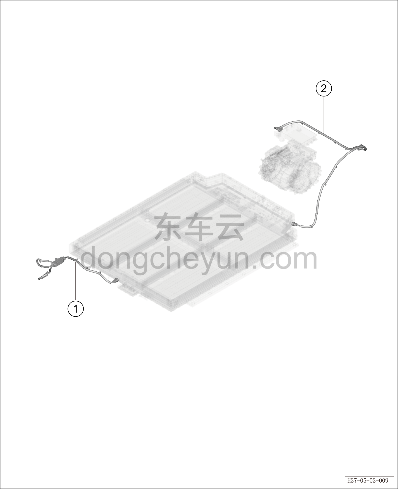

# Узел высоковольтного жгута (400 В)

> Силовая система на новых источниках энергии › Система высоковольтных жгутов › Покомпонентный вид (деталировка)  
> Оригинал: `高压线束组件（400V）` · [dongcheyun 56746](https://dongcheyun.com/p/56746), страница `87df342124b14d2cab2075824d257e49` · [оглавление](../README.md)

| № | Наименование детали | Кол-во на автомобиль | Примечание |
|---|---|---|---|
| 1 | Высоковольтный жгут PTC-компрессора | 1 |   |
| 2 | Высоковольтный жгут зарядного устройства | 1 |   |
