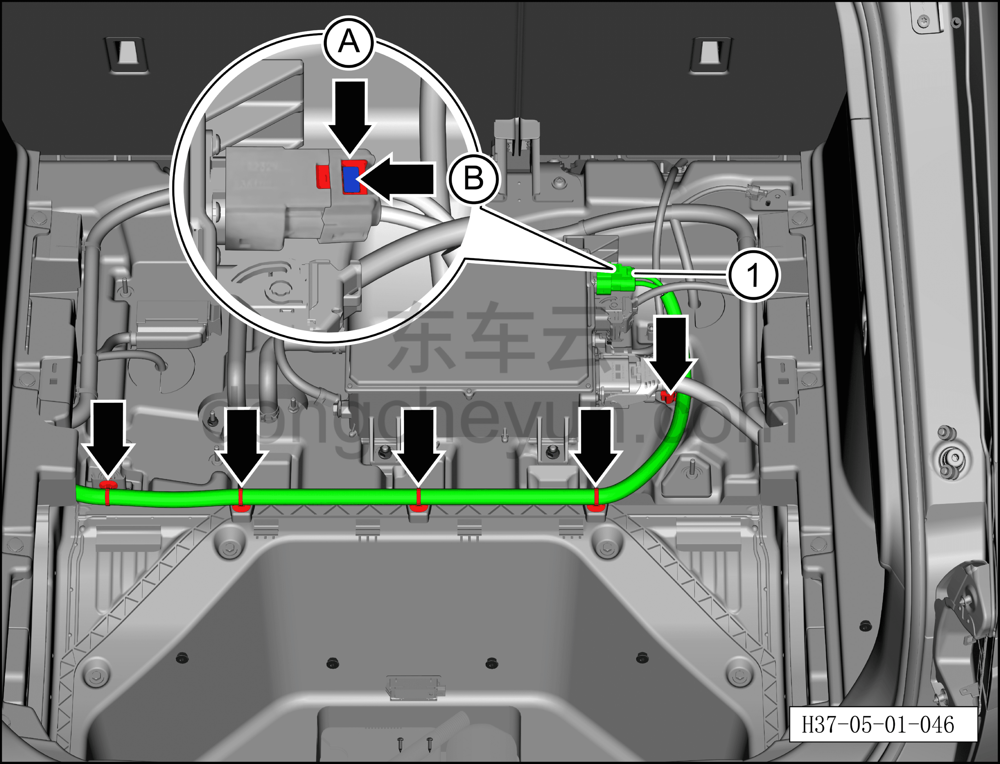
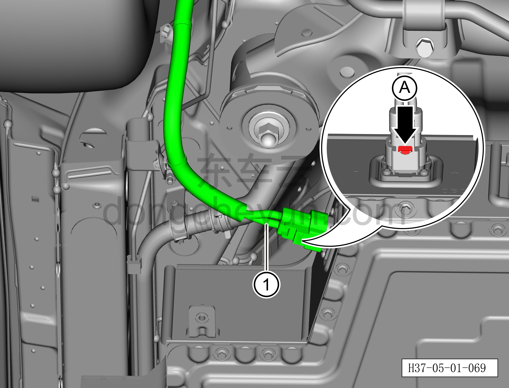
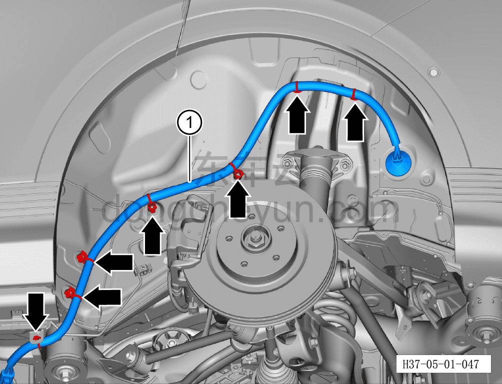

# Снятие и установка высоковольтного жгута зарядного устройства

> Силовая система на новых источниках энергии › Система высоковольтных жгутов › Высоковольтный жгут зарядного устройства  
> Оригинал: `拆卸与安装充电机高压线束` · [dongcheyun 56746](https://dongcheyun.com/p/56746), страница `91e1e4ec541744e68b896f2e761219d6` · [оглавление](../README.md)

**Порядок снятия**

**Примечание:**

**- Обратите внимание на предупреждения и указания по ремонту высоковольтной системы, подробнее см. [5.1.1 Меры предосторожности](001-указания.md)**

1. Выключите все электроприборы, отключите питание.

2. Выполните операцию обесточивания автомобиля для ремонта. См. [3.1.4.1 Обесточивание автомобиля](../03-техническое-обслуживание/005-обесточивание-автомобиля.md)

3. Снимите крышку багажника. См. [8.5.8.2 Снятие и установка крышки багажника](../08-внутренняя-и-внешняя-отделка/147-снятие-и-установка-крышки-пола-багажника.md)

4. Снимите опорный блок багажника. См. [8.5.8.3 Снятие и установка опорного блока багажника](../08-внутренняя-и-внешняя-отделка/148-снятие-и-установка-опорного-блока-багажника.md)

5. Снимите подкрылок левого заднего колеса. См. [8.6.4.2 Снятие и установка подкрылка левого заднего колеса](../08-внутренняя-и-внешняя-отделка/192-снятие-и-установка-левого-подкрылка-задней-колёсной.md)

6. Снятие высоковольтного жгута зарядного устройства.

a. Используя инструмент для снятия элементов обивки, отсоедините 5 фиксирующих клипс высоковольтного жгута зарядного устройства.

b. Вытяните фиксатор разъёма A для разблокировки, удерживая кнопку фиксации разъёма B, отсоедините разъём① высоковольтного жгута зарядного устройства (со стороны бортового зарядного устройства).

**Внимание:**

**- При работе с высоковольтными компонентами обязательно используйте изолирующие перчатки и изолирующий инструмент.**

**- После снятия закройте высоковольтный порт, к которому подключается высоковольтный жгут зарядного устройства (со стороны бортового зарядного устройства), чистой изолирующей защитной крышкой, чтобы предотвратить попадание посторонних предметов или случайное касание.**

c. Извлеките и удерживайте фиксатор разъёма A, отсоедините разъём① высоковольтного жгута зарядного устройства (со стороны тяговой батареи).

**Внимание:**

**- После снятия закройте высоковольтный порт, к которому подключается высоковольтный жгут зарядного устройства (со стороны тяговой батареи), чистой изолирующей защитной крышкой, чтобы предотвратить попадание посторонних предметов или случайное касание.**

d. Используя инструмент для снятия элементов обивки, отсоедините 7 фиксирующих клипс высоковольтного жгута зарядного устройства, снимите высоковольтный жгут зарядного устройства①.

**Порядок установки**

Установка выполняется в обратном порядке.

**Внимание:**

**- При работе с высоковольтными компонентами необходимо использовать изолирующие перчатки и изолирующие инструменты.**

**- После завершения установки проверьте отсутствие помех и скручивания жгута; потяните штекер высоковольтного жгута наружу с усилием не более 20 Н (не тянуть за жгут); штекер высоковольтного жгута не должен выниматься — убедитесь, что соединение выполнено правильно, затем повторно довставьте штекер высоковольтного жгута строго перпендикулярно внутрь, чтобы предотвратить некачественное соединение из-за обратного вытягивания.**

**- После завершения установки подключите диагностический сканер, проверьте наличие кодов неисправностей; при их наличии устраните причину и удалите коды неисправностей.**

**- После завершения установки проведите испытание зарядки, убедитесь, что система зарядки функционирует нормально.**
