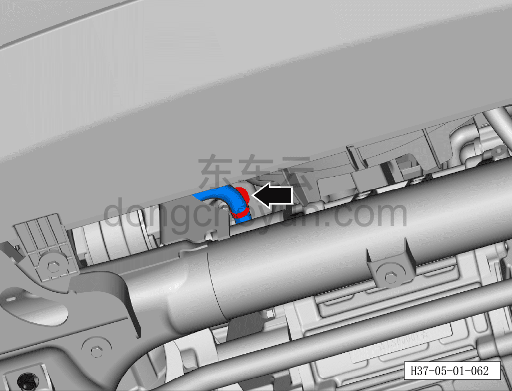
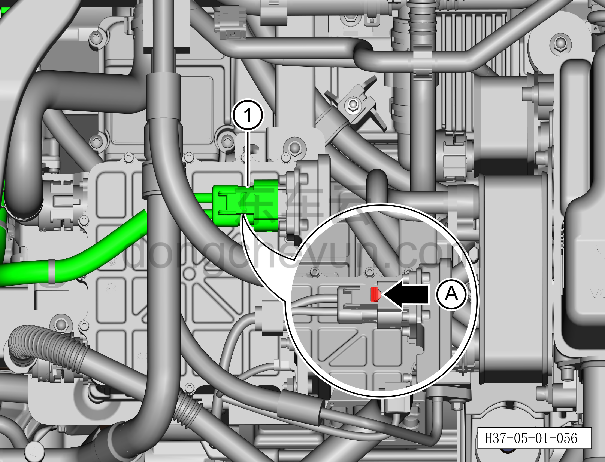
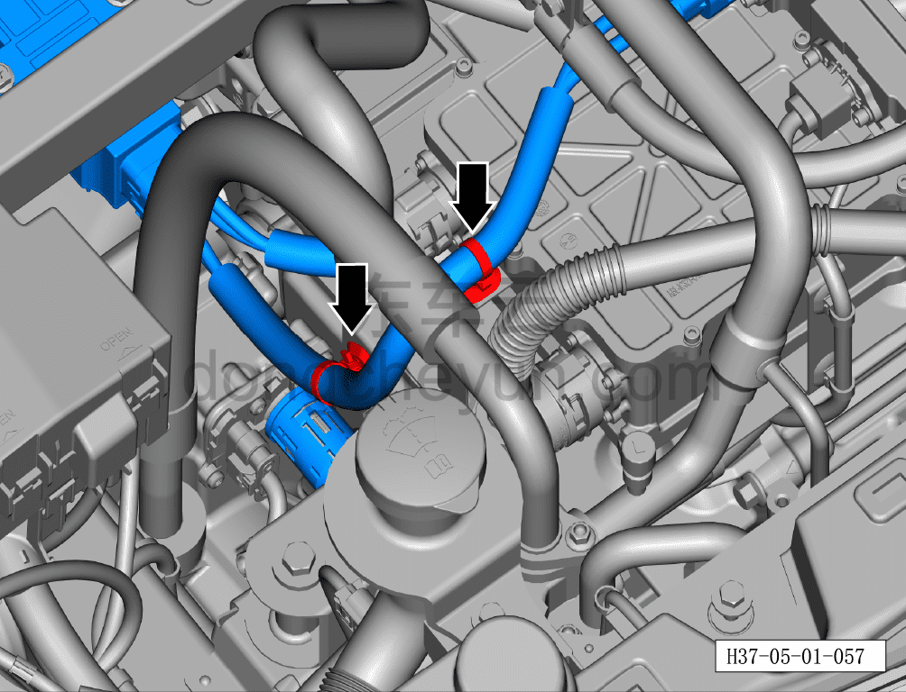
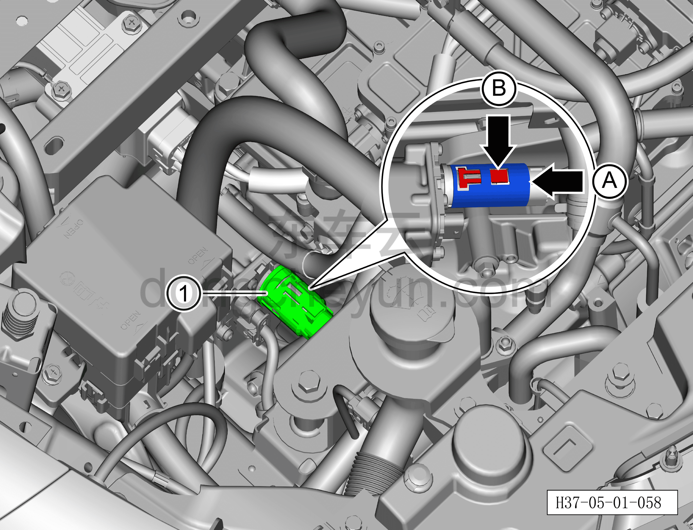
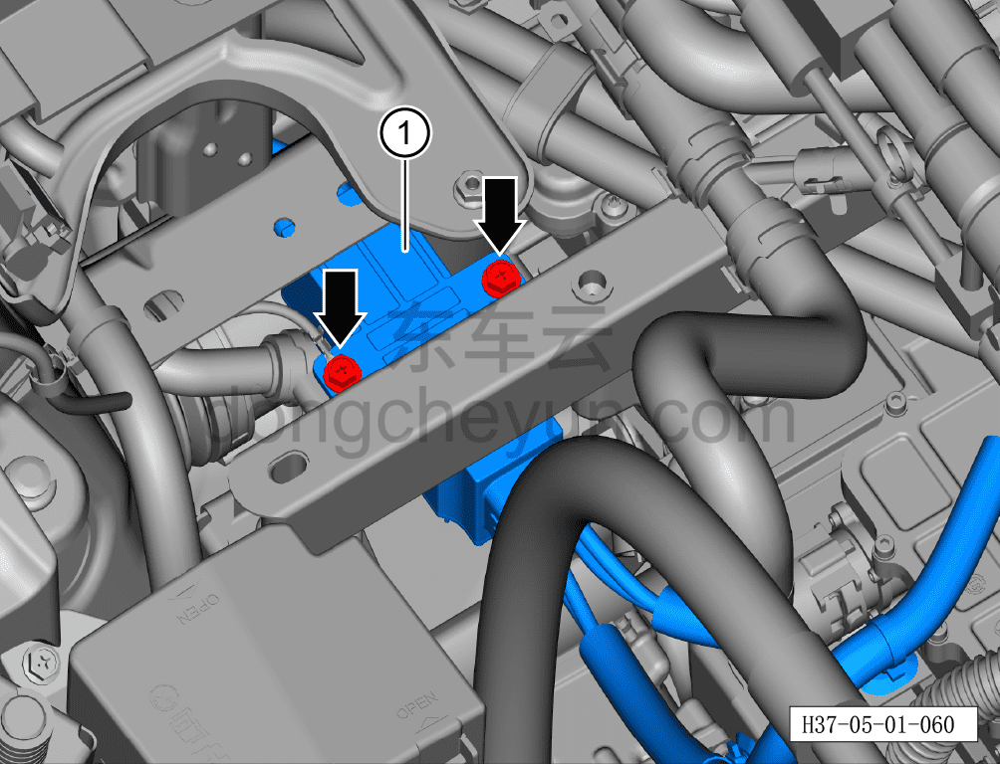

# Снятие и установка узла высоковольтного жгута PTC-компрессора в сборе (полный привод)

> Силовая система на новых источниках энергии › Система высоковольтных жгутов › Высоковольтный жгут PTC системы кондиционирования  
> Оригинал: `拆卸与安装PTC-压缩机高压线束总成（四驱）` · [dongcheyun 56746](https://dongcheyun.com/p/56746), страница `7d74587436934625917193fe597dc049` · [оглавление](../README.md)

**Порядок снятия**

**Примечание:**

**- Обратите внимание на предупреждения и указания по ремонту высоковольтной системы, подробнее см. [5.1.1 Меры предосторожности](001-указания.md)**

1. Выключите все электроприборы, отключите питание.

2. Выполните операцию обесточивания автомобиля для ремонта. См. [3.1.4.1 Обесточивание автомобиля](../03-техническое-обслуживание/005-обесточивание-автомобиля.md)

3. Снимите аккумуляторную батарею. См. [9.4.4.1 Снятие и установка аккумуляторной батареи](../09-электрическая-и-электронная-система/029-снятие-и-установка-аккумуляторной-батареи-12-в.md)

4. Снимите переднюю нижнюю защитную панель. См. [8.6.4.3 Снятие и установка передней нижней защитной панели](../08-внутренняя-и-внешняя-отделка/193-снятие-и-установка-переднего-нижнего-защитного-щитка.md)

5. Снятие узла высоковольтного жгута PTC системы кондиционирования в сборе (полный привод).

a. Вытяните фиксатор разъёма A, отсоедините разъём① высоковольтного жгута PTC-компрессора (со стороны тяговой батареи).

**Внимание:**

**- При работе с высоковольтными компонентами обязательно используйте изолирующие перчатки и изолирующий инструмент.**

**- После снятия закройте высоковольтный порт, к которому подключается высоковольтный жгут PTC-компрессора (со стороны тяговой батареи), чистой изолирующей защитной крышкой, чтобы предотвратить попадание посторонних предметов или случайное касание.**

b. Используя инструмент для снятия элементов обивки, отсоедините 3 фиксирующие клипсы высоковольтного жгута PTC-компрессора.

c. Используя инструмент для снятия элементов обивки, отсоедините 1 фиксирующую клипсу высоковольтного жгута PTC-компрессора.

d. Вытяните фиксатор разъёма A, отсоедините разъём① высоковольтного жгута PTC-компрессора (со стороны PTC).

**Внимание:**

**- После снятия закройте высоковольтный порт, к которому подключается высоковольтный жгут PTC-компрессора (со стороны PTC), чистой изолирующей защитной крышкой, чтобы предотвратить попадание посторонних предметов или случайное касание.**

e. Используя инструмент для снятия элементов обивки, отсоедините 2 фиксирующие клипсы высоковольтного жгута PTC-компрессора.

f. Вытяните наружный металлический кольцевой фиксатор разъёма A до его фиксации, нажмите на два фиксатора разъёма B (сверху и снизу), отсоедините разъём① высоковольтного жгута компрессора.

**Внимание:**

**- После снятия закройте высоковольтный порт, к которому подключается высоковольтный жгут компрессора, чистой изолирующей защитной крышкой, чтобы предотвратить попадание посторонних предметов или случайное касание.**

g. Используя торцевую головку на 13 мм, выверните 3 крепёжных болта A крепёжной ленты аккумуляторной батареи.

Момент затяжки болта A: 10±1 Н·м

h. Используя торцевую головку на 13 мм, выверните крепёжный болт B крепёжной ленты аккумуляторной батареи.

Момент затяжки болта B: 20±3 Н·м

i. Извлеките крепёжную ленту аккумуляторной батареи①.

j. Используя торцевую головку на 10 мм, выверните 2 крепёжных болта высоковольтного жгута PTC-компрессора.

Момент затяжки болтов: 10±1 Н·м

k. Извлеките высоковольтный жгут PTC-компрессора①.

**Порядок установки**

Установка выполняется в обратном порядке.

**Внимание:**

**- При работе с высоковольтными компонентами обязательно используйте изолирующие перчатки и изолирующий инструмент.**

**- После завершения установки проверьте отсутствие помех и скручивания жгута; потяните штекер высоковольтного жгута наружу с усилием не более 20 Н (не тянуть за жгут); штекер высоковольтного жгута не должен выниматься — убедитесь, что соединение выполнено правильно, затем повторно довставьте штекер высоковольтного жгута строго перпендикулярно внутрь, чтобы предотвратить некачественное соединение из-за обратного вытягивания.**

**- После завершения установки задействуйте панель управления кондиционером, проверьте и убедитесь, что все функции системы кондиционирования работают нормально, затем подключите диагностический сканер, устраните причину и удалите коды неисправностей.**
