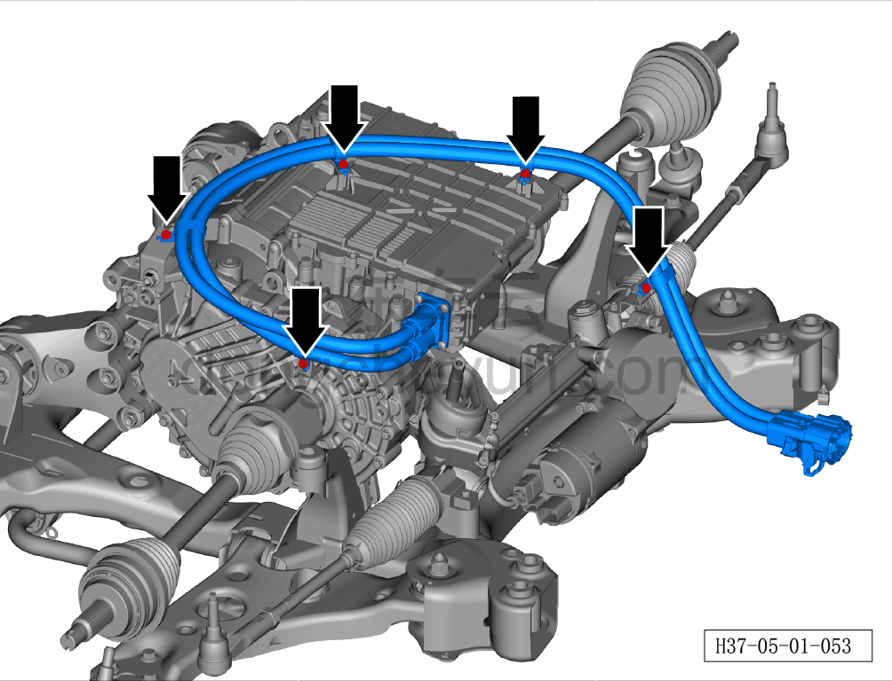
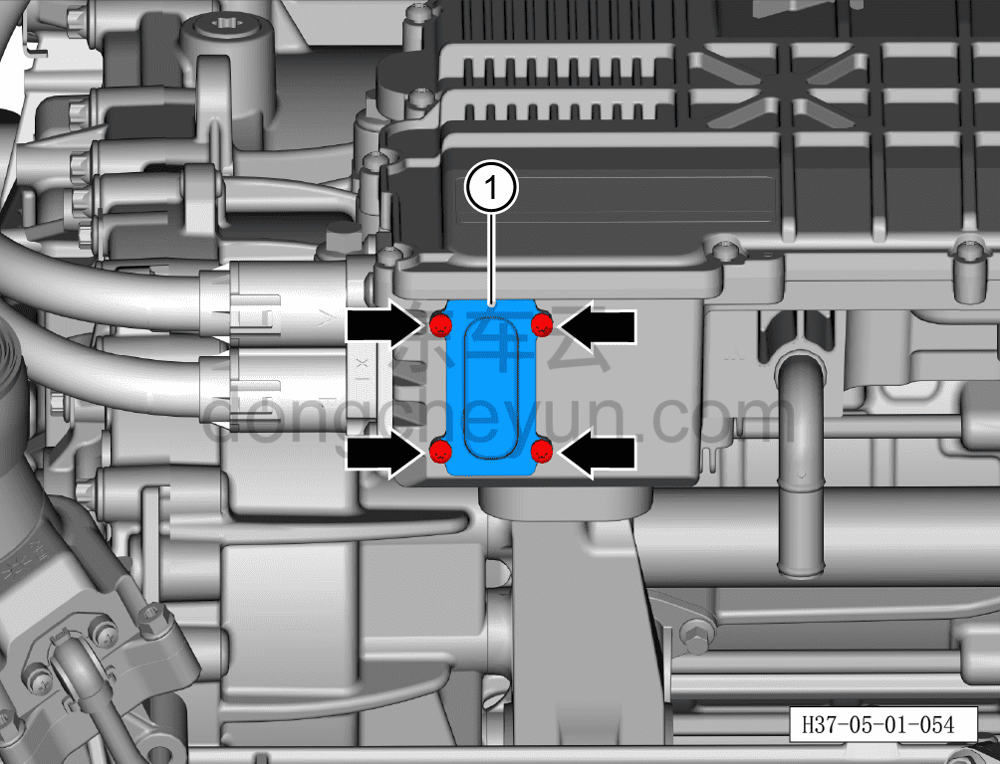
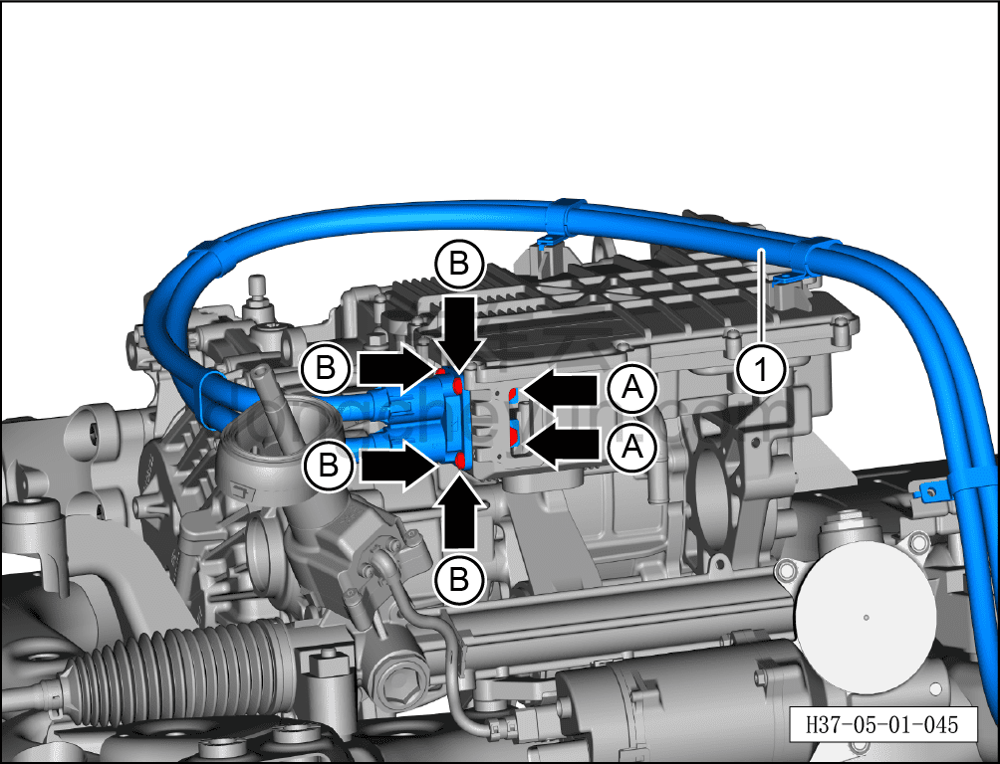

# Снятие и установка высоковольтного жгута переднего электродвигателя

> Силовая система на новых источниках энергии › Система высоковольтных жгутов › Высоковольтный жгут переднего электродвигателя  
> Оригинал: `拆卸与安装前电机高压线束` · [dongcheyun 56746](https://dongcheyun.com/p/56746), страница `89c870dafb92489ab3983262591b169a` · [оглавление](../README.md)

**Порядок снятия**

**Примечание:**

**- Обратите внимание на предупреждения и указания по ремонту высоковольтной системы, подробнее см. [5.1.1 Меры предосторожности](001-указания.md)**

1. Выключите все электроприборы, отключите питание.

2. Выполните операцию обесточивания автомобиля для ремонта. См. [3.1.4.1 Обесточивание автомобиля](../03-техническое-обслуживание/005-обесточивание-автомобиля.md)

3. Слейте охлаждающую жидкость переднего тягового электродвигателя. См. [3.1.5.1 Замена охлаждающей жидкости тягового электродвигателя и тяговой батареи](../03-техническое-обслуживание/006-замена-охлаждающей-жидкости-тягового-электродвигателя.md)

4. Соберите (откачайте) хладагент. См. [10.1.6.11 Сбор/откачка/заправка хладагента](../10-кондиционер/045-сбор-вакуумирование-заправка-хладагента.md)

5. Снимите передний подрамник и передний тяговый электродвигатель. См. [6.2.9.1 Снятие и установка переднего подрамника и переднего тягового электродвигателя в сборе (полный привод)](../06-система-шасси/022-снятие-и-установка-переднего-подрамника-и-переднего.md)

6. Снятие высоковольтного жгута переднего электродвигателя

a. Используя торцевую головку на 8 мм, выверните 5 крепёжных болтов высоковольтного жгута переднего электродвигателя.

Момент затяжки болта: 8±1 Н·м

b. Используя биту T20, выверните 4 крепёжных болта уплотнительной крышки переднего электродвигателя.

Момент затяжки болтов составляет: 4.5~6.5 Н·м

c. Извлеките уплотнительную крышку переднего электродвигателя①.

d. Используя торцевую головку на 13 мм, выверните 2 крепёжных болта A высоковольтного жгута переднего электродвигателя.

Момент затяжки болтов A составляет: 10~12 Н·м

e. Используя биту T30, выверните 4 крепёжных болта B высоковольтного жгута переднего электродвигателя.

Момент затяжки болтов B составляет: 6.2~7.6 Н·м

f. Извлеките высоковольтный жгут переднего электродвигателя①.

Порядок установки

Установка выполняется в обратном порядке.

**Внимание:**

**- После завершения установки жгута необходимо выполнить проверку герметичности электродвигателя с помощью прибора контроля герметичности; только после успешного прохождения проверки можно продолжать установку.**

**- После завершения установки залейте охлаждающую жидкость и выполните удаление воздуха (прокачку).**

**- После завершения установки залейте смазочное масло тягового электродвигателя и проверьте, что уровень смазочного масла соответствует норме.**

**- После завершения установки проверьте соединения трубопроводов на признаки просачивания воды; при их наличии немедленно устраните неисправность в соответствующем месте.**

**- После завершения установки подключите диагностический сканер, проверьте наличие кодов неисправностей; при их наличии устраните причину и удалите коды неисправностей.**

**- После завершения установки выполните дорожное испытание, убедитесь в отсутствии посторонних шумов со стороны шасси.**

**- После завершения испытательной поездки поднимите автомобиль на подъёмнике и убедитесь в отсутствии утечек масла.**
