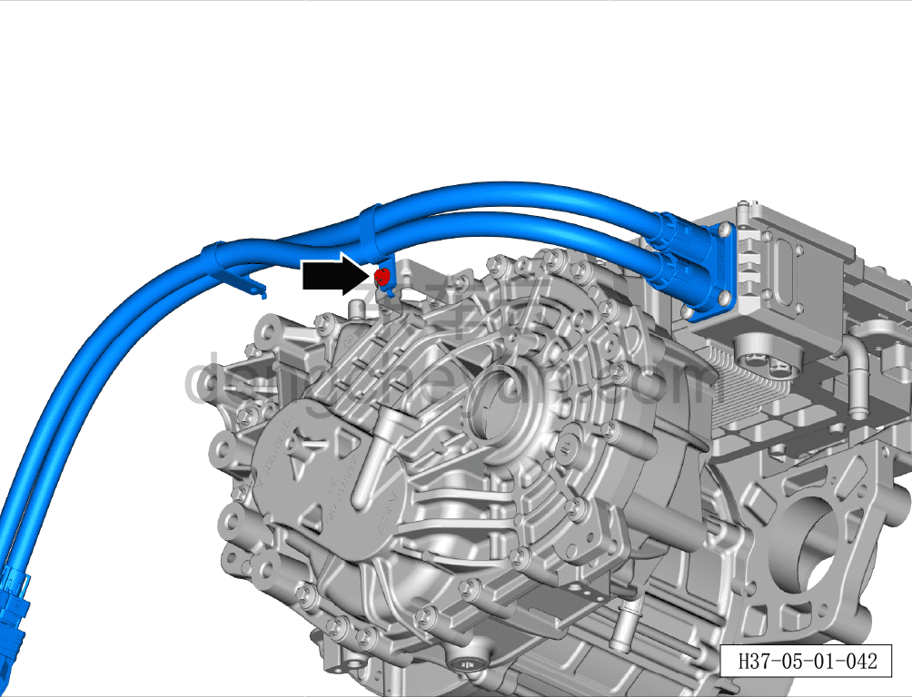
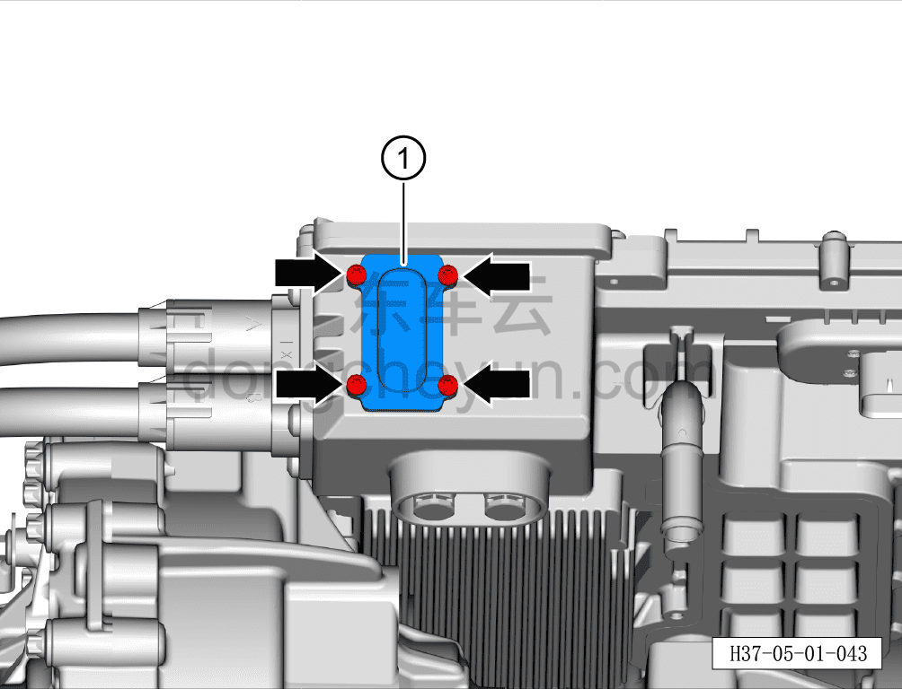
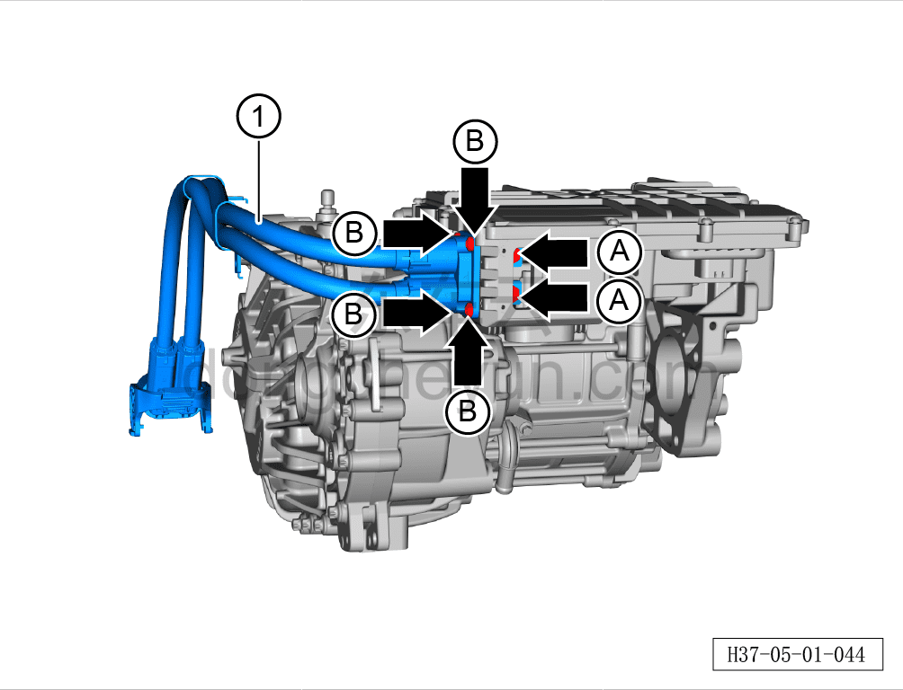

# Снятие и установка высоковольтного жгута заднего электродвигателя

> Силовая система на новых источниках энергии › Система высоковольтных жгутов › Высоковольтный жгут заднего электродвигателя  
> Оригинал: `拆卸与安装后电机高压线束` · [dongcheyun 56746](https://dongcheyun.com/p/56746), страница `984b37c65095469580feb2c2fd2f84a5` · [оглавление](../README.md)

**Порядок снятия**

**Примечание:**

**- Обратите внимание на предупреждения и указания по ремонту высоковольтной системы, подробнее см. [5.1.1 Меры предосторожности](001-указания.md)**

1. Выключите все электроприборы, отключите питание.

2. Выполните операцию обесточивания автомобиля для ремонта. См. [3.1.4.1 Обесточивание автомобиля](../03-техническое-обслуживание/005-обесточивание-автомобиля.md)

3. Снимите узел заднего тягового электродвигателя. См. [5.2.7.1 Снятие и установка заднего тягового электродвигателя](023-снятие-и-установка-заднего-тягового-электродвигателя.md)

4. Снятие высоковольтного жгута заднего электродвигателя

a. Используя торцевую головку на 10 мм, выверните крепёжный болт кронштейна высоковольтного жгута заднего электродвигателя.

b. Используя биту T20, выверните 4 крепёжных болта крышки высоковольтного жгута заднего электродвигателя.

Момент затяжки болтов составляет: 4.5~6.5 Н·м

c. Снимите крышку высоковольтного жгута заднего электродвигателя①.

d. Используя торцевую головку на 13 мм, выверните 2 крепёжных болта A высоковольтного жгута заднего электродвигателя.

Момент затяжки болтов A составляет: 10~12 Н·м

e. Используя биту T30, выверните 4 крепёжных болта B высоковольтного жгута заднего электродвигателя.

Момент затяжки болтов A составляет: 6.2~7.6 Н·м

f. Извлеките высоковольтный жгут заднего электродвигателя①.

Порядок установки

Установка выполняется в обратном порядке.

**Внимание:**

**- После завершения установки жгута необходимо выполнить проверку герметичности электродвигателя с помощью прибора контроля герметичности; только после успешного прохождения проверки можно продолжать установку.**

**- После завершения установки залейте охлаждающую жидкость и выполните удаление воздуха (прокачку).**

**- После завершения установки залейте смазочное масло тягового электродвигателя и проверьте, что уровень смазочного масла соответствует норме.**

**- После завершения установки проверьте соединения трубопроводов на признаки просачивания воды; при их наличии немедленно устраните неисправность в соответствующем месте.**

**- После завершения установки подключите диагностический сканер, проверьте наличие кодов неисправностей; при их наличии устраните причину и удалите коды неисправностей.**

**- После завершения установки выполните дорожное испытание, убедитесь в отсутствии посторонних шумов со стороны шасси.**

**- После завершения испытательной поездки поднимите автомобиль на подъёмнике и убедитесь в отсутствии утечек масла.**
