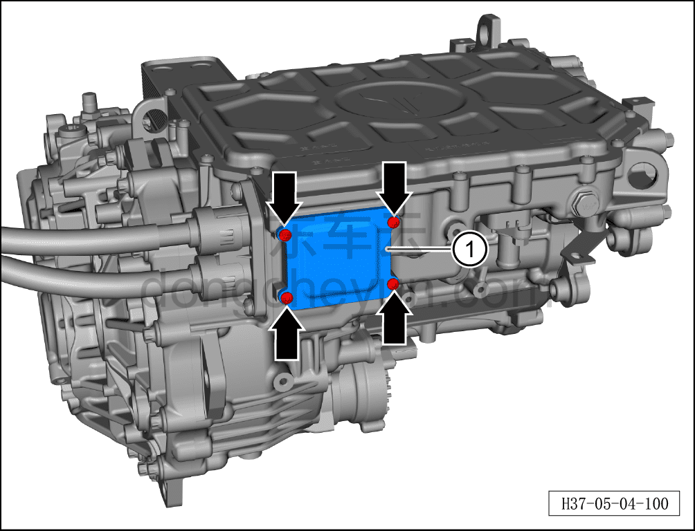
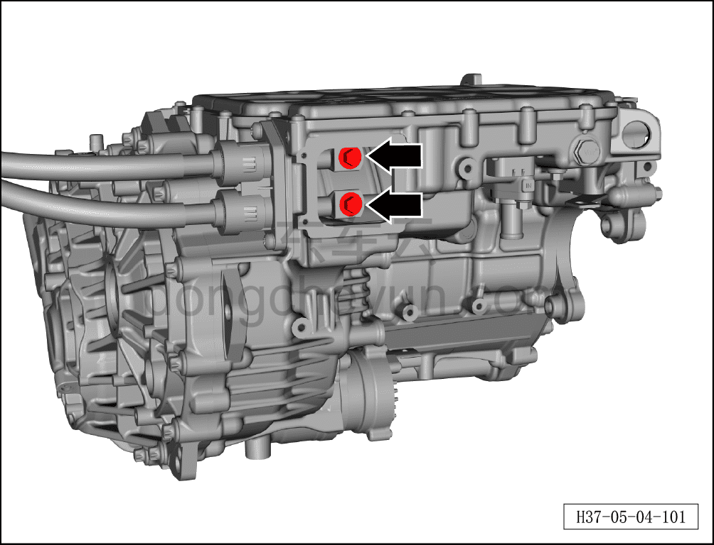
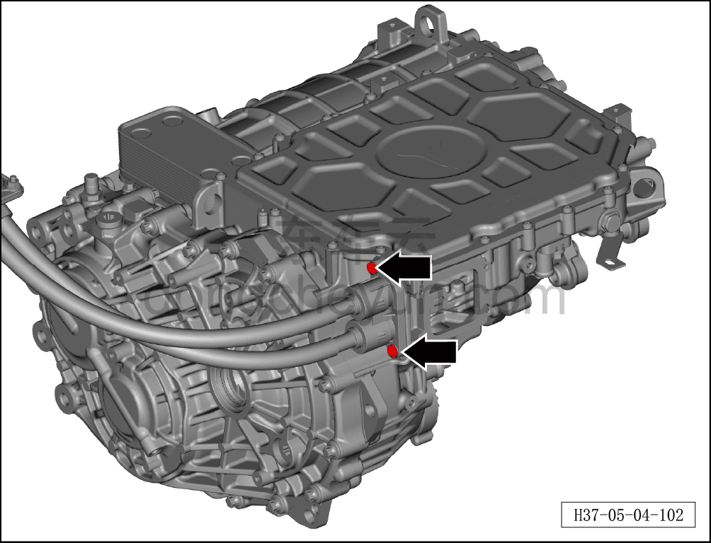
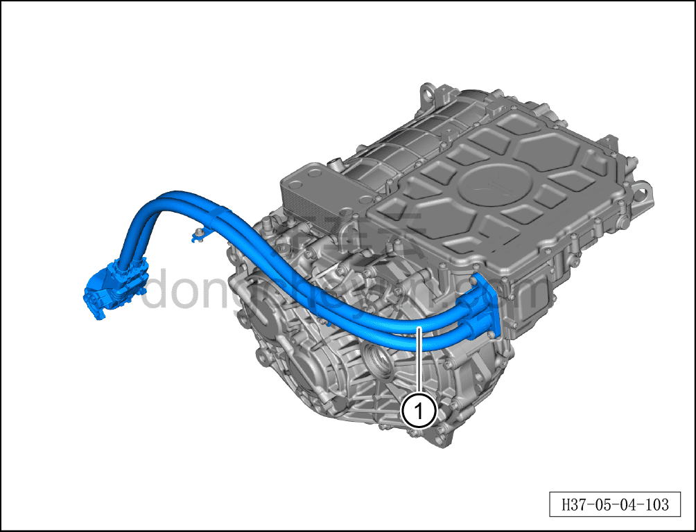

# Снятие и установка высоковольтного жгута заднего электродвигателя (800 В)

> Силовая система на новых источниках энергии › Система высоковольтных жгутов › Высоковольтный жгут заднего электродвигателя  
> Оригинал: `拆卸与安装后电机高压线束（800V）` · [dongcheyun 56746](https://dongcheyun.com/p/56746), страница `529193dfa4d447f6a9a05e0397813ac2` · [оглавление](../README.md)

**Порядок снятия**

**Примечание:**

**- Обратите внимание на предупреждения и указания по ремонту высоковольтной системы, подробнее см. [5.1.1 Меры предосторожности](001-указания.md)**

1. Выключите все электроприборы, отключите питание.

2. Выполните операцию обесточивания автомобиля для ремонта. См. [3.1.4.1 Обесточивание автомобиля](../03-техническое-обслуживание/005-обесточивание-автомобиля.md)

3. Снимите узел заднего тягового электродвигателя. См. [5.2.7.2 Снятие и установка заднего тягового электродвигателя (800 В)](024-снятие-и-установка-заднего-тягового-электродвигателя.md)

4. Снятие высоковольтного жгута заднего электродвигателя

a. Используя биту T30, выверните 4 крепёжных болта крышки, снимите крышку①.

Момент затяжки болтов составляет: 2.5±0.5 Н·м

b. Используя торцевую головку на 10 мм, выверните 2 крепёжных болта жгута и заднего электродвигателя.

Момент затяжки болтов составляет: 15±1.5 Н·м

c. Используя биту T30, выверните 2 крепёжных болта жгута.

Момент затяжки болтов составляет: 10±1 Н·м

d. Снимите узел высоковольтного жгута заднего электродвигателя①.

Порядок установки

Установка выполняется в обратном порядке.

**Внимание:**

**- После завершения установки жгута необходимо выполнить проверку герметичности электродвигателя с помощью прибора контроля герметичности; только после успешного прохождения проверки можно продолжать установку.**

**- После завершения установки залейте охлаждающую жидкость и выполните удаление воздуха (прокачку).**

**- После завершения установки залейте смазочное масло тягового электродвигателя и проверьте, что уровень смазочного масла соответствует норме.**

**- После завершения установки проверьте соединения трубопроводов на признаки просачивания воды; при их наличии немедленно устраните неисправность в соответствующем месте.**

**- После завершения установки подключите диагностический сканер, проверьте наличие кодов неисправностей; при их наличии устраните причину и удалите коды неисправностей.**

**- После завершения установки выполните дорожное испытание, убедитесь в отсутствии посторонних шумов со стороны шасси.**

**- После завершения испытательной поездки поднимите автомобиль на подъёмнике и убедитесь в отсутствии утечек масла.**
