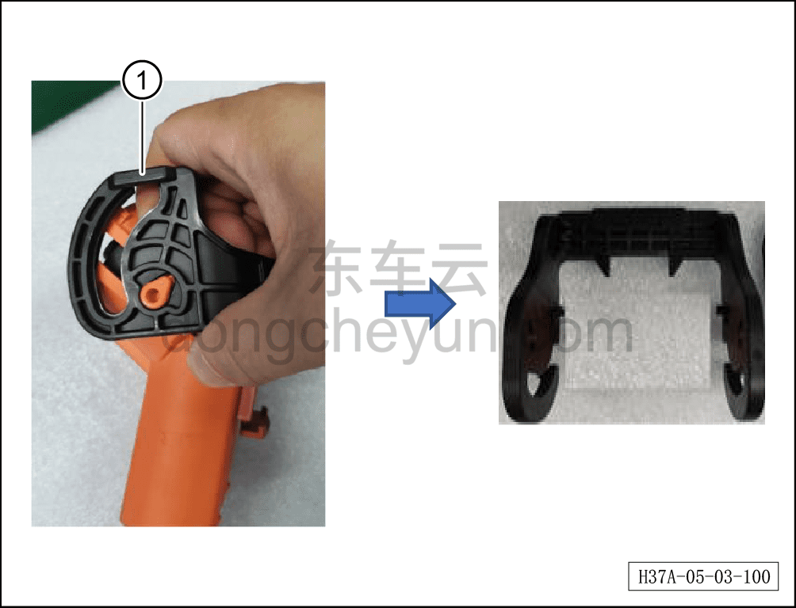
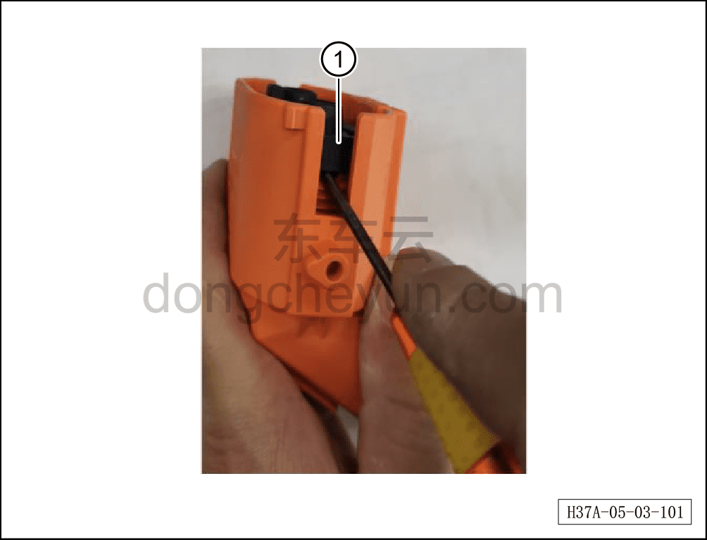
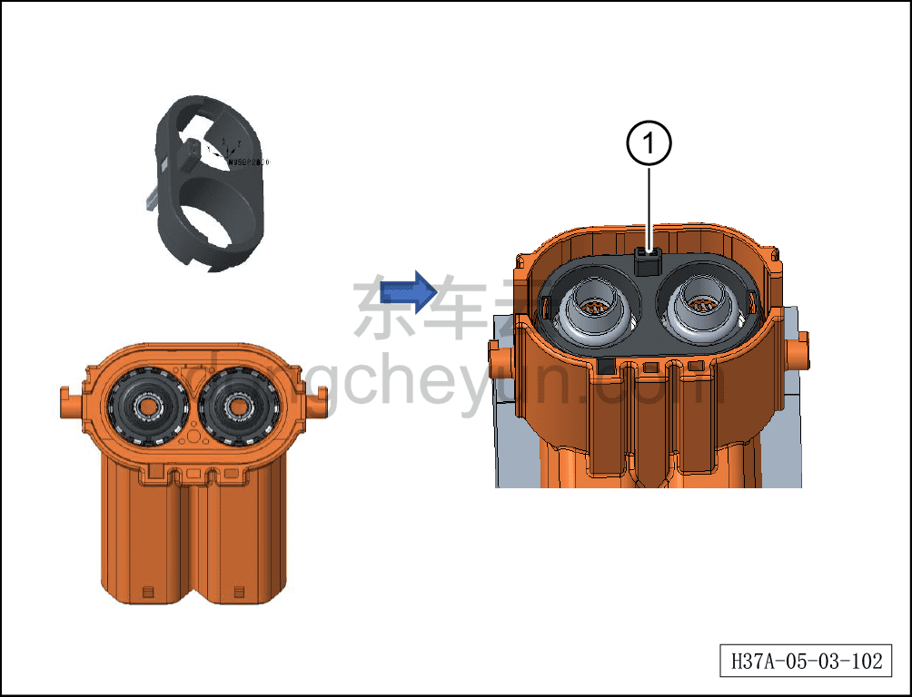
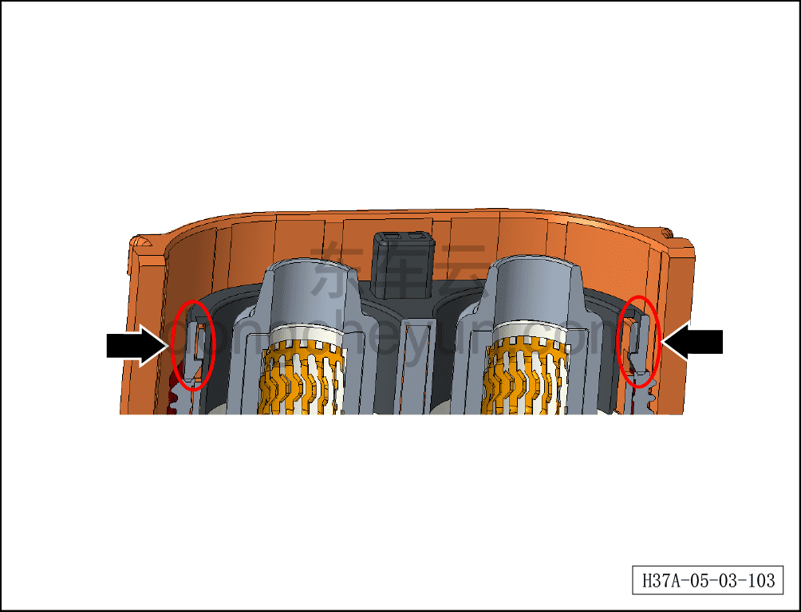
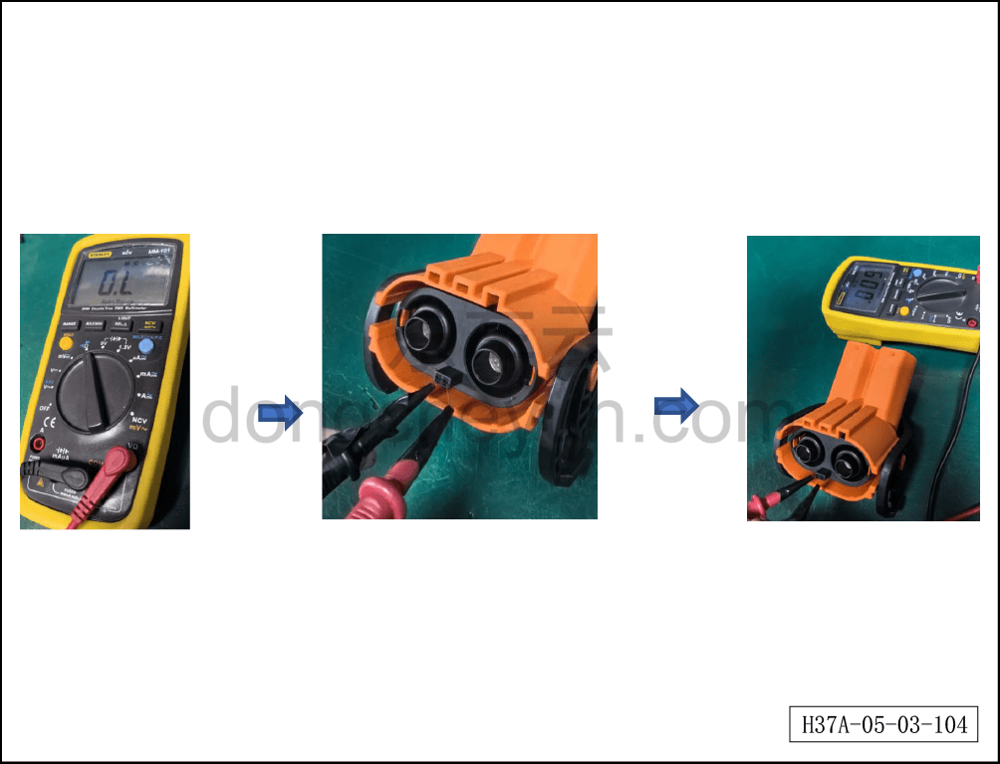
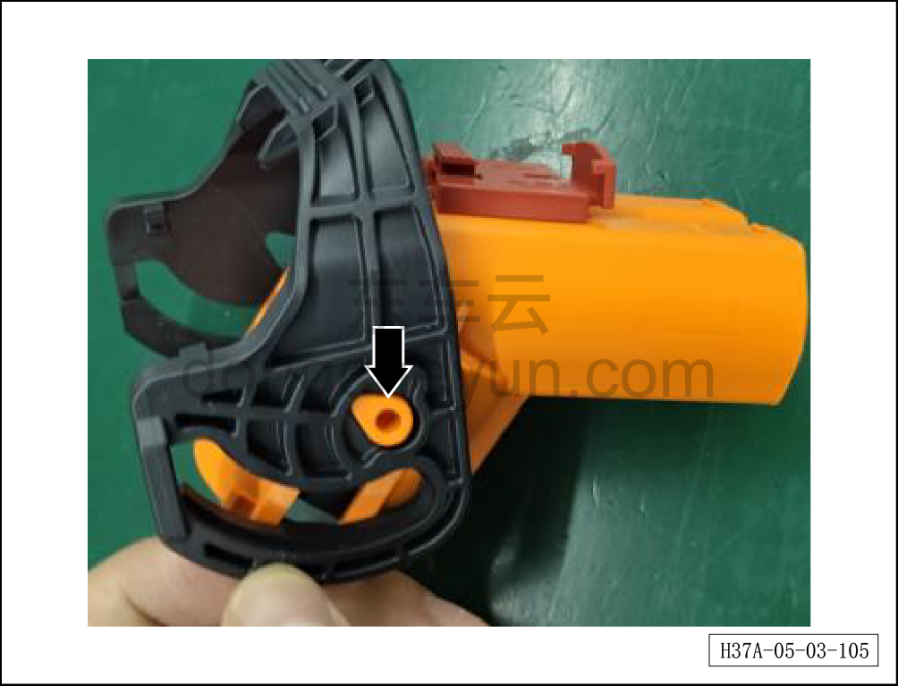
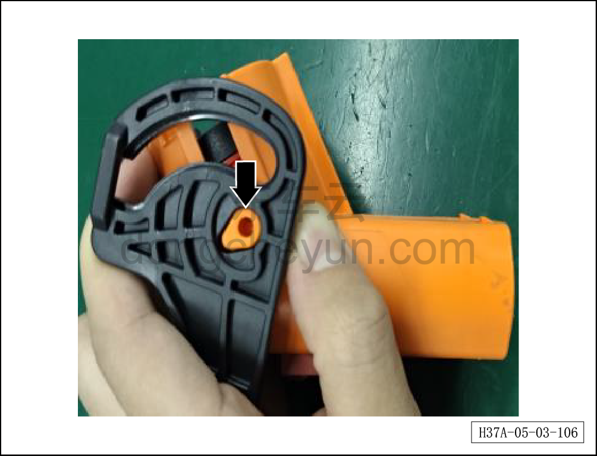
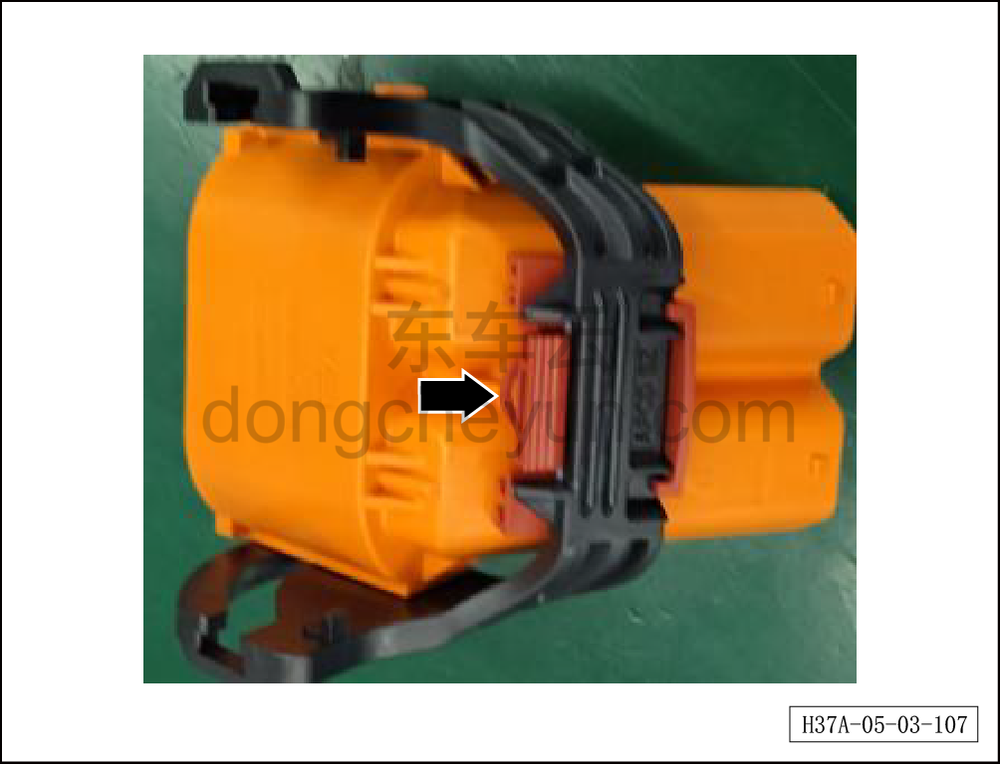
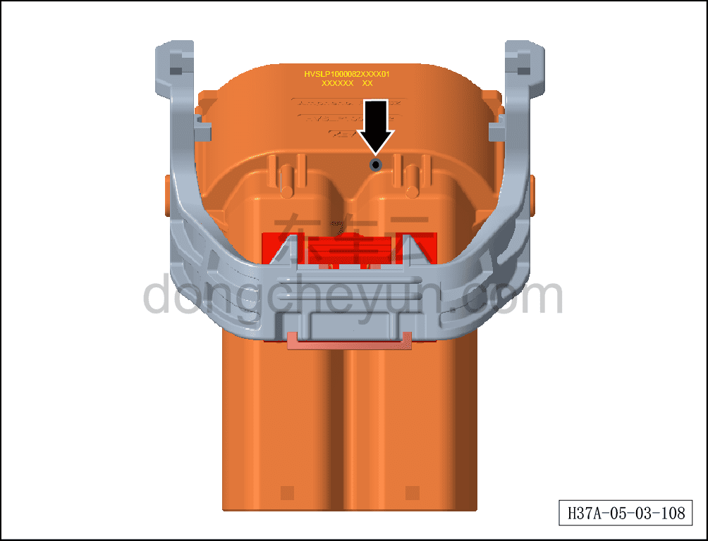

# Снятие и установка стопорного кольца блокировки высоковольтного жгута заднего электродвигателя

> Силовая система на новых источниках энергии › Система высоковольтных жгутов › Высоковольтный жгут заднего электродвигателя  
> Оригинал: `拆卸与安装后高压电机线束互锁挡圈` · [dongcheyun 56746](https://dongcheyun.com/p/56746), страница `faea6145ec5c42c68e0daccd9c25c1cc` · [оглавление](../README.md)

**Порядок снятия**

**Внимание:**

**- Обратите внимание на предупреждения и указания по ремонту высоковольтной системы, подробнее см. [5.4.1 Меры предосторожности](037-указания.md)**

1. Выключите все электроприборы, отключите питание.

2. Отсоедините минусовую клемму аккумуляторной батареи, см. [3.1.4.1 Обесточивание автомобиля](../03-техническое-обслуживание/005-обесточивание-автомобиля.md)

3. Снимите заднюю нижнюю защитную панель, см. [8.6.4.4 Снятие и установка задней нижней защитной панели](../08-внутренняя-и-внешняя-отделка/194-снятие-и-установка-заднего-нижнего-защитного-щитка.md)

4. Снятие стопорного кольца блокировки высоковольтного жгута заднего электродвигателя.

a. Отсоедините разъём высоковольтного жгута заднего электродвигателя.

b. Снимите рукоятку①.

**Внимание:**

**- Проверьте рукоятку на наличие повреждений.**

**- Если рукоятка не повреждена, её можно использовать повторно.**

c. Используя небольшую плоскую отвёртку, отожмите с двух сторон фиксаторы стопорного кольца, извлеките переднее стопорное кольцо①.

**Внимание:**

**- При отжимании фиксаторов стопорного кольца плоской отвёрткой необходимо обмотать её жало изолирующей лентой в два оборота, чтобы избежать царапин на окружающих деталях в процессе снятия.**

**- Переднее стопорное кольцо утилизируется, основной узел можно использовать повторно.**

**- Проверьте уплотнительное кольцо на отсутствие повреждений, царапин.**

**Порядок установки**

a. Установите новое переднее стопорное кольцо① вручную на основной узел в правильном направлении до фиксации с характерным щелчком.

**Внимание:**

**- Перед установкой нового переднего стопорного кольца убедитесь, что деталь соответствует требуемой.**

b. После завершения установки нового переднего стопорного кольца проверьте, что фиксаторы с обоих сторон защёлкнулись до конца.

c. Переключите мультиметр в режим проверки целостности цепи.

d. Вставьте медные жилы обоих щупов в сигнальные контактные отверстия для контакта.

e. Если на дисплее мультиметра отображаются данные — цепь исправна.

f. Совместите отверстие на одной стороне рукоятки с фиксирующим штифтом основного узла, затем защёлкните на место.

g. Слегка отогните другую сторону рукоятки и отрегулируйте её угол так, чтобы отверстие рукоятки совпало с направлением фиксирующего штифта, затем защёлкните рукоятку.

h. После установки рукоятки поверните её и проверьте на наличие отклонений. Если отклонений нет, сдвиньте рукоятку назад до фиксации CPA.

**Внимание:**

**- После завершения установки проверьте, что переднее стопорное кольцо собрано ровно, без деформации, перепадов высоты, трещин и других дефектов.**

**- Проверьте, что сигнальные гнёзда внутри переднего стопорного кольца не имеют перепадов высоты, окисления/почернения и других дефектов, что гнездо расположено по центру отверстия, без смещения.**

i. На боковой поверхности изделия, прошедшего проверку успешно, поставьте чёрную маркировочную точку.
