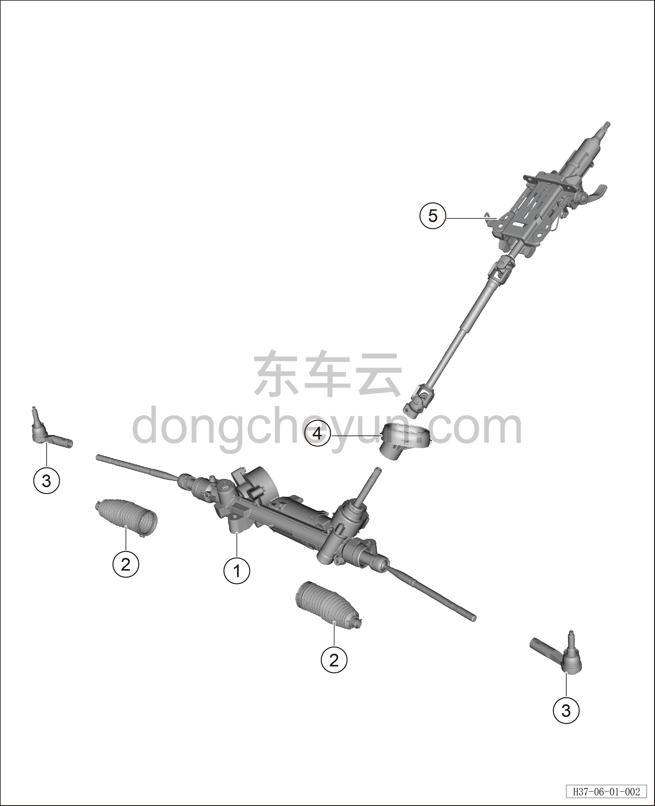

# Покомпонентный вид (деталировка)

> Система шасси › Система рулевого управления  
> Оригинал: `结构分解图` · [dongcheyun 56746](https://dongcheyun.com/p/56746), страница `efcf0da1d8db417ebf9a69d716d947d8` · [оглавление](../README.md)

| № | Наименование детали | Кол-во на автомобиль | Примечание |
|---|---|---|---|
| 1 | Рулевой механизм в сборе | 1 |   |
| 2 | Ремонтный комплект пыльника | 2 |   |
| 3 | Наружный шаровой шарнир рулевого механизма | 2 |   |
| 4 | Пыльник вала рулевого управления | 1 |   |
| 5 | Рулевая колонка в сборе | 1 |   |
