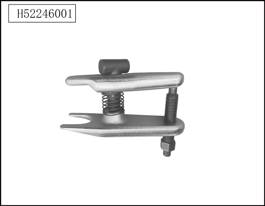

# Специальный инструмент

> Система шасси › Система рулевого управления  
> Оригинал: `专用工具` · [dongcheyun 56746](https://dongcheyun.com/p/56746), страница `614c19ac77dd48a3bc51d765eeaec121` · [оглавление](../README.md)

| № | Иллюстрация | Номер инструмента | Наименование |
|---|---|---|---|
| 1 |  | H52246001 | Специальный инструмент для снятия наружного шарового шарнира рулевого механизма |
