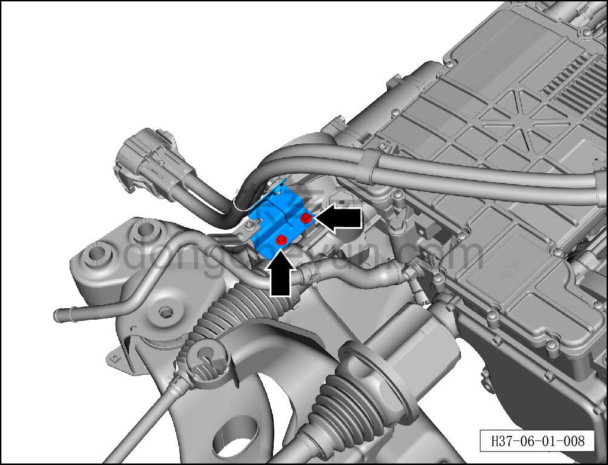
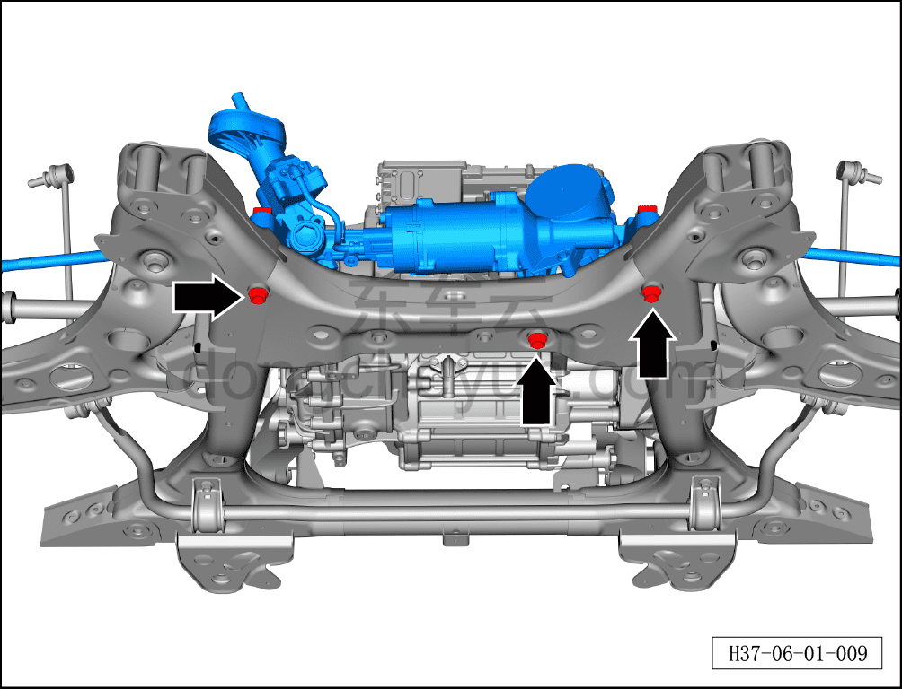
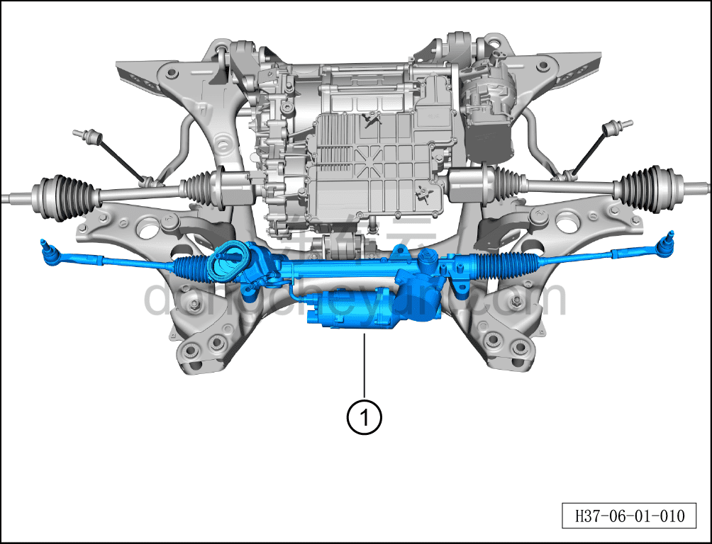

# Снятие и установка рулевого механизма

> Система шасси › Система рулевого управления › Узел рулевого управления передних колёс  
> Оригинал: `拆卸与安装转向器` · [dongcheyun 56746](https://dongcheyun.com/p/56746), страница `da6f42a5eedc420e9fc0c54cfa4921b2` · [оглавление](../README.md)

**Порядок снятия**

**Примечание:**

**- Из-за ограниченного пространства для снятия и установки рулевого механизма необходимо сначала снять передний подрамник и передний тяговый электродвигатель в сборе, и только затем производить ремонт и замену.**

1. Выключите все электроприборы, отключите питание.

2. Выполните операцию обесточивания автомобиля для ремонта. См. [3.1.4.1 Обесточивание автомобиля](../03-техническое-обслуживание/005-обесточивание-автомобиля.md)

3. Поднимите автомобиль на подъёмнике на подходящую высоту.

4. Слейте охлаждающую жидкость тягового электродвигателя. См. [3.1.5.1 Замена охлаждающей жидкости тягового электродвигателя и тяговой батареи](../03-техническое-обслуживание/006-замена-охлаждающей-жидкости-тягового-электродвигателя.md)

5. Снимите переднее колесо. См. [6.5.8.1 Снятие и установка колеса](064-снятие-и-установка-колеса.md)

6. Снимите переднюю нижнюю защитную панель. См. [8.6.4.3 Снятие и установка передней нижней защитной панели](../08-внутренняя-и-внешняя-отделка/193-снятие-и-установка-переднего-нижнего-защитного-щитка.md)

7. Снимите передний подрамник и передний тяговый электродвигатель в сборе. См. [6.2.9.1 Снятие и установка переднего подрамника и переднего тягового электродвигателя в сборе (полный привод)](022-снятие-и-установка-переднего-подрамника-и-переднего.md)

8. Снятие рулевого механизма.

a. Используя торцевую головку на 10 мм, выверните 2 крепёжных болта кронштейна узла высоковольтного жгута переднего электродвигателя, отведите кронштейн в место, не мешающее снятию.

b. Используя торцевую головку на 19 мм, выверните 3 крепёжных болта рулевого механизма в сборе.

Момент затяжки болтов составляет: 115±10 Н·м

c. Извлеките рулевой механизм①.

**Порядок установки**

Установка выполняется в обратном порядке.

**Примечание:**

**После завершения замены необходимо выполнить следующие операции с помощью диагностического сканера или удалённой диагностики:**

**- Сначала прошить программное обеспечение до последней версии;**

**- После успешного обновления программного обеспечения выполнить процедуру замены детали для контроллера.**

**Внимание:**

**- Выполните развал-схождение;**

**- Выполните регулировку схождения передних колёс. См. [6.1.6.5 Регулировка схождения передних колёс](009-регулировка-схождения-передних-колёс.md)**

**- После завершения ремонта обязательно выполните дорожное испытание, убедитесь в отсутствии посторонних шумов со стороны шасси и явления увода.**
