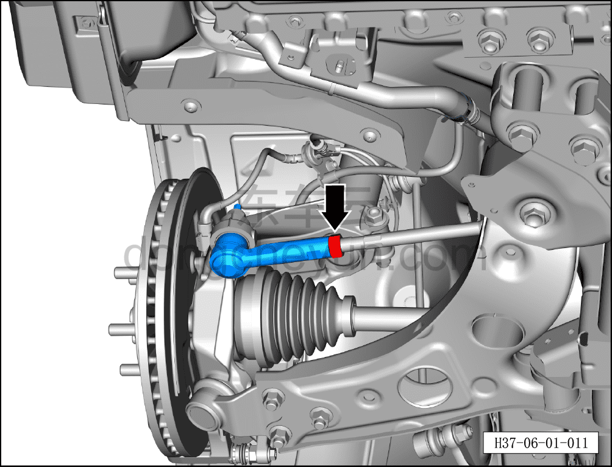
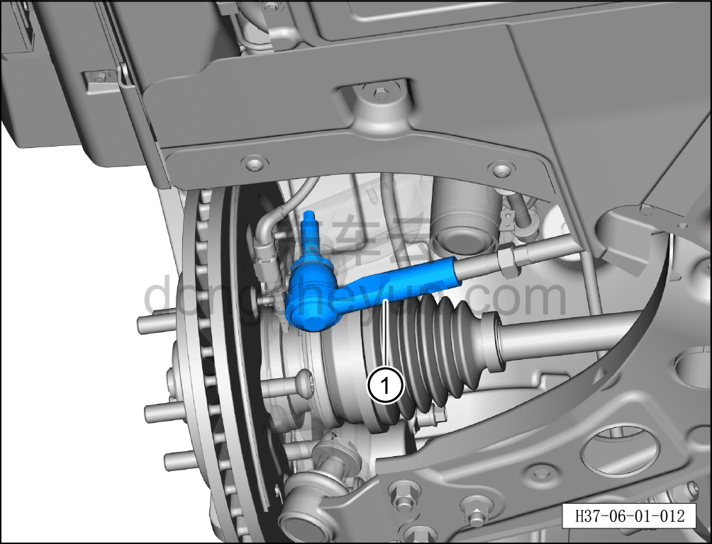

# Снятие и установка левого наружного шарового шарнира рулевого механизма

> Система шасси › Система рулевого управления › Узел рулевого управления передних колёс  
> Оригинал: `拆卸与安装转向器左外球头` · [dongcheyun 56746](https://dongcheyun.com/p/56746), страница `6e8067340b5d471ba3048246d96546e9` · [оглавление](../README.md)

**Порядок снятия**

**Примечание:**

**- Ниже описано снятие и установка левого наружного шарового шарнира рулевого механизма; для правой стороны можно руководствоваться порядком для левой.**

1. Выключите все электроприборы, отключите питание.

2. Выполните операцию обесточивания автомобиля для ремонта. См. [3.1.4.1 Обесточивание автомобиля](../03-техническое-обслуживание/005-обесточивание-автомобиля.md)

3. Снимите переднее колесо. См. [6.5.8.1 Снятие и установка колеса](064-снятие-и-установка-колеса.md)

4. Поднимите автомобиль на подъёмнике на подходящую высоту.

5. Снятие левого наружного шарового шарнира рулевого механизма.

a. Используя гаечный ключ на 24 мм, отверните соединительную гайку внутренней и наружной рулевых тяг.

Момент затяжки гайки составляет: 72±8 Н·м

**Внимание:**

**- Перед снятием необходимо маркером отметить положение наружной тяги, чтобы облегчить установку.**

b. Используя биту на 8 мм для фиксации оси пальца, совместно с гаечным ключом на 21 мм, выверните крепёжную гайку.

Момент затяжки гайки составляет: 120±12 Н·м

c. Используя специальный инструмент (H52246001), отсоедините левый наружный шаровой шарнир рулевого механизма от рулевого кулака.

d. Выверните левый наружный шаровой шарнир рулевого механизма①.

**Порядок установки**

Установка выполняется в обратном порядке.

**Внимание:**

**- Выполните развал-схождение;**

**- Выполните регулировку схождения передних колёс. См. [6.1.6.5 Регулировка схождения передних колёс](009-регулировка-схождения-передних-колёс.md)**

**- После завершения ремонта обязательно выполните дорожное испытание, убедитесь в отсутствии посторонних шумов со стороны шасси и явления увода.**
