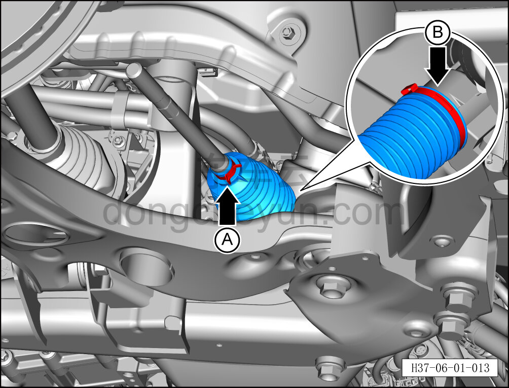
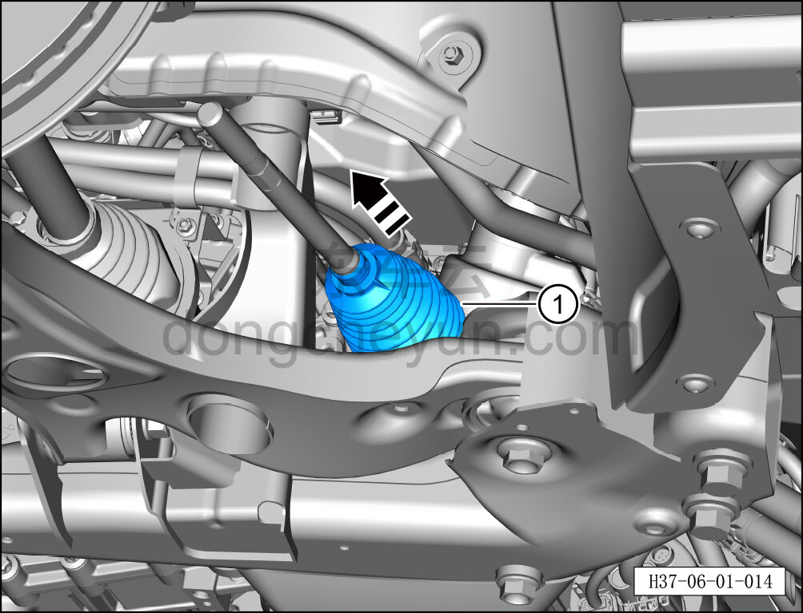

# Снятие и установка пыльника вала рулевого управления

> Система шасси › Система рулевого управления › Узел рулевого управления передних колёс  
> Оригинал: `拆卸与安装转向轴防尘罩` · [dongcheyun 56746](https://dongcheyun.com/p/56746), страница `e7f118103bd648d2a667d07f8b536891` · [оглавление](../README.md)

**Порядок снятия**

**Примечание:**

**- Ниже описано снятие и установка пыльника вала рулевого управления; для правой стороны можно руководствоваться порядком для левой.**

1. Выключите все электроприборы, отключите питание.

2. Выполните операцию обесточивания автомобиля для ремонта. См. [3.1.4.1 Обесточивание автомобиля](../03-техническое-обслуживание/005-обесточивание-автомобиля.md)

3. Поднимите автомобиль на подъёмнике на подходящую высоту.

4. Снимите переднюю нижнюю защитную панель. См. [8.6.4.3 Снятие и установка передней нижней защитной панели](../08-внутренняя-и-внешняя-отделка/193-снятие-и-установка-переднего-нижнего-защитного-щитка.md)

5. Снимите наружный шаровой шарнир рулевого механизма. См. [6.1.6.2 Снятие и установка левого наружного шарового шарнира рулевого механизма](007-снятие-и-установка-левого-наружного-шарового-шарнира.md)

6. Снятие пыльника вала рулевого управления.

a. Отсоедините фиксирующий хомут A и фиксирующее кольцо B пыльника вала рулевого управления.

**Внимание:**

**- Кольцо является одноразовой деталью, после снятия необходимо заменить его на новое при установке.**

b. Снимите пыльник вала рулевого управления① в направлении стрелки.

**Порядок установки**

Установка выполняется в обратном порядке.

**Внимание:**

**- Выполните развал-схождение;**

**- Выполните регулировку схождения передних колёс. См. [6.1.6.5 Регулировка схождения передних колёс](009-регулировка-схождения-передних-колёс.md)**

**- После завершения ремонта обязательно выполните дорожное испытание, убедитесь в отсутствии посторонних шумов со стороны шасси и явления увода.**
