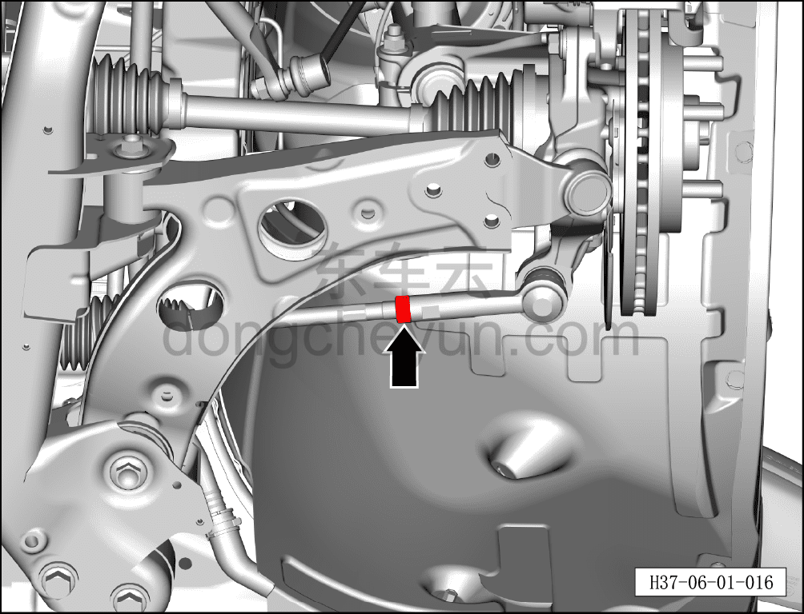

# Регулировка схождения передних колёс

> Система шасси › Система рулевого управления › Узел рулевого управления передних колёс  
> Оригинал: `前轮前束调整` · [dongcheyun 56746](https://dongcheyun.com/p/56746), страница `d86eaf364fc946998c38658c03e376d0` · [оглавление](../README.md)

**Порядок снятия**

**Примечание:**

**- Ниже описана соединительная гайка левой внутренней/наружной тяги; для правой стороны можно руководствоваться порядком для левой.**

1. Выключите все электроприборы, отключите питание.

2. Выполните обесточивание автомобиля для ремонта. См. [3.1.4.1 Обесточивание автомобиля](../03-техническое-обслуживание/005-обесточивание-автомобиля.md)

3. Снимите переднее колесо. См. [6.5.8.1 Снятие и установка колеса](064-снятие-и-установка-колеса.md)

4. Поднимите автомобиль на подъёмнике на подходящую высоту.

5. Снимите переднюю нижнюю защитную панель. См. [8.6.4.3 Снятие и установка передней нижней защитной панели](../08-внутренняя-и-внешняя-отделка/193-снятие-и-установка-переднего-нижнего-защитного-щитка.md)

6. Снимите болт полуоси вала рулевого управления. См. [6.1.6.1 Снятие и установка рулевого механизма с поперечной тягой в сборе](006-снятие-и-установка-рулевого-механизма.md)

7. Регулировка схождения передних колёс.

a. Используя гаечный ключ на 24 мм, отверните соединительную гайку внутренней и наружной рулевых тяг.

b. Используя гаечный ключ на 15 мм, установите внутреннюю рулевую тягу① в нужное положение и затяните соединительную гайку внутренней и наружной рулевых тяг гаечным ключом на 24 мм.

Момент затяжки гайки: 72±8 Н·м

**Порядок установки**

Установка выполняется в обратном порядке.

**Внимание:**

**- После завершения ремонта обязательно выполните дорожное испытание, убедитесь в отсутствии посторонних шумов со стороны шасси и явления увода.**
