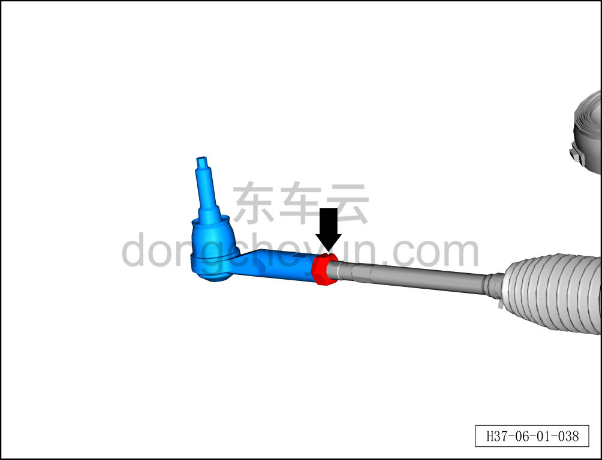
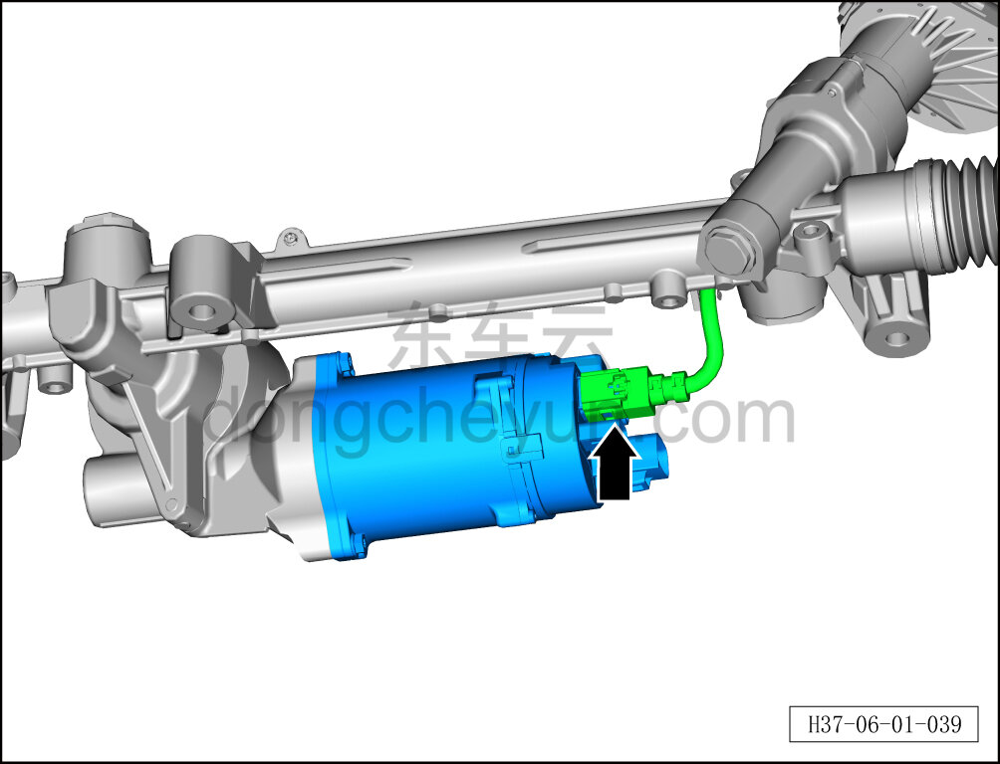
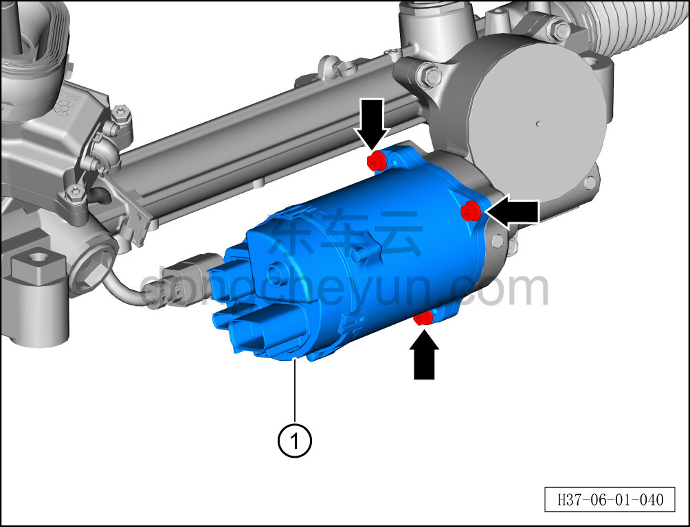
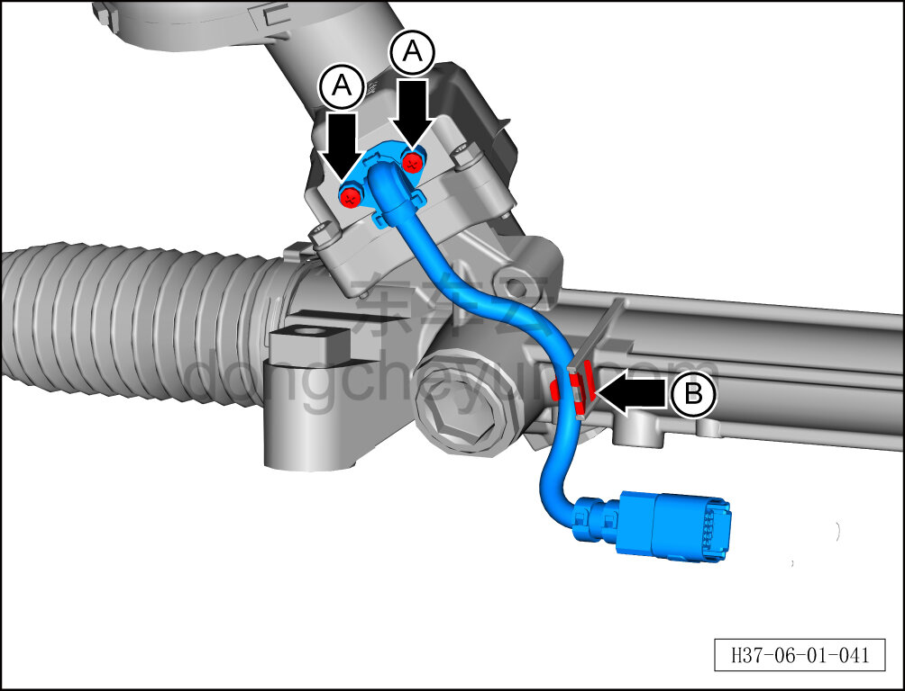
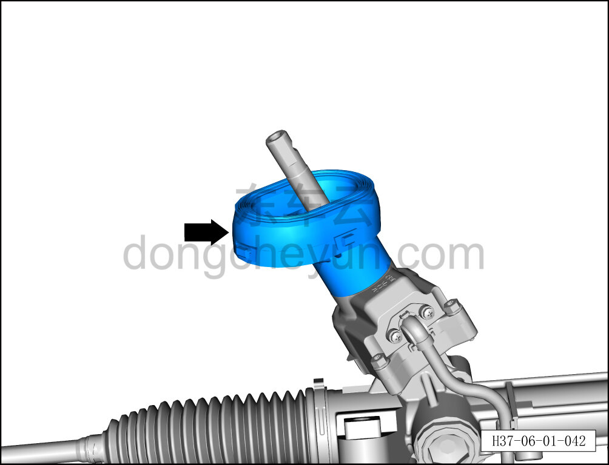
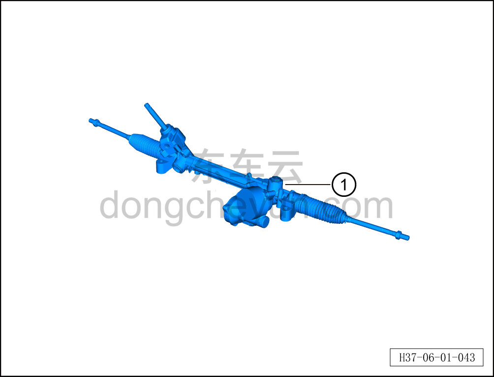

# Снятие и установка механического узла рулевого механизма

> Система шасси › Система рулевого управления › Узел рулевого управления передних колёс  
> Оригинал: `拆卸与安装转向器机械总成` · [dongcheyun 56746](https://dongcheyun.com/p/56746), страница `11750418b0fd47ffb707304aad2d8979` · [оглавление](../README.md)

**Порядок снятия**

1. Выполните операцию обесточивания автомобиля для ремонта. См. [3.1.4.1 Обесточивание автомобиля](../03-техническое-обслуживание/005-обесточивание-автомобиля.md)

2. Поднимите автомобиль на подъёмнике на подходящую высоту.

3. Снимите переднюю нижнюю защитную панель. См. [8.6.4.3 Снятие и установка передней нижней защитной панели](../08-внутренняя-и-внешняя-отделка/193-снятие-и-установка-переднего-нижнего-защитного-щитка.md)

4. Снимите рулевой механизм в сборе. См. [6.1.6.1 Снятие и установка рулевого механизма с поперечной тягой в сборе](006-снятие-и-установка-рулевого-механизма.md)

5. Снятие механического узла рулевого механизма.

a. Используя гаечный ключ на 24 мм, отверните соединительную гайку внутренней и наружной рулевых тяг.

Момент затяжки гайки составляет: 72±8 Н·м

**Внимание:**

**- Перед снятием необходимо маркером отметить положение наружной тяги, чтобы облегчить установку.**

b. Отсоедините разъём жгута датчика рулевого механизма.

**Примечание:**

**- Перед снятием очистите поверхность от пыли и мусора безворсовой салфеткой или сжатым воздухом, чтобы предотвратить попадание внутрь рулевого механизма при разборке.**

c. Используя торцевую головку на 10 мм, выверните 3 крепёжных болта узла контроллера мотора рулевого механизма.

d. Снимите узел контроллера мотора рулевого механизма①.

**Внимание:**

**- Не извлекайте узел контроллера мотора рулевого механизма с усилием.**

e. Используя крестовую отвёртку, выверните 2 крепёжных винта A разъёма жгута датчика рулевого механизма.

f. Отсоедините жгут датчика рулевого механизма от фиксирующей клипсы B.

g. Снимите жгут датчика рулевого механизма.

h. Снимите вверх пыльник входного вала.

h. Извлеките механический узел рулевого механизма①.

**Порядок установки**

Установка выполняется в обратном порядке.

**Внимание:**

**- Выполните развал-схождение;**

**- После завершения ремонта обязательно выполните дорожное испытание, убедитесь в отсутствии посторонних шумов со стороны шасси и явления увода.**
