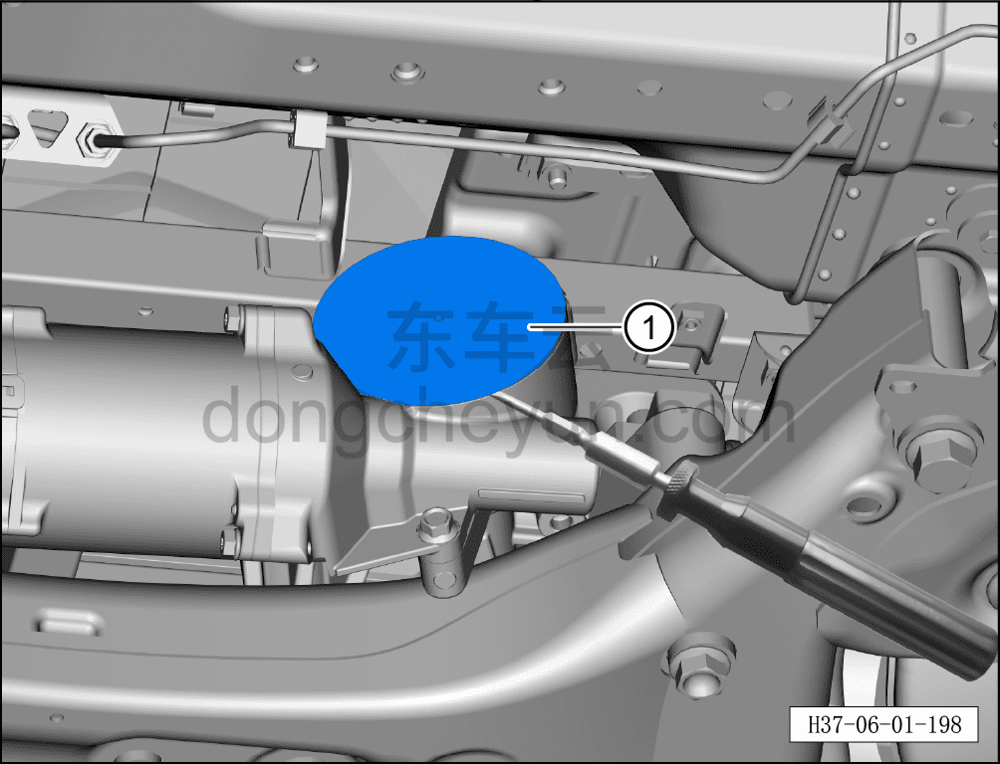
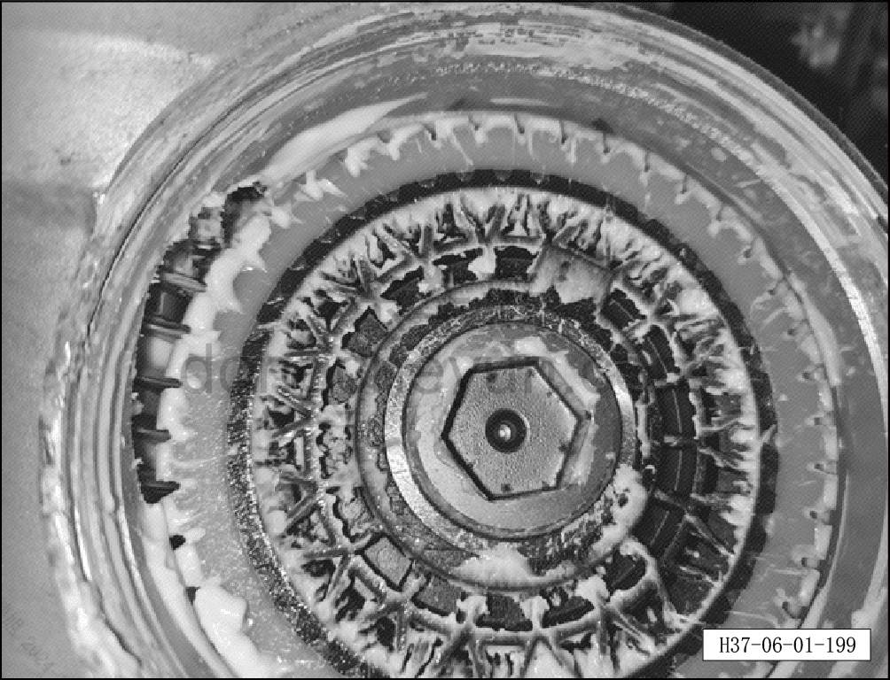
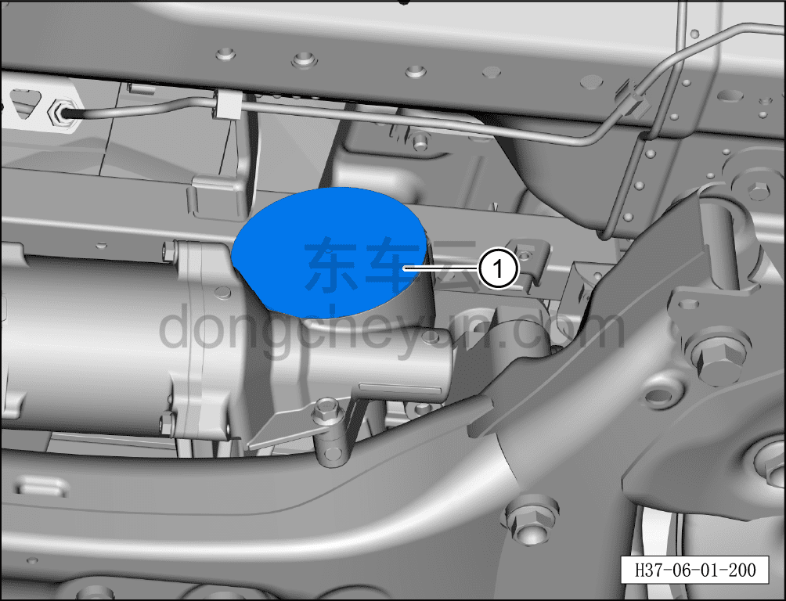

# Устранение заклинивания рулевого механизма

> Система шасси › Система рулевого управления › Узел рулевого управления передних колёс  
> Оригинал: `转向器卡滞维护` · [dongcheyun 56746](https://dongcheyun.com/p/56746), страница `8704ded65a1648908d3f765f250874c6` · [оглавление](../README.md)

**Порядок обслуживания**

1. Выполните операцию обесточивания автомобиля для ремонта. См. [3.1.4.1 Обесточивание автомобиля](../03-техническое-обслуживание/005-обесточивание-автомобиля.md)

2. Поднимите автомобиль на подъёмнике на подходящую высоту.

3. Снимите переднюю нижнюю защитную панель. См. [8.6.4.3 Снятие и установка передней нижней защитной панели](../08-внутренняя-и-внешняя-отделка/193-снятие-и-установка-переднего-нижнего-защитного-щитка.md)

4. Нанесите смазку.

a. Отведите патрубок отвода воды кондиционера, чтобы избежать попадания капель воды внутрь корпуса в процессе обслуживания.

b. Используя плоскую отвёртку, упритесь в место соединения задней крышки и корпуса, лёгкими ударами резинового молотка снимите заднюю крышку①. (Наносите удары с разных сторон примерно 3 раза, после образования зазора удерживайте крышку рукой, плоской отвёрткой расширяйте зазор по окружности, после чего заднюю крышку можно снять)

**Внимание:**

**- Перед снятием очистите от пыли и других загрязнений периметр задней крышки рулевого механизма.**

c. Вручную переместите колесо в правое крайнее положение, нанесите смазку на червяк в указанном на рисунке месте, затем сдвиньте колесо влево — вы увидите, как смазка затягивается внутрь; повторяйте это действие, пока червячное колесо не повернётся более чем на один оборот, а расход смазки из ремонтного комплекта не превысит 4/5.

**Внимание:**

**- Подвигайте колесо влево-вправо несколько раз; если наружу выдавливается большое количество смазки, чистым инструментом соберите её на зубья червяка, затем снова сдвиньте колесо влево.**

5. Установка крышки обратно.

a. Возьмите новую крышку, проверьте её состояние, убедитесь в целостности уплотнительного кольца круглого сечения.

b. На внешней стороне уплотнительного кольца круглого сечения расположены 4 симметричных выступа; нанесите на выступы равномерно небольшое количество смазки, установите заднюю крышку① обратно на корпус. (Подложите под заднюю крышку небольшой резиновый молоток и с помощью монтажки вдавите заднюю крышку на место)

**Внимание:**

**- После завершения установки проверьте отсутствие зазора между периметром задней крышки и корпусом.**

6. Установите переднюю нижнюю защитную панель. См. [8.6.4.3 Снятие и установка передней нижней защитной панели](../08-внутренняя-и-внешняя-отделка/193-снятие-и-установка-переднего-нижнего-защитного-щитка.md)

**Внимание:**

**- После завершения установки проверьте, устранена ли неисправность заклинивания рулевого управления.**
