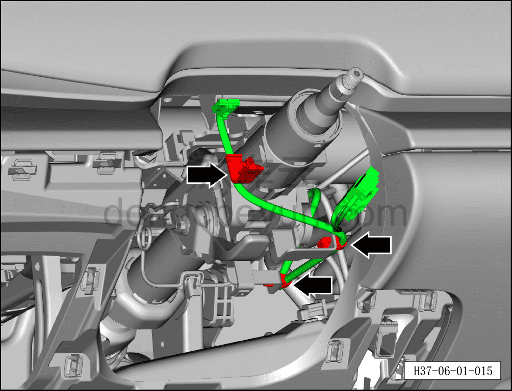
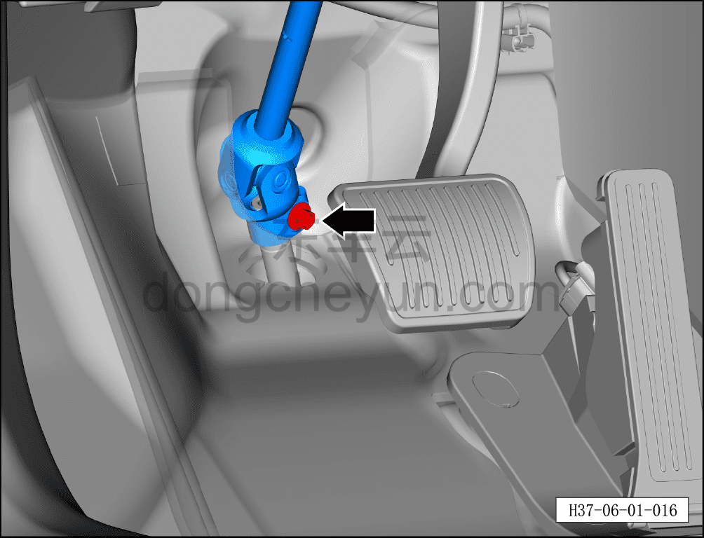
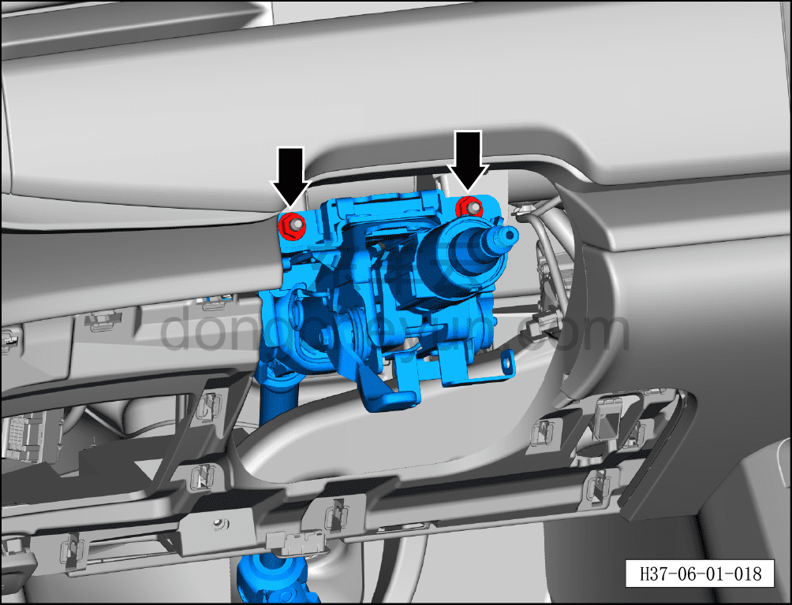
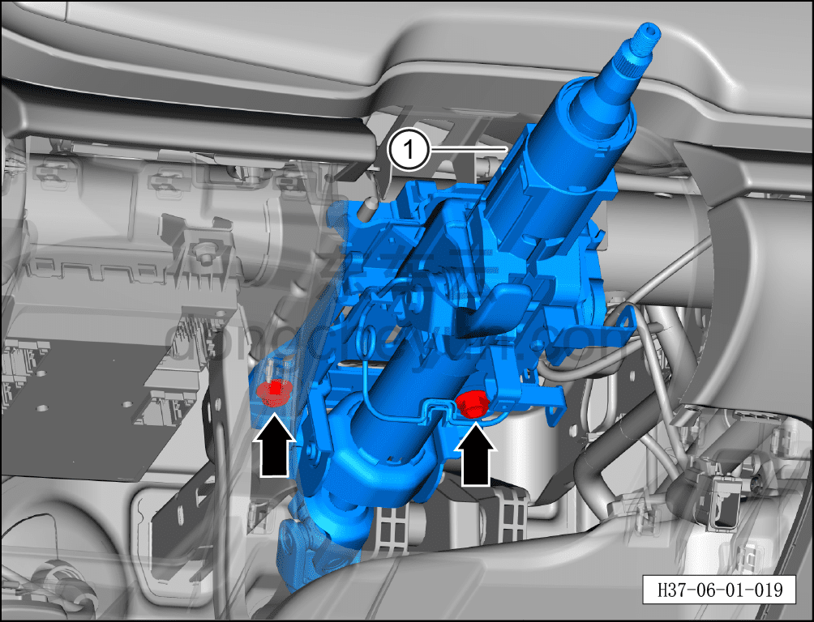

# Снятие и установка рулевой колонки с промежуточным валом в сборе

> Система шасси › Система рулевого управления › Рулевая колонка в сборе  
> Оригинал: `拆卸与安装转向管柱带中间轴总成` · [dongcheyun 56746](https://dongcheyun.com/p/56746), страница `0005312b87824757ba4343f1a547299d` · [оглавление](../README.md)

**Порядок снятия**

1. Выключите все электроприборы, отключите питание.

2. Выполните операцию обесточивания автомобиля для ремонта. См. [3.1.4.1 Обесточивание автомобиля](../03-техническое-обслуживание/005-обесточивание-автомобиля.md)

3. Поднимите автомобиль на подъёмнике на подходящую высоту.

4. Снимите узел левой нижней защитной панели. См. [8.2.4.2 Снятие и установка узла левой нижней защитной панели](../08-внутренняя-и-внешняя-отделка/055-снятие-и-установка-нижней-левой-защитной-накладки-в.md)

5. Снимите нижний защитный кожух рулевой колонки. См. [8.2.4.24 Снятие и установка нижнего защитного кожуха рулевой колонки](../08-внутренняя-и-внешняя-отделка/077-снятие-и-установка-нижнего-кожуха-рулевой-колонки.md)

6. Снимите рулевое колесо. См. [11.1.4.1 Снятие и установка рулевого колеса](../11-система-безопасности/004-снятие-и-установка-рулевого-колеса.md)

7. Снятие рулевой колонки с промежуточным валом в сборе.

a. Используя инструмент для снятия элементов обивки, отсоедините 3 фиксирующие клипсы жгута приборной панели.

b. Используя торцевую головку на 10 мм, выверните соединительный болт рулевой колонки с промежуточным валом в сборе и рулевого механизма в сборе.

Момент затяжки болта составляет: 20±2 Н·м

c. Используя торцевую головку на 13 мм, выверните 2 крепёжные гайки рулевой колонки с промежуточным валом в сборе.

Момент затяжки гаек составляет: 23±2 Н·м

d. Используя торцевую головку на 13 мм, выверните 2 крепёжных болта рулевой колонки с промежуточным валом в сборе.

e. Извлеките рулевую колонку с промежуточным валом в сборе①.

Момент затяжки болтов составляет: 23±2 Н·м

**Порядок установки**

Установка выполняется в обратном порядке.

**Внимание:**

**- Выполните развал-схождение;**

**- После завершения ремонта обязательно выполните дорожное испытание, убедитесь в отсутствии посторонних шумов со стороны шасси и явления увода.**
