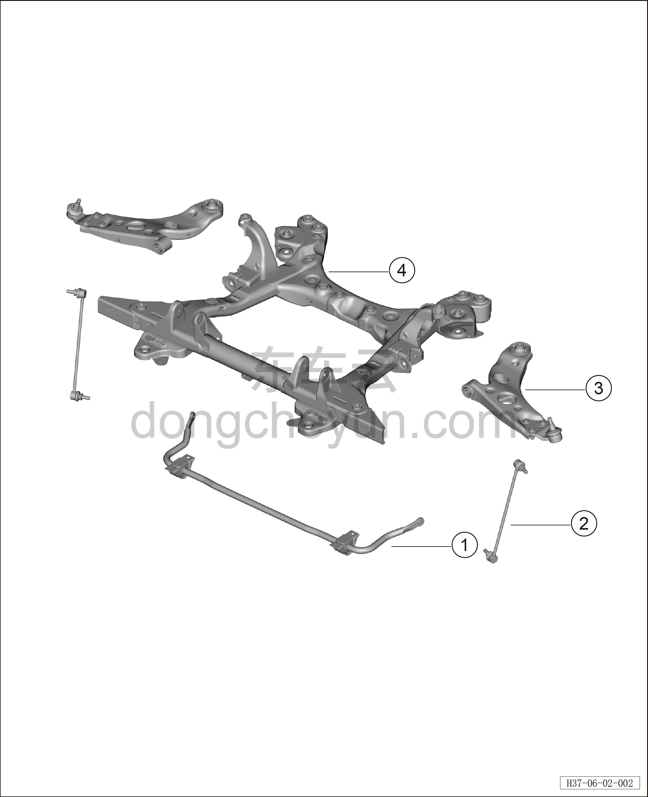

# Покомпонентный вид (деталировка)

> Система шасси › Система передней подвески  
> Оригинал: `结构分解图` · [dongcheyun 56746](https://dongcheyun.com/p/56746), страница `925e9a097c054a828b5bcbf69e165e11` · [оглавление](../README.md)

| № | Наименование детали | Кол-во на автомобиль | Примечание |
|---|---|---|---|
| 1 | Передний стабилизатор поперечной устойчивости | 1 |   |
| 2 | Стойка переднего стабилизатора поперечной устойчивости | 2 |   |
| 3 | Нижний рычаг передней подвески | 2 |   |
| 4 | Передний подрамник | 1 |   |
