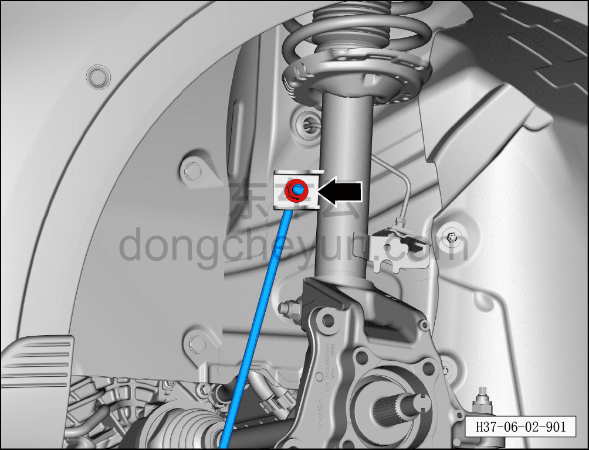
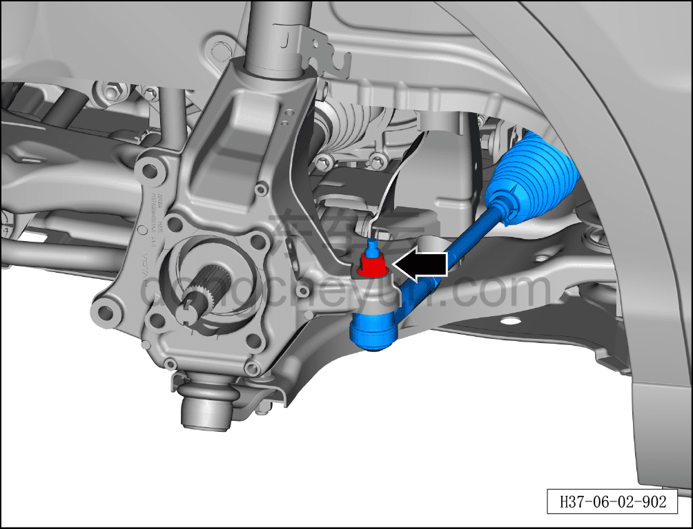
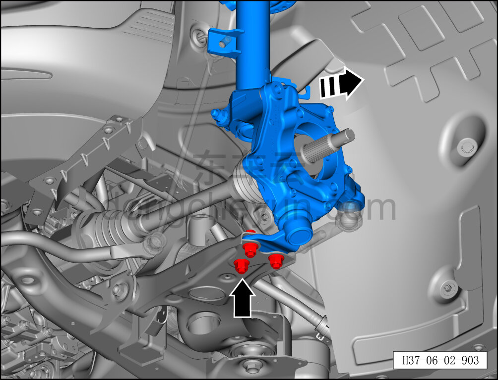
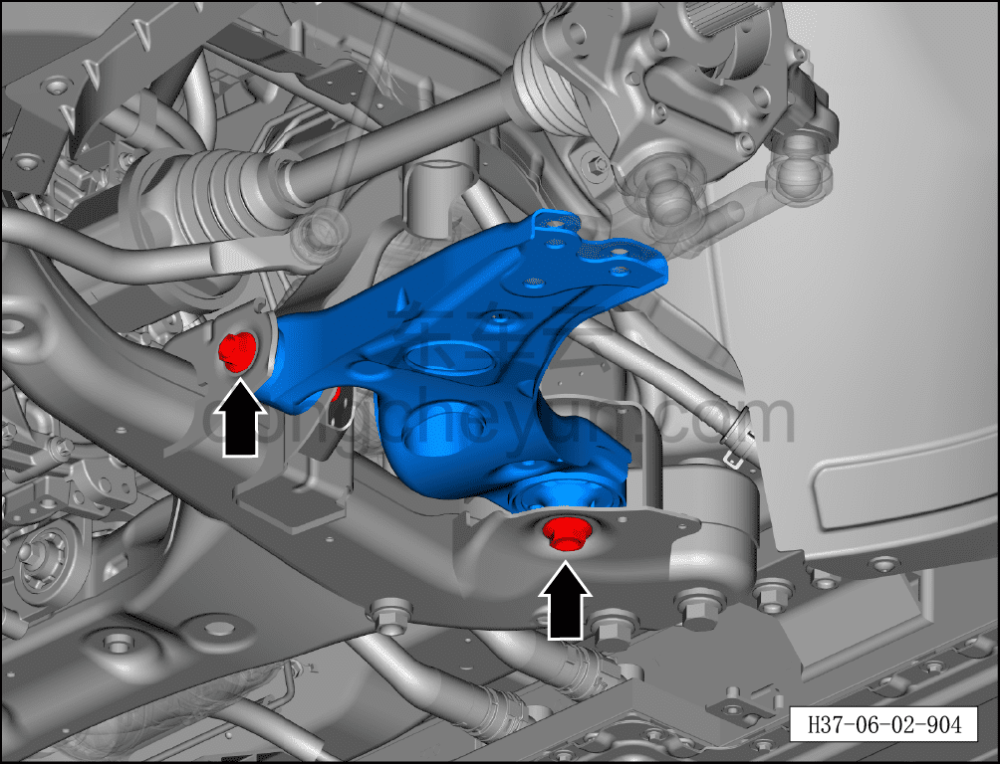
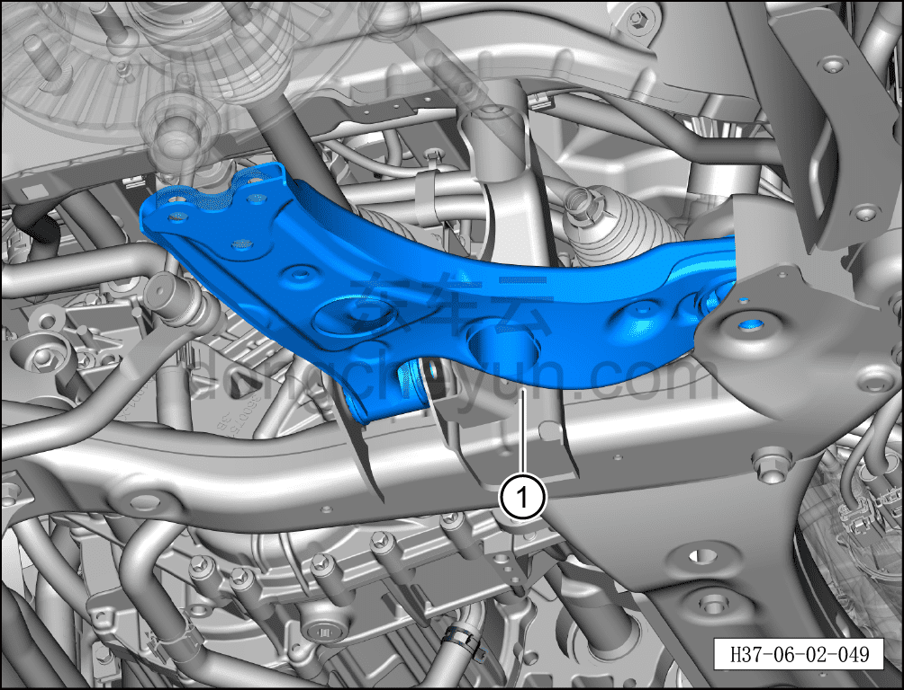
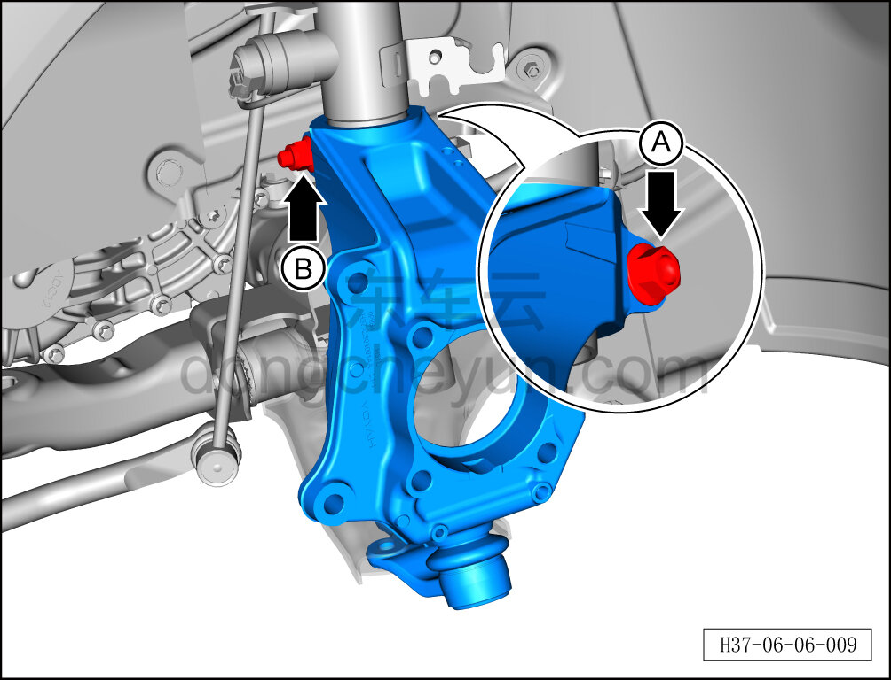
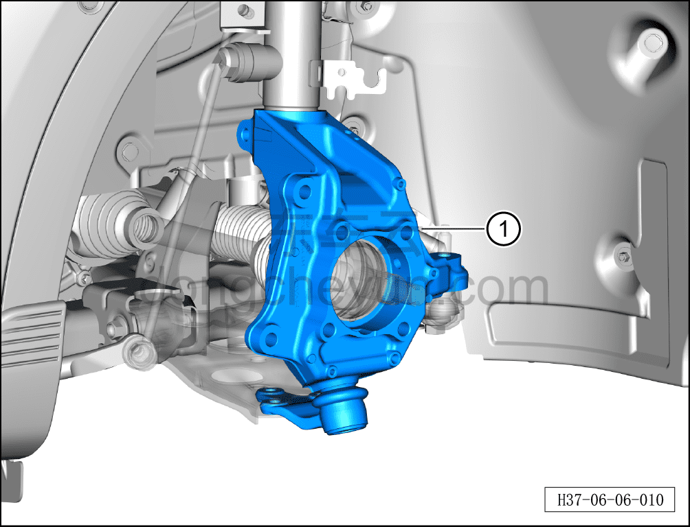
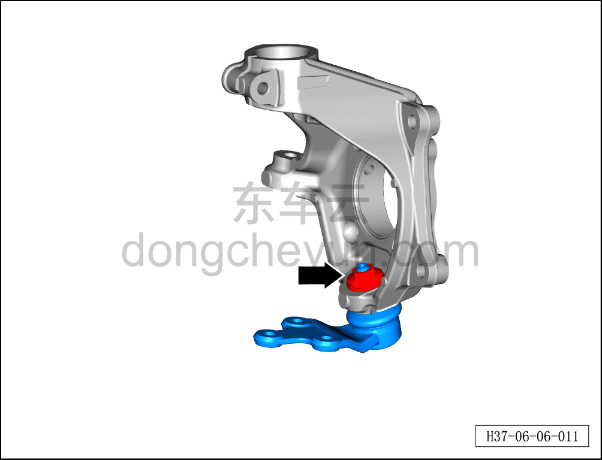
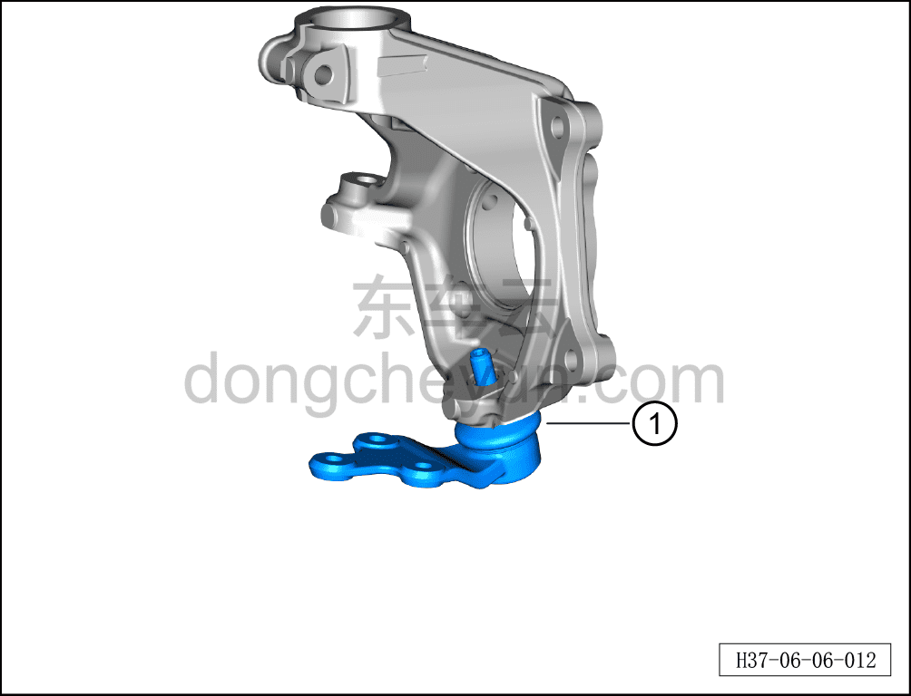

# Снятие и установка нижнего рычага передней подвески с шаровым пальцем в сборе

> Система шасси › Система передней подвески › Передний рычаг подвески  
> Оригинал: `拆卸与安装前悬架下控制臂带球销总成` · [dongcheyun 56746](https://dongcheyun.com/p/56746), страница `366947e1bffd487e833b9f9bc18c73af` · [оглавление](../README.md)

**Порядок снятия**

**Примечание:**

**- Ниже описано снятие и установка левого нижнего рычага передней подвески с шаровым пальцем в сборе; для правой стороны можно руководствоваться порядком для левой.**

1. Выключите все электроприборы, отключите питание.

2. Выполните операцию обесточивания автомобиля для ремонта. См. [3.1.4.1 Обесточивание автомобиля](../03-техническое-обслуживание/005-обесточивание-автомобиля.md)

3. Снимите переднее колесо. См. [6.5.8.1 Снятие и установка колеса](064-снятие-и-установка-колеса.md)

4. Поднимите автомобиль на подъёмнике на подходящую высоту.

5. Снимите защитный кожух переднего тормозного диска. См. [6.6.7.3 Снятие и установка защитного кожуха переднего тормозного диска](086-снятие-и-установка-защитного-кожуха-переднего.md)

6. Снимите подшипник переднего колёсного узла. См. [6.6.6.7 Снятие и установка подшипника колёсного узла (переднее колесо)](079-снятие-и-установка-ступичного-подшипника-переднее.md)

7. Снимите датчик скорости переднего колеса. См. [6.7.6.1 Снятие и установка датчика скорости колеса](104-снятие-и-установка-датчика-скорости-колеса.md)

8. Снятие левого нижнего рычага передней подвески с шаровым пальцем в сборе.

a. Используя биту TX30 для фиксации совместно с гаечным ключом на 18 мм, выверните крепёжную гайку стойки левого переднего стабилизатора поперечной устойчивости.

Момент затяжки гайки: 60 Н·м+45°

b. Используя торцевую головку на 8 мм для фиксации оси пальца, совместно с гаечным ключом на 21 мм, выверните крепёжную гайку.

Момент затяжки гайки составляет: 120±12 Н·м

c. Используя специальный инструмент (H52246001), отсоедините левый наружный шаровой шарнир рулевого механизма от рулевого кулака.

d. Используя торцевую головку на 15 мм для фиксации крепёжного болта, используя торцевую головку на 18 мм, выверните 3 крепёжные гайки опорной чашки шарового шарнира левого нижнего рычага передней подвески.

e. Отведите стойку переднего амортизатора в сборе и передний рулевой кулак в направлении стрелки до отсоединения опорной чашки шарового шарнира левого нижнего рычага передней подвески от монтажного отверстия нижнего рычага.

f. Используя торцевую головку на 21 мм, выверните 2 крепёжных болта левого нижнего рычага передней подвески.

Момент затяжки болтов составляет: 130 Н·м+120°

g. Снимите левый нижний рычаг передней подвески①.

h. Используя гаечный ключ на 18 мм для фиксации крепёжного болта A, используя торцевую головку на 18 мм, выверните крепёжную гайку B и извлеките крепёжный болт.

Момент затяжки гайки: 60 Н·м+45°

i. Извлеките левый передний рулевой кулак и опорную чашку шарового шарнира левого нижнего рычага передней подвески①.

j. Используя гаечный ключ на 21 мм, выверните крепёжную гайку опорной чашки шарового шарнира левого нижнего рычага передней подвески.

k. Извлеките опорную чашку шарового шарнира нижнего рычага передней подвески①.

**Порядок установки**

Необходимо использовать новый задний рычаг передней подвески с шаровым пальцем в сборе для установки.

**Внимание:**

**- Так как задний рычаг передней подвески и шаровой палец являются единым узлом, а соединительный болт между шаровым пальцем и нижним рычагом передней подвески имеет строгие требования к сборке, после снятия болта необходимо заменить весь узел переднего нижнего рычага с шаровым пальцем на новый, при установке разборка узла не допускается.**

**- Выполните развал-схождение;**

**- После завершения ремонта обязательно выполните дорожное испытание, убедитесь в отсутствии посторонних шумов со стороны шасси и явления увода.**
