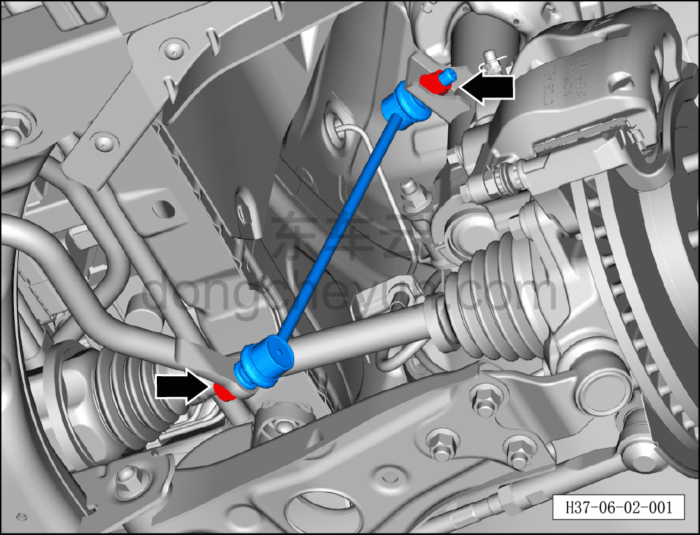
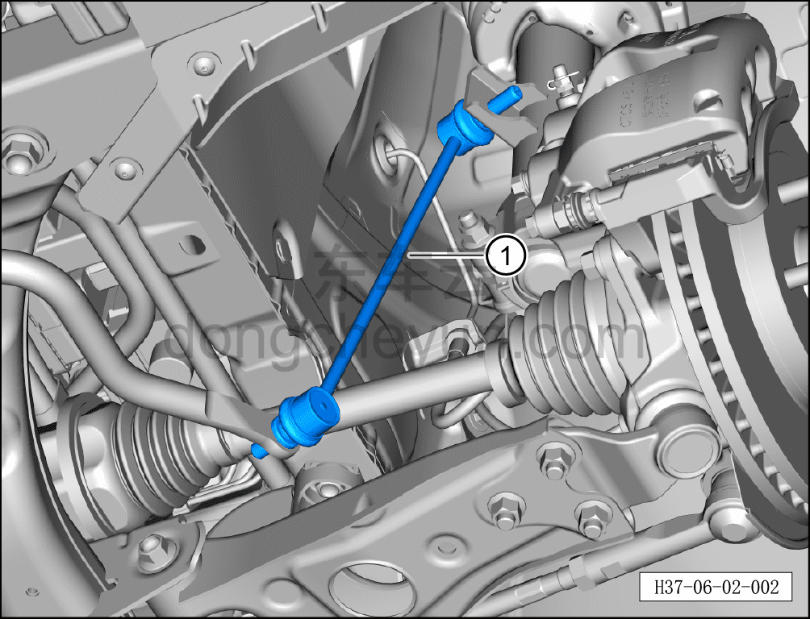

# Снятие и установка стойки левого переднего стабилизатора поперечной устойчивости

> Система шасси › Система передней подвески › Передний стабилизатор поперечной устойчивости  
> Оригинал: `拆卸与安装左前稳定杆接头` · [dongcheyun 56746](https://dongcheyun.com/p/56746), страница `cfd2b085c9dd45c9a83e4ed67a121fe1` · [оглавление](../README.md)

**Порядок снятия**

**Примечание:**

**- Ниже описано снятие стойки левого переднего стабилизатора поперечной устойчивости; для правой стороны можно руководствоваться порядком для левой.**

**- Если стойку переднего стабилизатора поперечной устойчивости трудно снять, можно нажать на передний стабилизатор поперечной устойчивости вниз, пока стойка не будет извлечена.**

1. Выключите все электроприборы, отключите питание.

2. Выполните обесточивание автомобиля для ремонта. См. [3.1.4.1 Обесточивание автомобиля](../03-техническое-обслуживание/005-обесточивание-автомобиля.md)

3. Снимите переднее колесо. См. [6.5.8.1 Снятие и установка колеса](064-снятие-и-установка-колеса.md)

4. Поднимите автомобиль на подъёмнике на подходящую высоту.

5. Снятие стойки левого переднего стабилизатора поперечной устойчивости.

a. Используя биту TX30 для фиксации совместно с гаечным ключом на 18 мм, выверните 2 крепёжные гайки стойки левого переднего стабилизатора поперечной устойчивости.

Момент затяжки гайки: 60 Н·м+45°

b. Извлеките стойку левого переднего стабилизатора поперечной устойчивости①.

**Порядок установки**

Установка выполняется в обратном порядке.

**Внимание:**

**- Выполните развал-схождение;**

**- После завершения ремонта обязательно выполните дорожное испытание, убедитесь в отсутствии посторонних шумов со стороны шасси и явления увода.**
