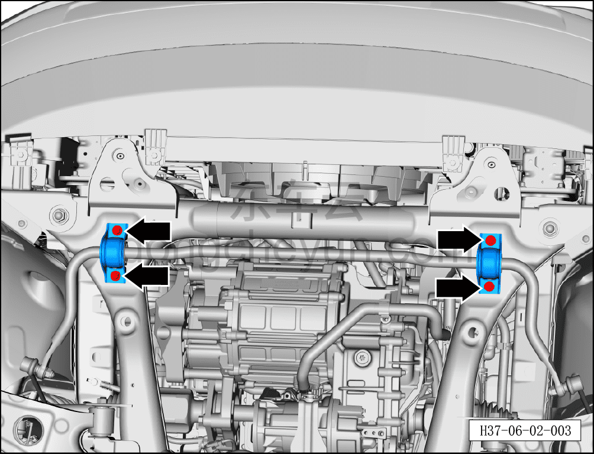
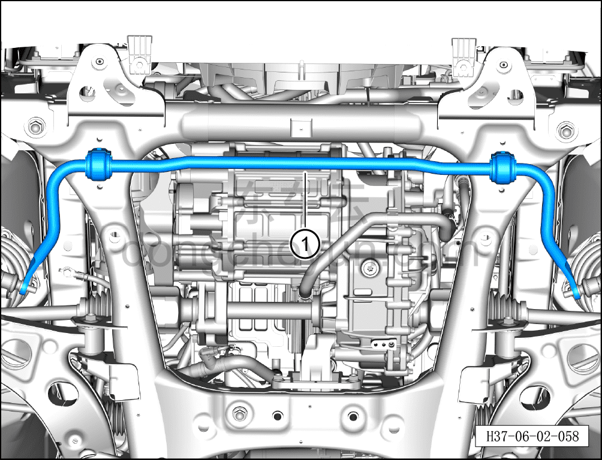

# Снятие и установка переднего стабилизатора поперечной устойчивости

> Система шасси › Система передней подвески › Передний стабилизатор поперечной устойчивости  
> Оригинал: `拆卸与安装前稳定杆` · [dongcheyun 56746](https://dongcheyun.com/p/56746), страница `32784e0b1e5843d882eae973107a630a` · [оглавление](../README.md)

**Порядок снятия**

1. Выключите все электроприборы, отключите питание.

2. Выполните операцию обесточивания автомобиля для ремонта. См. [3.1.4.1 Обесточивание автомобиля](../03-техническое-обслуживание/005-обесточивание-автомобиля.md)

3. Снимите переднее колесо. См. [6.5.8.1 Снятие и установка колеса](064-снятие-и-установка-колеса.md)

4. Поднимите автомобиль на подъёмнике на подходящую высоту.

5. Снимите переднюю нижнюю защитную панель. См. [8.6.4.3 Снятие и установка передней нижней защитной панели](../08-внутренняя-и-внешняя-отделка/193-снятие-и-установка-переднего-нижнего-защитного-щитка.md)

6. Снимите болт и гайку стойки левого переднего стабилизатора поперечной устойчивости. См. [6.2.8.1 Снятие и установка стойки левого переднего стабилизатора поперечной устойчивости](020-снятие-и-установка-стойки-левого-переднего.md)

7. Снятие переднего стабилизатора поперечной устойчивости.

a. Используя торцевую головку на 14 мм, выверните 4 крепёжных болта кронштейна переднего стабилизатора поперечной устойчивости, снимите кронштейн переднего стабилизатора поперечной устойчивости.

Момент затяжки болтов: 65±5 Н·м

b. Снимите передний стабилизатор поперечной устойчивости①.

**Порядок установки**

Установка выполняется в обратном порядке.

**Внимание:**

**- Выполните развал-схождение;**

**- После завершения ремонта обязательно выполните дорожное испытание, убедитесь в отсутствии посторонних шумов со стороны шасси и явления увода.**
