# Снятие и установка переднего подрамника и переднего тягового электродвигателя в сборе (полный привод)

> Система шасси › Система передней подвески › Передний подрамник и передний тяговый электродвигатель в сборе  
> Оригинал: `拆卸与安装前副车架及前驱动电机总成（四驱）` · [dongcheyun 56746](https://dongcheyun.com/p/56746), страница `9cb612b1b2744909b37ce80d405b6687` · [оглавление](../README.md)

**Порядок снятия**

**Примечание:**

**- Передний подрамник необходимо снимать вместе с передним тяговым электродвигателем, и только затем разделять их.**

**- При снятии левого переднего тормозного суппорта не требуется отворачивать крепёжный болт соединения тормозного шланга с суппортом.**

**- После снятия тормозного суппорта закрепите его стальной проволокой в месте, не мешающем снятию и не создающем натяжения тормозного шланга.**

1. Выключите все электроприборы, отключите питание.

2. Выполните операцию обесточивания автомобиля для ремонта. См. [3.1.4.1 Обесточивание автомобиля](../03-техническое-обслуживание/005-обесточивание-автомобиля.md)

4. Слейте охлаждающую жидкость тягового электродвигателя. См. [3.1.5.1 Замена охлаждающей жидкости тягового электродвигателя и тяговой батареи](../03-техническое-обслуживание/006-замена-охлаждающей-жидкости-тягового-электродвигателя.md)

5. Соберите (откачайте) хладагент. См. [10.1.6.12 Сбор/откачка/заправка хладагента](../10-кондиционер/045-сбор-вакуумирование-заправка-хладагента.md)

6. Снимите переднее колесо. См. [6.5.8.1 Снятие и установка колеса](064-снятие-и-установка-колеса.md)

7. Снимите левый и правый передние тормозные суппорты. См. [6.6.6.1 Снятие и установка левого переднего тормозного суппорта](074-снятие-и-установка-левого-переднего-тормозного-суппорта.md)

8. Снятие переднего подрамника и переднего тягового электродвигателя в сборе.

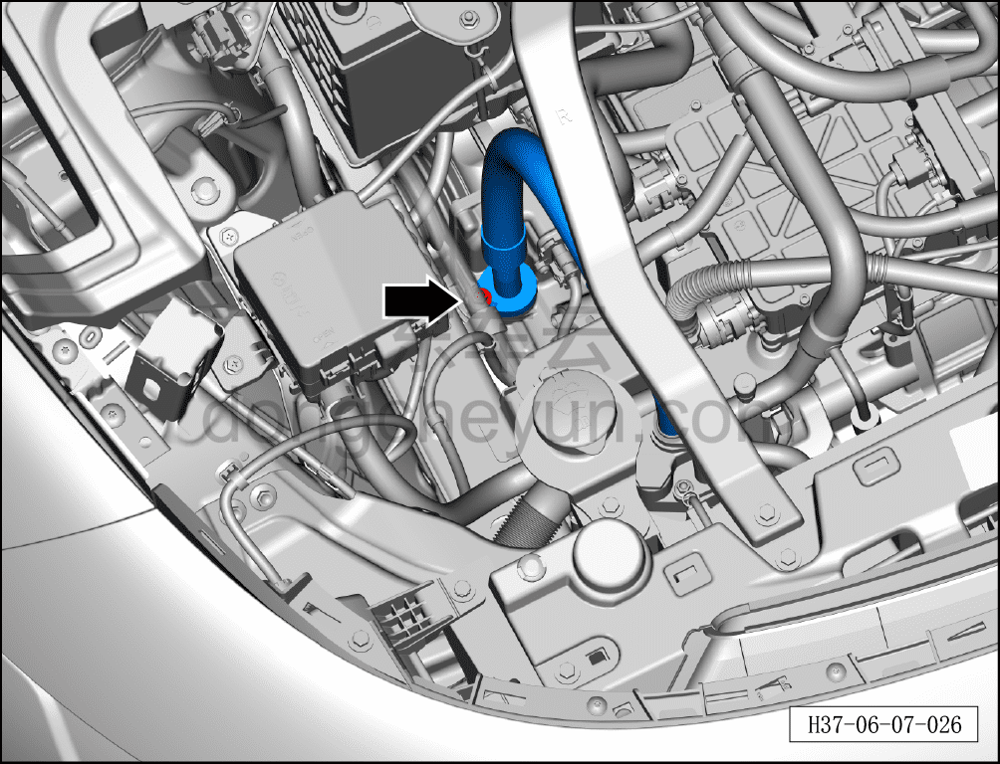

a. Используя торцевую головку на 10 мм, выверните крепёжный болт всасывающего трубопровода компрессора, отсоедините всасывающий трубопровод компрессора.

Момент затяжки болтов: 10±1 Н·м

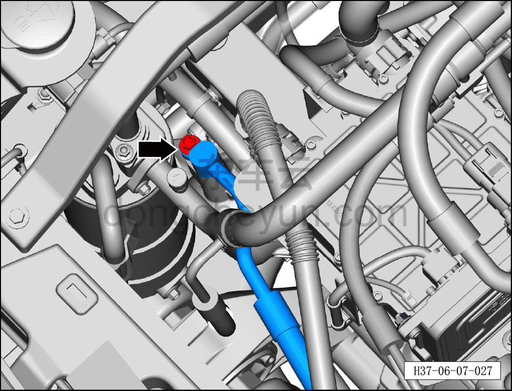

b. Используя торцевую головку на 10 мм, выверните крепёжный болт нагнетательного трубопровода компрессора, отсоедините нагнетательный трубопровод компрессора.

Момент затяжки болтов: 10±1 Н·м

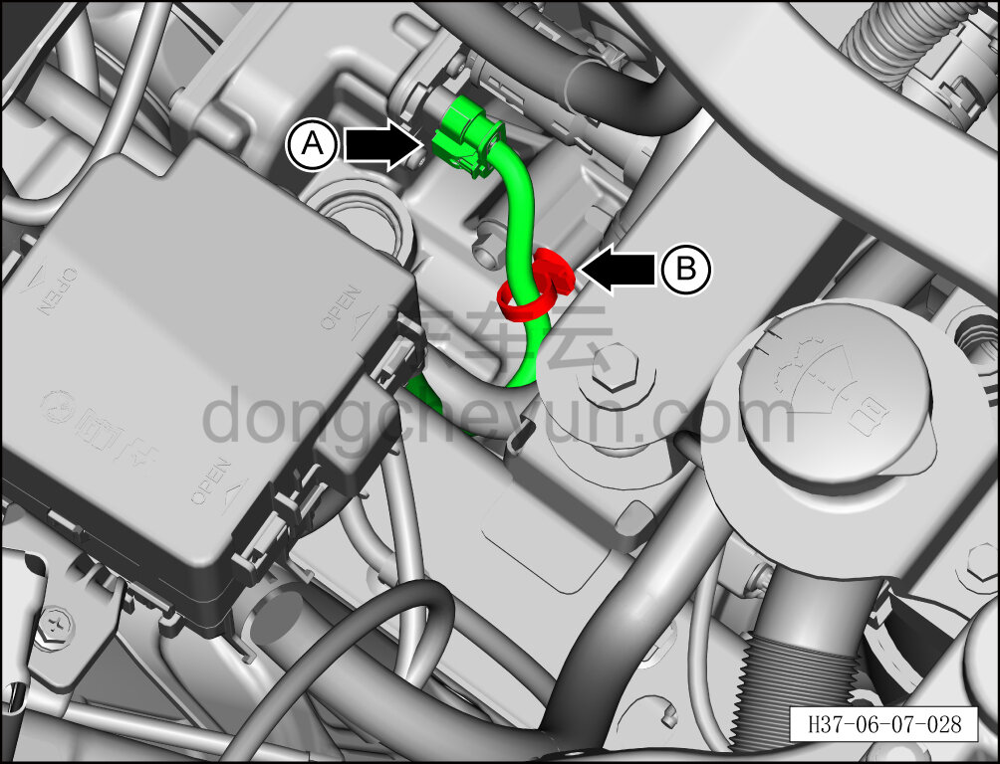

c. Отсоедините разъём жгута компрессора A и фиксирующую клипсу жгута компрессора B.

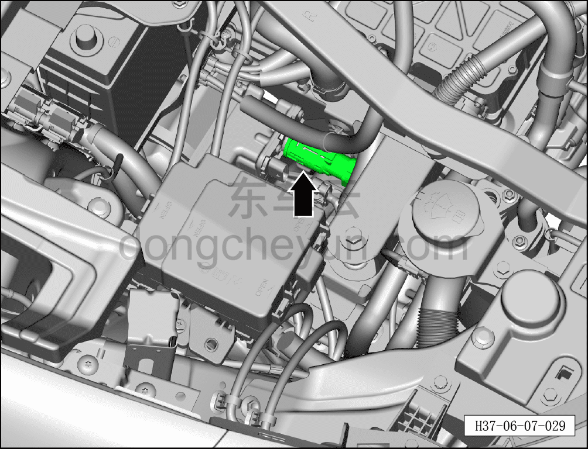

d. Вытяните фиксатор, нажмите на фиксатор разъёма, отсоедините разъём высоковольтного жгута PTC-компрессора.

**Внимание:**

**- После снятия закройте высоковольтный порт, к которому подключается высоковольтный жгут PTC-компрессора (со стороны PTC), чистой изолирующей защитной крышкой, чтобы предотвратить попадание посторонних предметов или случайное касание.**

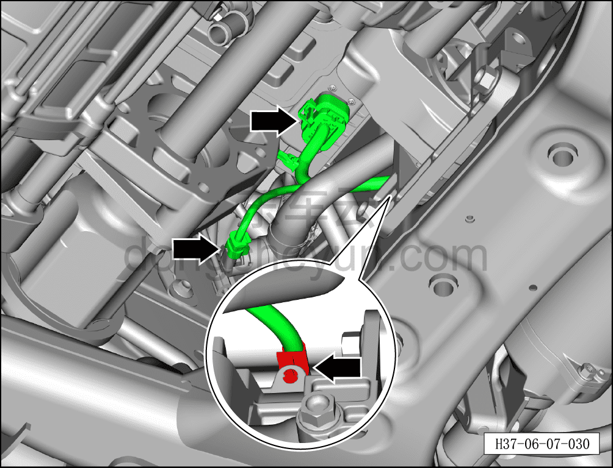

e. Отсоедините 2 разъёма жгута переднего отсека, отсоедините фиксирующую клипсу жгута переднего отсека, отведите жгут переднего отсека в место, не мешающее снятию.

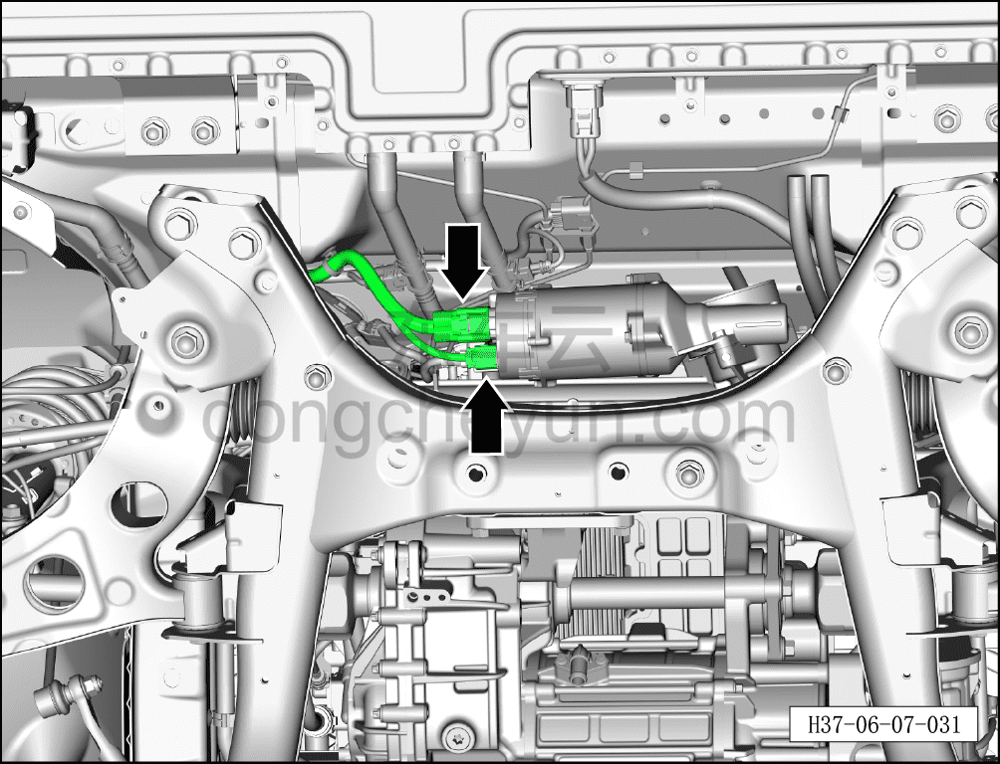

f. Отсоедините 2 разъёма жгута рулевого механизма в сборе.

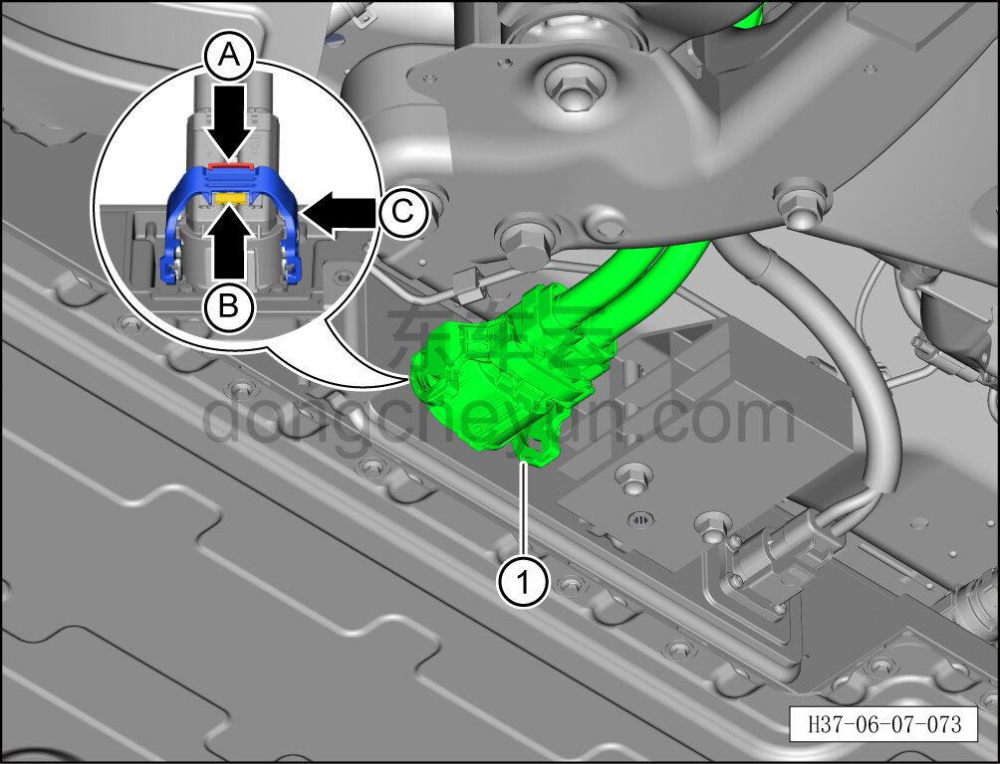

g. Вытяните фиксатор разъёма A для разблокировки, удерживая кнопку фиксации разъёма B, поверните рукоятку разъёма C, отсоедините разъём① высоковольтного жгута переднего электродвигателя.

**Внимание:**

**- После снятия закройте высоковольтный порт, к которому подключается высоковольтный жгут переднего электродвигателя, чистой изолирующей защитной крышкой, чтобы предотвратить попадание посторонних предметов или случайное касание.**

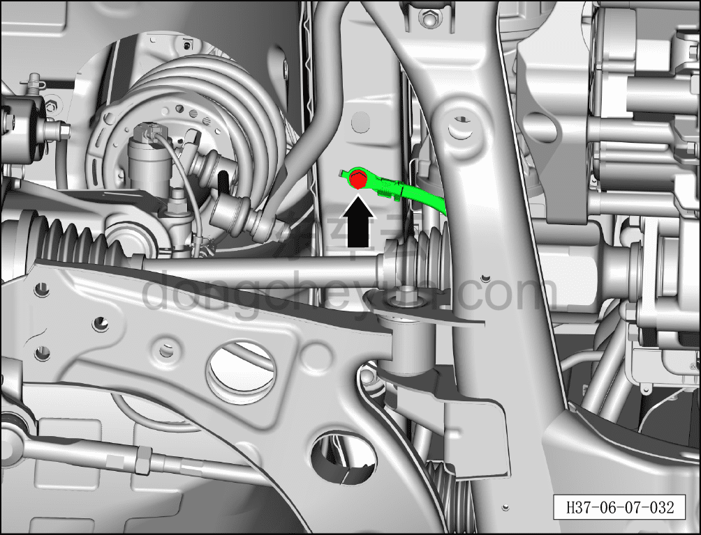

h. Используя торцевую головку на 10 мм, выверните крепёжный болт жгута заземления переднего электродвигателя.

Момент затяжки болта: 20±3 Н·м

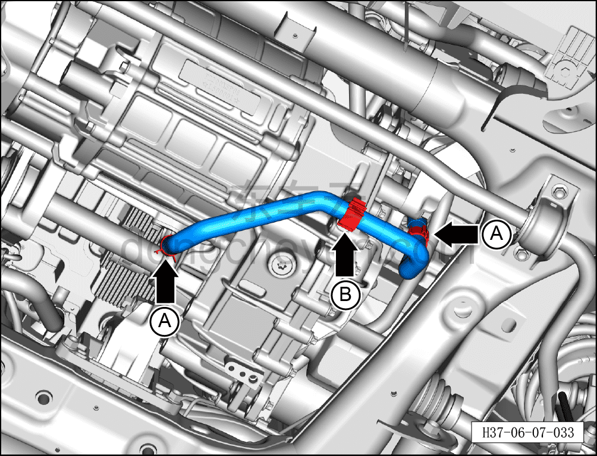

i. Используя клещи для хомутов шлангов, отсоедините 2 фиксирующих хомута A патрубка подачи водяного насоса электродвигателя.

j. Отсоедините фиксирующую клипсу B патрубка подачи водяного насоса электродвигателя от переднего тягового электродвигателя.

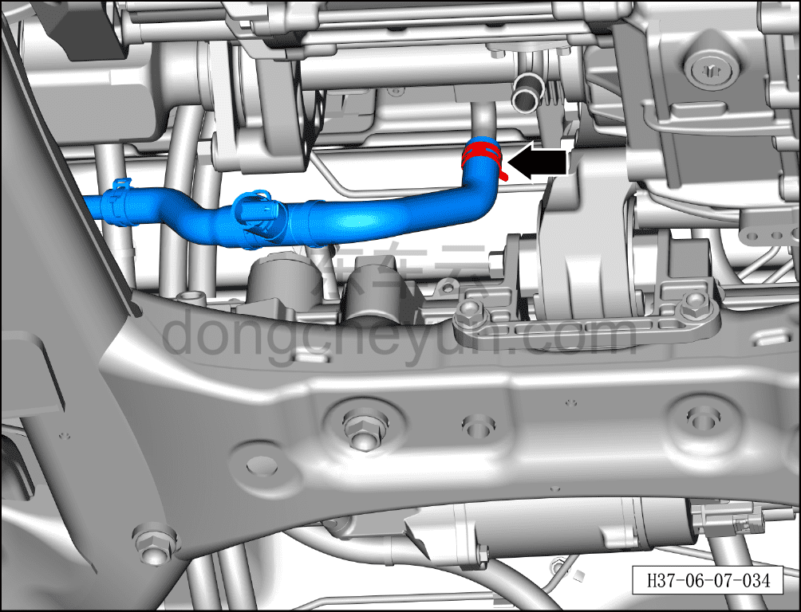

k. Используя клещи для хомутов шлангов, отсоедините фиксирующий хомут патрубка обратки заднего электродвигателя, отсоедините патрубок обратки заднего электродвигателя от переднего тягового электродвигателя.

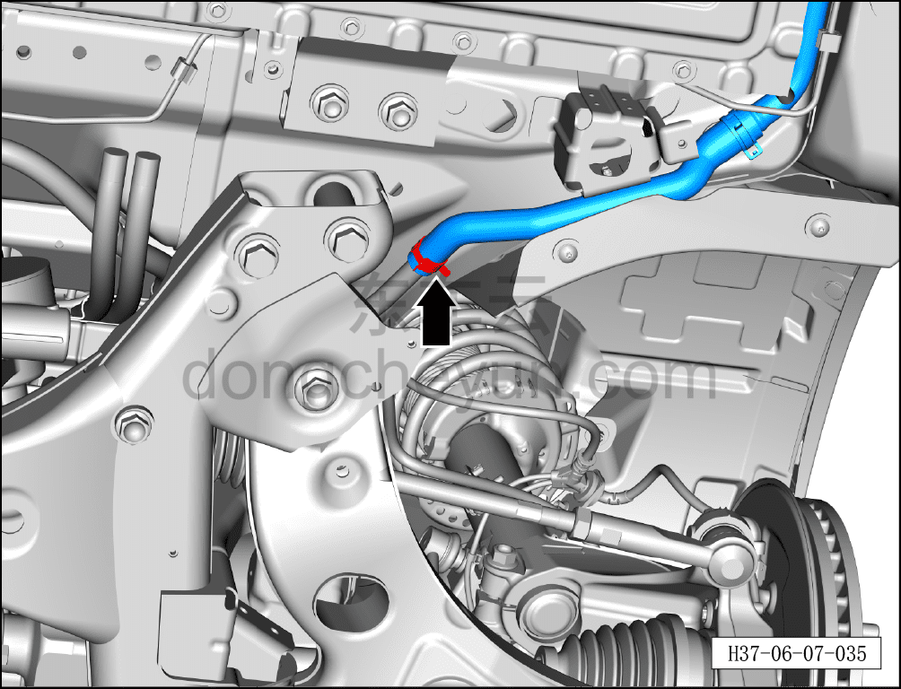

l. Используя клещи для хомутов шлангов, отсоедините фиксирующий хомут жёсткой трубки обратки среднего канала заднего электродвигателя, отсоедините мягкий патрубок обратки среднего канала заднего электродвигателя от жёсткой трубки обратки среднего канала заднего электродвигателя.

m. Используя торцевую головку на 10 мм, выверните соединительный болт рулевой колонки в сборе.

Момент затяжки болта составляет: 20±2 Н·м

n. Используя специальный инструмент (H52220000), выверните стопорную гайку ступицы колеса.

Момент затяжки гайки составляет: 330±15 Н·м

**Примечание:**

**- Необходимо использовать инструмент фиксации ступицы для удержания тормозного диска.**

**- Здесь описано выворачивание стопорной гайки ступицы левой стороны; для правой стороны можно руководствоваться порядком для левой.**

**- При установке гайки не используйте пневматический инструмент — это может привести к повреждению резьбы гайки.**

o. Используя гаечный ключ на 8 мм для фиксации оси левого наружного шарового шарнира рулевого механизма, используя гаечный ключ на 21 мм, выверните крепёжную гайку.

Момент затяжки гайки составляет: 120±12 Н·м

**Примечание:**

**- Здесь описано выворачивание крепёжной гайки левого наружного шарового шарнира рулевого механизма; для правой стороны можно руководствоваться порядком для левой.**

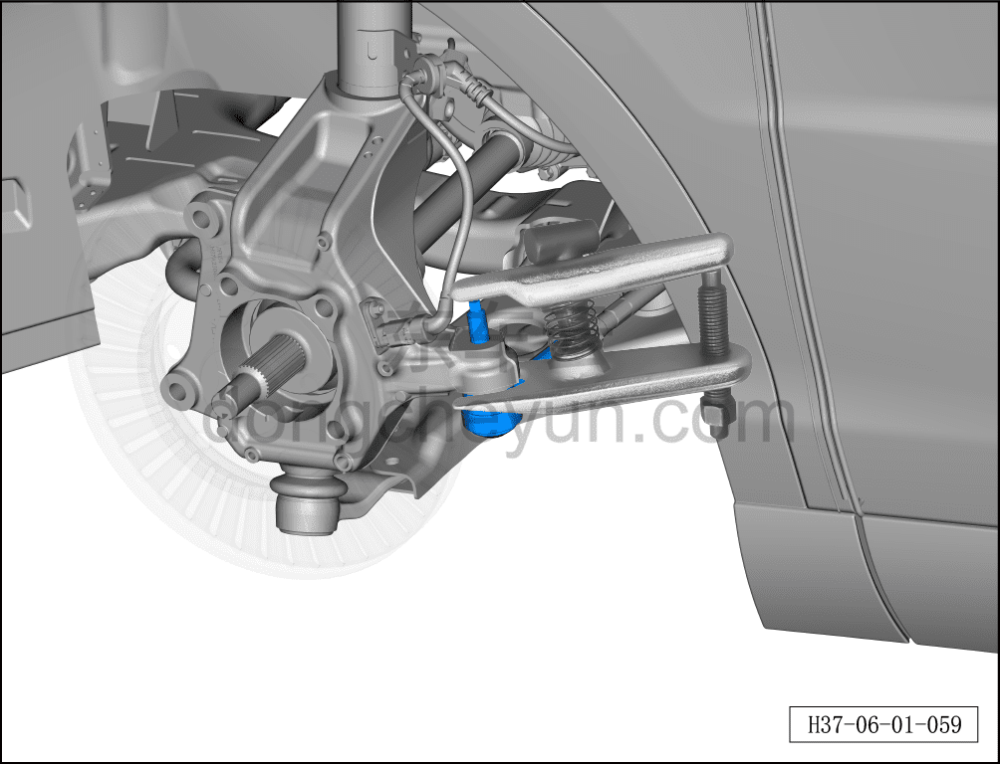

p. Используя специальный инструмент (H52246001), отсоедините левый наружный шаровой шарнир рулевого механизма от рулевого кулака.

**Примечание:**

**- Здесь описано отсоединение левого наружного шарового шарнира рулевого механизма от рулевого кулака; для правой стороны можно руководствоваться порядком для левой.**

q. Используя биту TX30 для фиксации узла стойки переднего стабилизатора поперечной устойчивости в сборе, используя гаечный ключ на 19 мм, выверните крепёжную гайку и отсоедините стойку переднего стабилизатора поперечной устойчивости от стойки переднего амортизатора в сборе.

Момент затяжки гайки составляет: 60 Н·м+45°

**Примечание:**

**- Здесь описано отсоединение левой стойки переднего стабилизатора поперечной устойчивости от стойки переднего амортизатора в сборе; для правой стороны можно руководствоваться порядком для левой.**

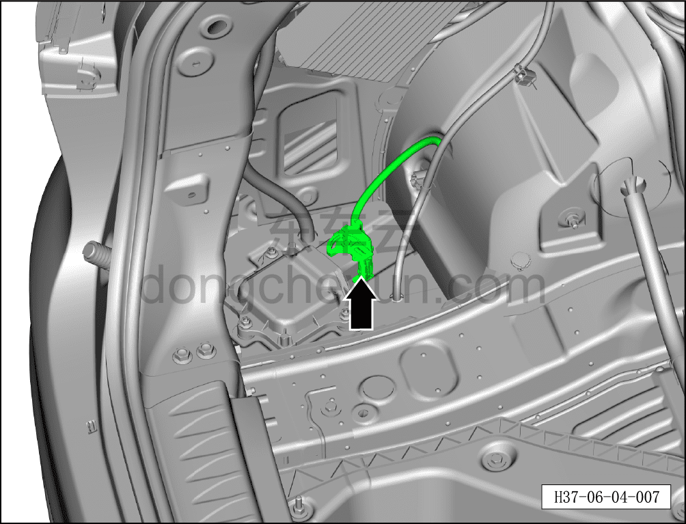

r. Отсоедините разъём жгута датчика скорости колеса.

**Примечание:**

**- Здесь описано отсоединение разъёма жгута датчика скорости левого колеса; для правой стороны можно руководствоваться порядком для левой.**

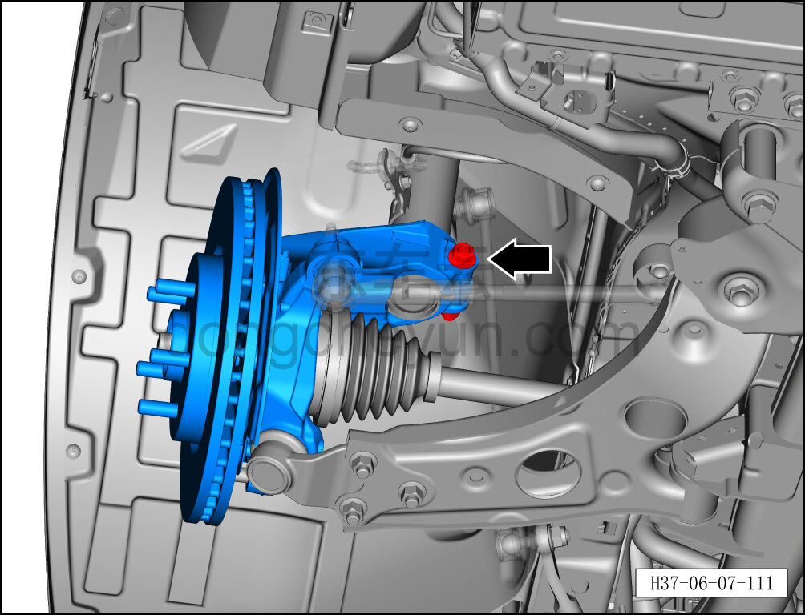

s. Используя гаечный ключ на 18 мм для фиксации соединительного болта левой стойки переднего амортизатора в сборе с рулевым кулаком, используя торцевую головку на 18 мм, выверните крепёжную гайку и извлеките крепёжный болт.

t. Используя биту TX25, выверните крепёжный винт подкрылка левого переднего колеса.

**Примечание:**

**- Здесь описан порядок выворачивания крепёжного винта подкрылка левого переднего колеса; для правой стороны можно руководствоваться порядком для левой.**

u. Используя торцевую головку на 10 мм, выверните 4 крепёжных болта.

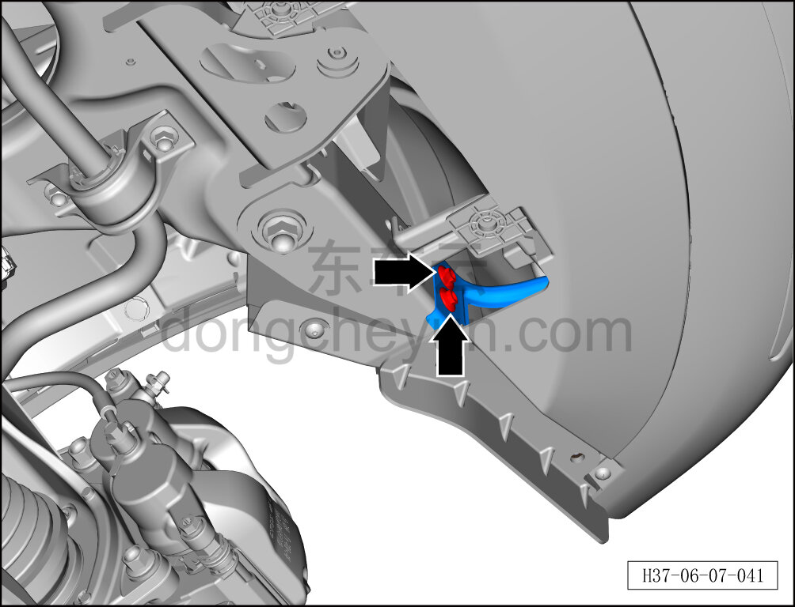

v. Используя гаечный ключ на 10 мм, выверните 2 крепёжных болта верхнего монтажного кронштейна левой передней фары.

**Примечание:**

**- Здесь описано снятие крепёжных болтов верхнего монтажного кронштейна левой передней фары; для правой стороны можно руководствоваться порядком для левой.**

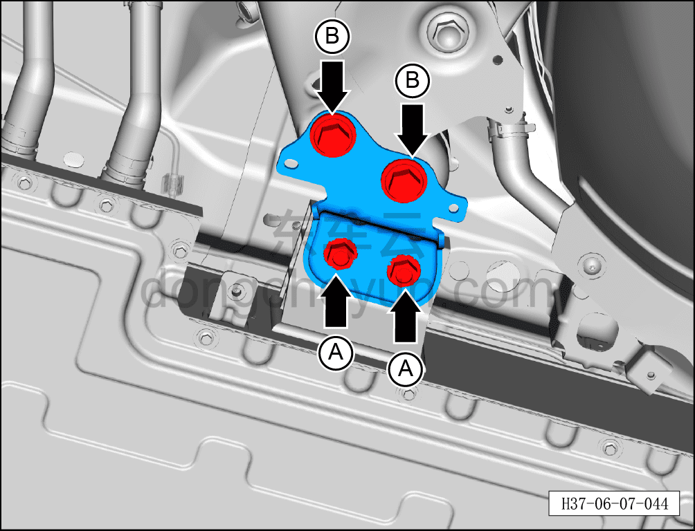

w. Используя торцевую головку на 17 мм, выверните 2 крепёжных болта A задней усилительной пластины левой части переднего подрамника.

x. Используя торцевую головку на 21 мм, выверните 2 крепёжных болта B задней усилительной пластины левой части переднего подрамника и извлеките заднюю усилительную пластину левой части переднего подрамника.

**Примечание:**

**- Здесь описано снятие задней усилительной пластины левой части переднего подрамника; для правой стороны можно руководствоваться порядком для левой.**

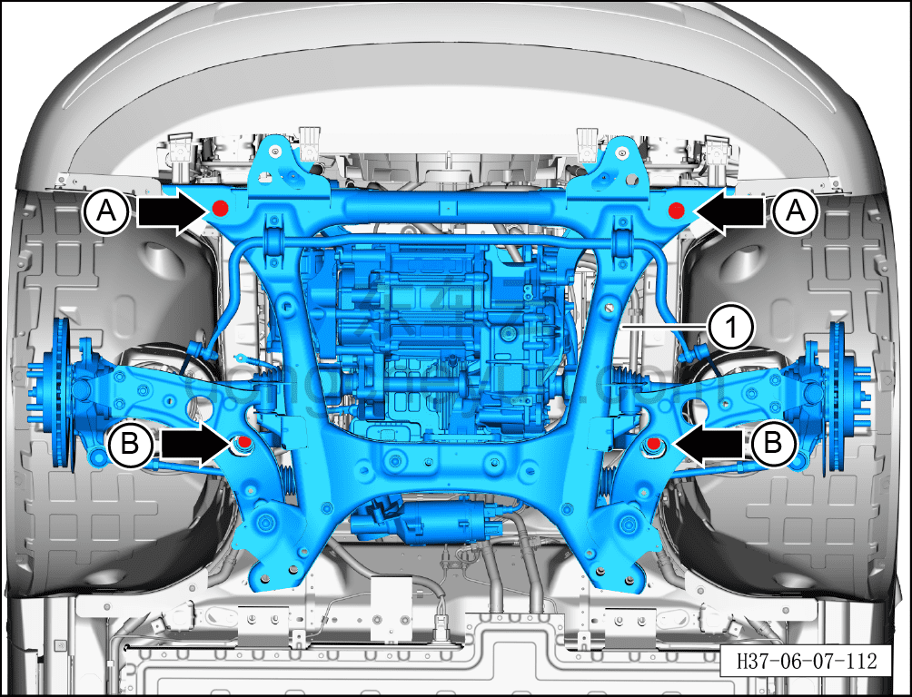

y. Установите подъёмную опору под передний подрамник, поднимите её так, чтобы она поддерживала передний подрамник и передний тяговый электродвигатель в сборе.

z. Используя торцевую головку на 21 мм, выверните 2 крепёжных болта A переднего подрамника.

Момент затяжки болта: 130 Н·м+90°

a. Используя торцевую головку на 18 мм, выверните 2 крепёжных болта B переднего подрамника.

Момент затяжки болтов: 70 Н·м+45°

b. Медленно опустите подъёмную опору, извлеките передний подрамник и передний тяговый электродвигатель в сборе①.

**Внимание:**

**- Закрепите передний модуль в сборе на переднем каркасе в сборе с помощью проволоки, чтобы предотвратить повреждение жгутов и трубопроводов после снятия переднего подрамника и переднего тягового электродвигателя в сборе.**

**- В процессе снятия переднего подрамника и переднего тягового электродвигателя в сборе следите за фиксирующими клипсами жгутов и трубопроводов, чтобы не повредить их.**

**Порядок установки**

Установка выполняется в обратном порядке.

Внимание:

**- Охлаждающую жидкость нельзя использовать повторно, смешивать, а также нельзя заменять охлаждающей жидкостью другого цвета. Проверьте, находится ли уровень охлаждающей жидкости между отметками MAX (максимум) и MIN (минимум).**

**- Обязательно выполните удаление воздуха из системы.**

**- Заправьте хладагент.**

**- Выполните развал-схождение;**

- После завершения ремонта обязательно выполните дорожное испытание, убедитесь в отсутствии посторонних шумов со стороны шасси и явления увода.

- После завершения установки подключите диагностический сканер, проверьте наличие кодов неисправностей у автомобиля; при их наличии выявите причину и удалите коды неисправностей.
