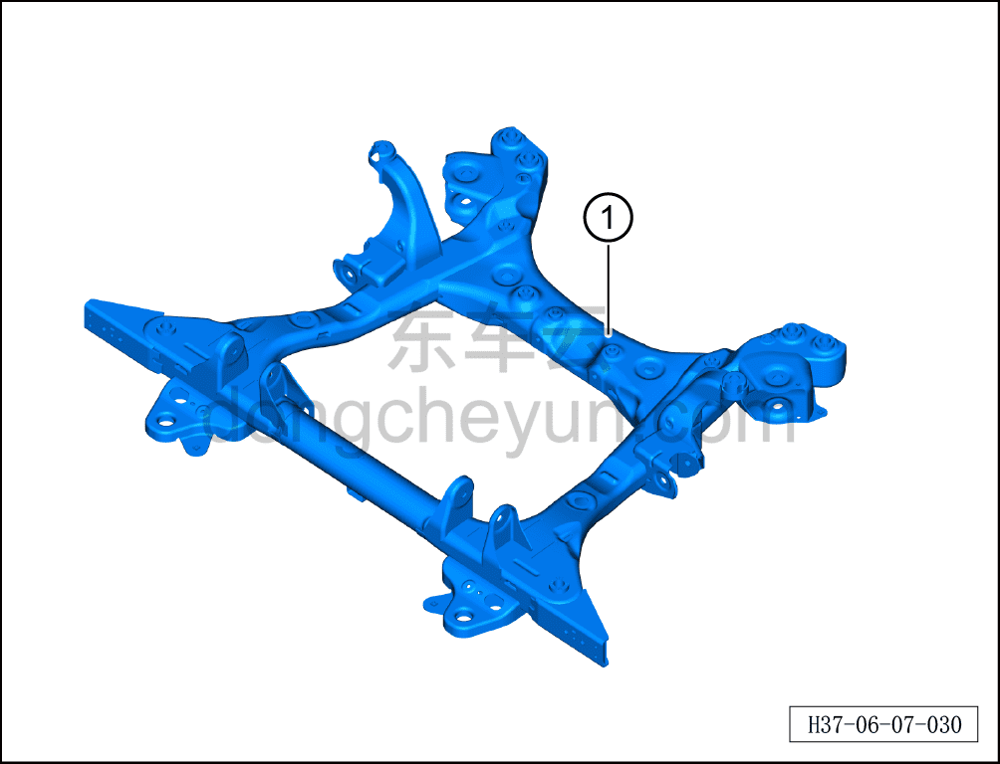

# Снятие и установка переднего подрамника (полный привод)

> Система шасси › Система передней подвески › Передний подрамник и передний тяговый электродвигатель в сборе  
> Оригинал: `拆卸与安装前副车架（四驱）` · [dongcheyun 56746](https://dongcheyun.com/p/56746), страница `cae3f13b7c0c4096922280850a951c0c` · [оглавление](../README.md)

**Порядок снятия**

1. Выключите все электроприборы, отключите питание.

2. Выполните операцию обесточивания автомобиля для ремонта. См. [3.1.4.1 Обесточивание автомобиля](../03-техническое-обслуживание/005-обесточивание-автомобиля.md)

3. Слейте охлаждающую жидкость тягового электродвигателя. См. [3.1.5.1 Замена охлаждающей жидкости тягового электродвигателя и тяговой батареи](../03-техническое-обслуживание/006-замена-охлаждающей-жидкости-тягового-электродвигателя.md)

4. Соберите (откачайте) хладагент. См. [10.1.6.11 Сбор/откачка/заправка хладагента](../10-кондиционер/045-сбор-вакуумирование-заправка-хладагента.md)

4. Снимите левый передний приводной вал (полный привод). См. [6.7.11.1 Снятие и установка левого переднего приводного вала (полный привод)](119-снятие-и-установка-левого-переднего-приводного-вала.md)

5. Снимите правый передний приводной вал (полный привод). См. [6.7.11.2 Снятие и установка правого переднего приводного вала (полный привод)](120-снятие-и-установка-правого-переднего-приводного-вала.md)

6. Снимите передний подрамник и передний тяговый электродвигатель в сборе. См. [6.2.9.1 Снятие и установка переднего подрамника и переднего тягового электродвигателя в сборе (полный привод)](022-снятие-и-установка-переднего-подрамника-и-переднего.md)

7. Снимите узел переднего тягового электродвигателя. См. [5.2.6.1 Снятие и установка переднего тягового электродвигателя](../05-силовая-система-на-новых-источниках/021-снятие-и-установка-переднего-тягового-электродвигателя.md)

8. Снимите рулевой механизм. См. [6.1.6.1 Снятие и установка рулевого механизма](006-снятие-и-установка-рулевого-механизма.md)

9. Снимите передний стабилизатор поперечной устойчивости. См. [6.2.8.2 Снятие и установка переднего стабилизатора поперечной устойчивости](021-снятие-и-установка-переднего-стабилизатора-поперечной.md)

10. Снимите стойку переднего стабилизатора поперечной устойчивости. См. [6.2.8.1 Снятие и установка стойки левого переднего стабилизатора поперечной устойчивости](020-снятие-и-установка-стойки-левого-переднего.md)

11. Снимите нижний рычаг передней подвески с шаровым пальцем в сборе. См. [6.2.7.1 Снятие и установка нижнего рычага передней подвески с шаровым пальцем в сборе](019-снятие-и-установка-нижнего-рычага-передней-подвески-с.md)

12. Снимите компрессор (полноприводные версии). См. [10.1.5.5 Снятие и установка компрессора (полноприводные версии)](../10-кондиционер/014-снятие-и-установка-компрессора-версия-awd.md)

13. Снимите левую переднюю опору переднего электродвигателя. См. [6.7.10.1 Снятие и установка левой передней опоры переднего электродвигателя](115-снятие-и-установка-левой-передней-опоры-переднего.md)

14. Снимите правую переднюю опору переднего электродвигателя. См. [6.7.10.2 Снятие и установка правой передней опоры переднего электродвигателя](116-снятие-и-установка-правой-опоры-переднего.md)

15. Снимите заднюю опору переднего электродвигателя. См. [6.7.10.3 Снятие и установка задней опоры переднего электродвигателя](117-снятие-и-установка-задней-опоры-переднего.md)

16. Снимите кронштейн правой опоры переднего электродвигателя. См. [6.7.10.4 Снятие и установка кронштейна правой опоры переднего электродвигателя](118-снятие-и-установка-кронштейна-правой-опоры-переднего.md)

17. Снятие переднего подрамника (полный привод).

a. Извлеките передний подрамник (полный привод)①.

**Порядок установки**

Установка выполняется в обратном порядке.

**Внимание:**

**- После завершения установки необходимо выполнить развал-схождение;**

**- После завершения ремонта обязательно выполните дорожное испытание, убедитесь в отсутствии посторонних шумов со стороны шасси и явления увода.**

**- После завершения установки подключите диагностический сканер, проверьте наличие кодов неисправностей у автомобиля; при их наличии выявите причину и удалите коды неисправностей.**
