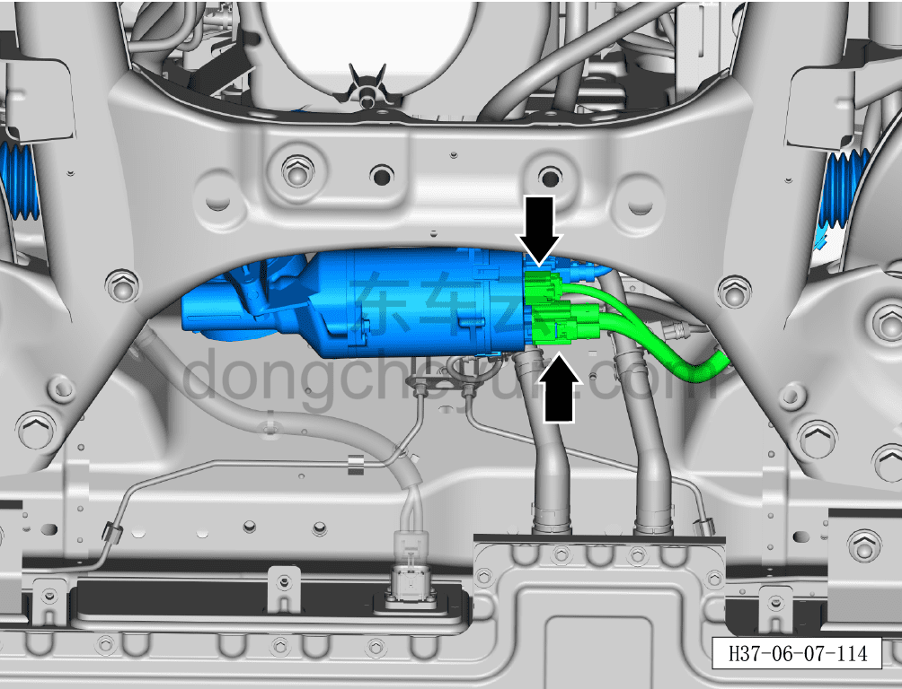
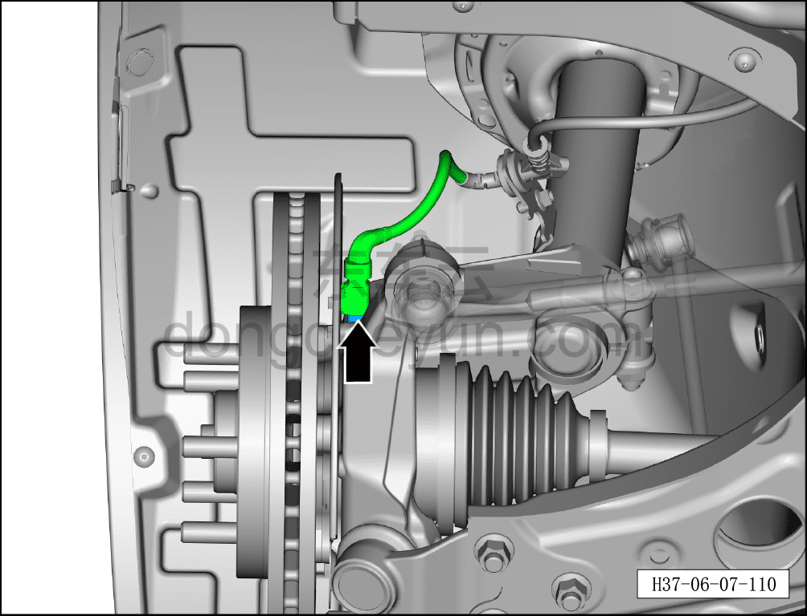
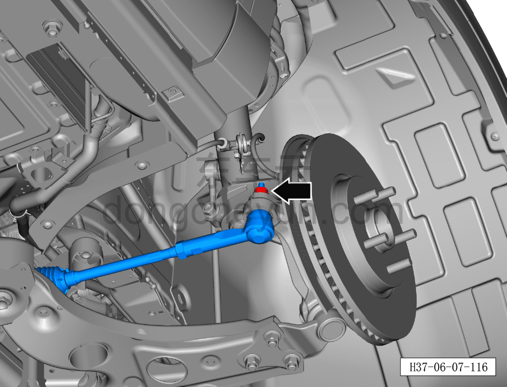
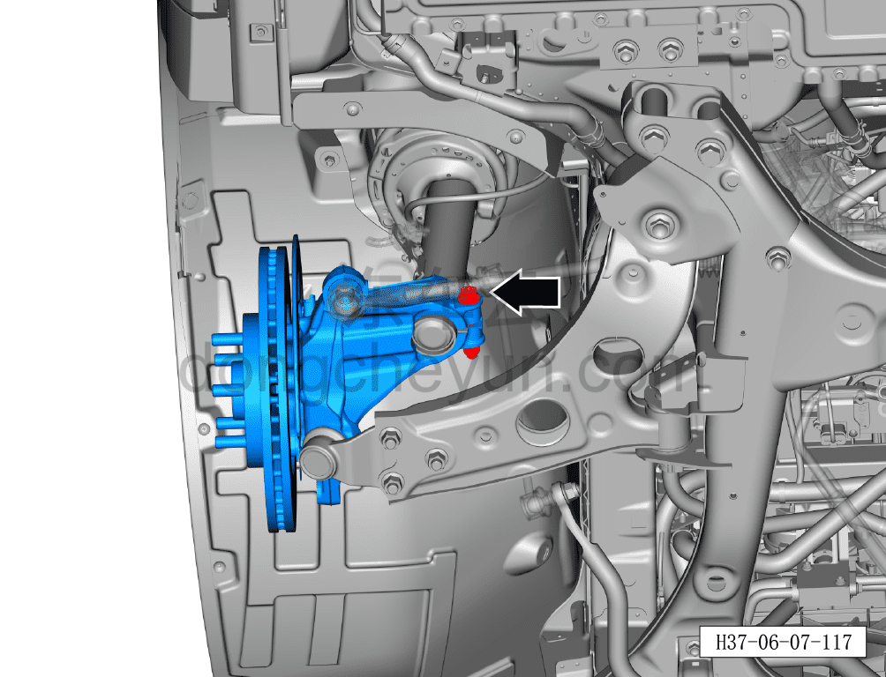
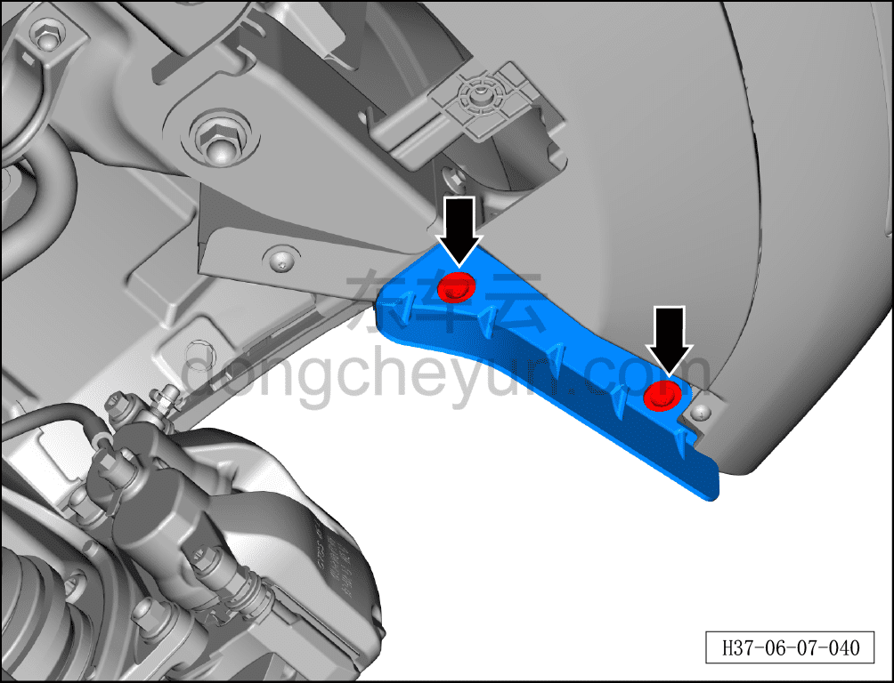
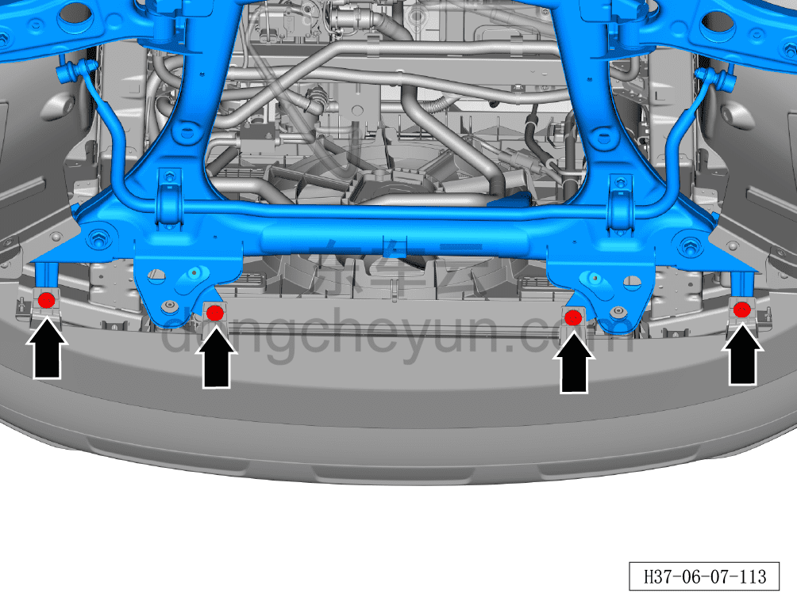
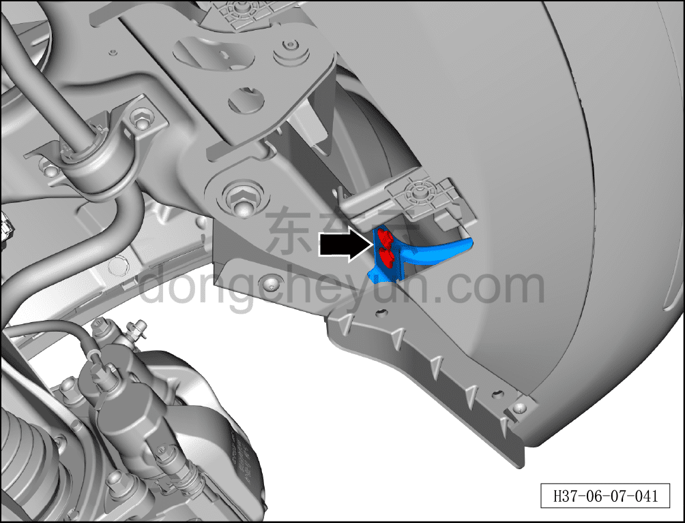
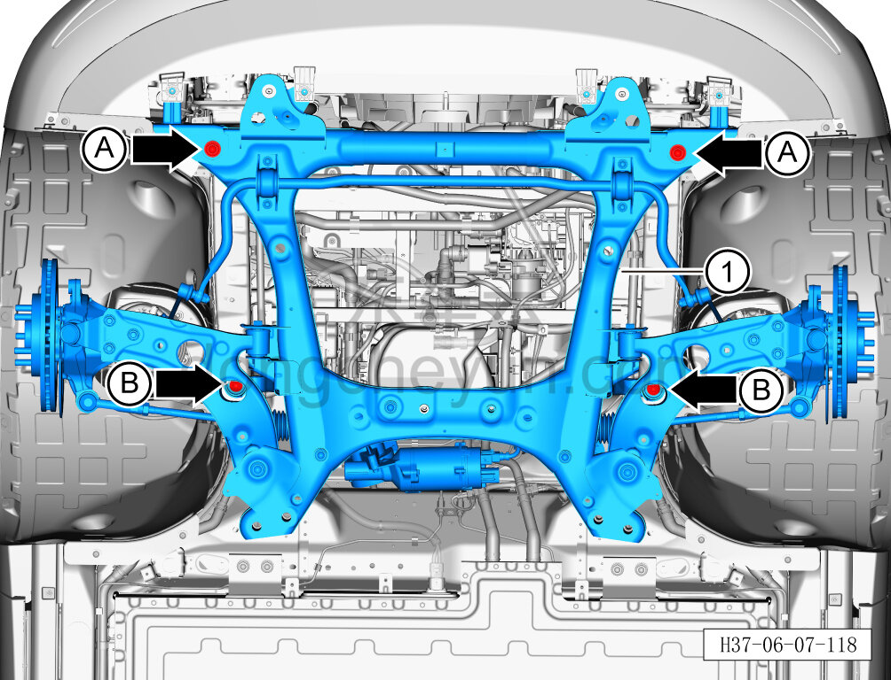

# Снятие и установка переднего подрамника с рычагами подвески в сборе (задний привод)

> Система шасси › Система передней подвески › Передний подрамник и передний тяговый электродвигатель в сборе  
> Оригинал: `拆卸与安装前副车架带控制臂总成（后驱）` · [dongcheyun 56746](https://dongcheyun.com/p/56746), страница `60bdf287e6354dfc97388832da0fd30c` · [оглавление](../README.md)

**Порядок снятия**

**Примечание:**

**- При снятии левого переднего тормозного суппорта не требуется отворачивать крепёжный болт соединения тормозного шланга с суппортом.**

**- После снятия тормозного суппорта закрепите его стальной проволокой в месте, не мешающем снятию и не создающем натяжения тормозного шланга.**

1. Выключите все электроприборы, отключите питание.

2. Выполните операцию обесточивания автомобиля для ремонта. См. [3.1.4.1 Обесточивание автомобиля](../03-техническое-обслуживание/005-обесточивание-автомобиля.md)

4. Соберите (откачайте) хладагент. См. [10.1.6.12 Сбор/откачка/заправка хладагента](../10-кондиционер/045-сбор-вакуумирование-заправка-хладагента.md)

5. Снимите переднее колесо. См. [6.5.8.1 Снятие и установка колеса](064-снятие-и-установка-колеса.md)

6. Снимите левый и правый передние тормозные суппорты. См. [6.6.6.1 Снятие и установка левого переднего тормозного суппорта](074-снятие-и-установка-левого-переднего-тормозного-суппорта.md)

7. Снятие и установка компрессора (заднеприводные версии). См. [10.1.5.1 Снятие и установка компрессора (заднеприводные версии)](../10-кондиционер/010-снятие-и-установка-компрессора-версия-rwd-400-в.md)

8. Снятие переднего подрамника в сборе.

a. Отсоедините 2 разъёма жгута рулевого механизма.

b. Отсоедините разъём жгута датчика скорости колеса.

**Примечание:**

**- Здесь описано отсоединение разъёма жгута левого датчика скорости колеса; для правой стороны можно руководствоваться порядком для левой.**

c. Используя биту TX30 для фиксации узла стойки переднего стабилизатора поперечной устойчивости в сборе, используя гаечный ключ на 19 мм, выверните крепёжную гайку и отсоедините стойку переднего стабилизатора поперечной устойчивости от стойки переднего амортизатора в сборе.

Момент затяжки гайки составляет: 60 Н·м+45°

**Примечание:**

**- Здесь описано отсоединение левой стойки переднего стабилизатора поперечной устойчивости от стойки переднего амортизатора в сборе; для правой стороны можно руководствоваться порядком для левой.**

d. Используя гаечный ключ на 8 мм для фиксации оси левого наружного шарового шарнира рулевого механизма, используя гаечный ключ на 21 мм, выверните крепёжную гайку.

Момент затяжки гайки составляет: 120±12 Н·м

**Примечание:**

**- Здесь описано выворачивание крепёжной гайки левого наружного шарового шарнира рулевого механизма; для правой стороны можно руководствоваться порядком для левой.**

e. Используя специальный инструмент (H52246001), отсоедините левый наружный шаровой шарнир рулевого механизма от рулевого кулака.

**Примечание:**

**- Здесь описано отсоединение левого наружного шарового шарнира рулевого механизма от рулевого кулака; для правой стороны можно руководствоваться порядком для левой.**

f. Используя гаечный ключ на 18 мм для фиксации соединительного болта левой стойки переднего амортизатора в сборе с рулевым кулаком, используя торцевую головку на 18 мм, выверните крепёжную гайку и извлеките крепёжный болт.

**Примечание:**

**- Здесь описано снятие крепёжного болта левого рулевого кулака; для правой стороны можно руководствоваться порядком для левой.**

g. Используя биту TX25, выверните крепёжный винт подкрылка левого переднего колеса.

**Примечание:**

**- Здесь описан порядок выворачивания крепёжного винта подкрылка левого переднего колеса; для правой стороны можно руководствоваться порядком для левой.**

h. Используя торцевую головку на 10 мм, выверните 4 крепёжных болта.

i. Используя гаечный ключ на 10 мм, выверните 2 крепёжных болта верхнего опорного кронштейна левой передней фары.

**Примечание:**

**- Здесь описано снятие крепёжных болтов верхнего опорного кронштейна левой передней фары; для правой стороны можно руководствоваться порядком для левой.**

j. Используя торцевую головку на 17 мм, выверните 2 крепёжных болта A задней усилительной пластины левой части переднего подрамника.

k. Используя торцевую головку на 21 мм, выверните 2 крепёжных болта B задней усилительной пластины левой части переднего подрамника и извлеките заднюю усилительную пластину левой части переднего подрамника.

**Примечание:**

**- Здесь описано снятие задней усилительной пластины левой части переднего подрамника; для правой стороны можно руководствоваться порядком для левой.**

l. Установите подъёмную опору под передний подрамник, поднимите её так, чтобы она поддерживала передний подрамник в сборе.

m. Используя торцевую головку на 21 мм, выверните 2 крепёжных болта A переднего подрамника.

Момент затяжки болта: 130 Н·м+90°

n. Используя торцевую головку на 18 мм, выверните 2 крепёжных болта B переднего подрамника.

Момент затяжки болтов: 70 Н·м+45°

o. Медленно опустите подъёмную опору, извлеките передний подрамник и передний тяговый электродвигатель в сборе①.

**Внимание:**

**- Закрепите передний модуль в сборе на переднем каркасе в сборе с помощью проволоки, чтобы предотвратить повреждение жгутов и трубопроводов после опускания переднего подрамника в сборе.**

**- В процессе опускания переднего подрамника в сборе следите за фиксирующими клипсами жгутов и трубопроводов, чтобы не повредить их.**

**Порядок установки**

Установка выполняется в обратном порядке.

Внимание:

**- Охлаждающую жидкость нельзя использовать повторно, смешивать, а также нельзя заменять охлаждающей жидкостью другого цвета. Проверьте, находится ли уровень охлаждающей жидкости между отметками MAX (максимум) и MIN (минимум).**

**- Обязательно выполните удаление воздуха из системы.**

**- После завершения установки необходимо выполнить развал-схождение;**

**- После завершения ремонта обязательно выполните дорожное испытание, убедитесь в отсутствии посторонних шумов со стороны шасси и явления увода.**

**- После завершения установки подключите диагностический сканер, проверьте наличие кодов неисправностей у автомобиля; при их наличии выявите причину и удалите коды неисправностей.**
