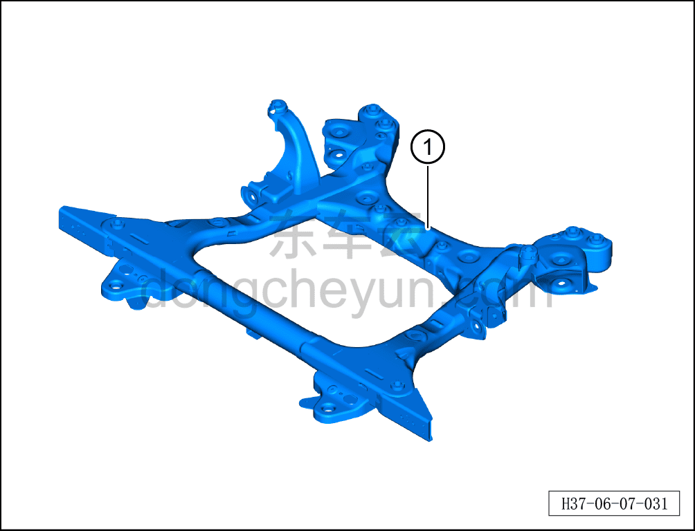

# Снятие и установка переднего подрамника (задний привод)

> Система шасси › Система передней подвески › Передний подрамник и передний тяговый электродвигатель в сборе  
> Оригинал: `拆卸与安装前副车架（后驱）` · [dongcheyun 56746](https://dongcheyun.com/p/56746), страница `d89c80c3717a4f9eadeeed48a8ab2197` · [оглавление](../README.md)

**Порядок снятия**

1. Выключите все электроприборы, отключите питание.

2. Выполните операцию обесточивания автомобиля для ремонта. См. [3.1.4.1 Обесточивание автомобиля](../03-техническое-обслуживание/005-обесточивание-автомобиля.md)

3. Снимите передний подрамник с рычагами подвески в сборе. См. [6.2.9.3 Снятие и установка переднего подрамника с рычагами подвески в сборе (задний привод)](024-снятие-и-установка-переднего-подрамника-с-рычагами.md)

4. Снимите рулевой механизм. См. [6.1.6.1 Снятие и установка рулевого механизма](006-снятие-и-установка-рулевого-механизма.md)

5. Снимите передний стабилизатор поперечной устойчивости. См. [6.2.8.2 Снятие и установка переднего стабилизатора поперечной устойчивости](021-снятие-и-установка-переднего-стабилизатора-поперечной.md)

6. Снимите стойку переднего стабилизатора поперечной устойчивости. См. [6.2.8.1 Снятие и установка стойки левого переднего стабилизатора поперечной устойчивости](020-снятие-и-установка-стойки-левого-переднего.md)

7. Снимите левый нижний рычаг передней подвески с шаровым пальцем в сборе. См. [6.2.7.1 Снятие и установка нижнего рычага передней подвески с шаровым пальцем в сборе](019-снятие-и-установка-нижнего-рычага-передней-подвески-с.md)

8. Снятие переднего подрамника (задний привод).

a. Извлеките передний подрамник (задний привод)①.

**Порядок установки**

Установка выполняется в обратном порядке.

**Внимание:**

**- После завершения установки необходимо выполнить развал-схождение;**

**- После завершения ремонта обязательно выполните дорожное испытание, убедитесь в отсутствии посторонних шумов со стороны шасси и явления увода.**

**- После завершения установки подключите диагностический сканер, проверьте наличие кодов неисправностей у автомобиля; при их наличии выявите причину и удалите коды неисправностей.**
