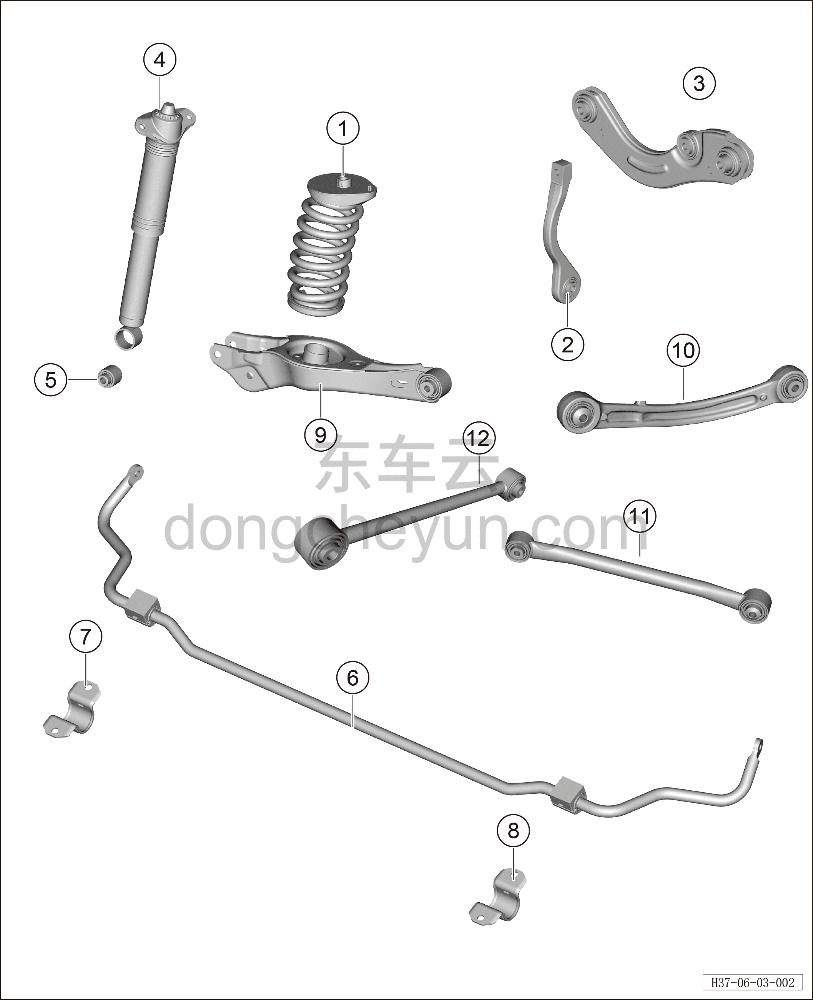

# Покомпонентный вид (деталировка)

> Система шасси › Система задней подвески  
> Оригинал: `结构分解图` · [dongcheyun 56746](https://dongcheyun.com/p/56746), страница `7be4fcb4417f4b72bd4ef373b48e8b9e` · [оглавление](../README.md)

| № | Наименование детали | Кол-во на автомобиль | Примечание |
|---|---|---|---|
| 1 | Пружина подвески | 2 |   |
| 2 | Стойка заднего стабилизатора поперечной устойчивости | 2 |   |
| 3 | Передний верхний рычаг задней подвески | 2 |   |
| 4 | Стойка заднего регулируемого амортизатора демпфирования | 2 |   |
| 5 | Нижняя втулка заднего амортизатора | 2 |   |
| 6 | Задний стабилизатор поперечной устойчивости | 1 |   |
| 7 | Правый кронштейн заднего стабилизатора поперечной устойчивости | 1 |   |
| 8 | Левый кронштейн заднего стабилизатора поперечной устойчивости | 1 |   |
| 9 | Правый нижний рычаг задней подвески | 1 |   |
| 10 | Правый верхний рычаг задней подвески | 1 |   |
| 11 | Тяга схождения | 2 |   |
| 12 | Передний нижний рычаг задней подвески | 2 |   |
