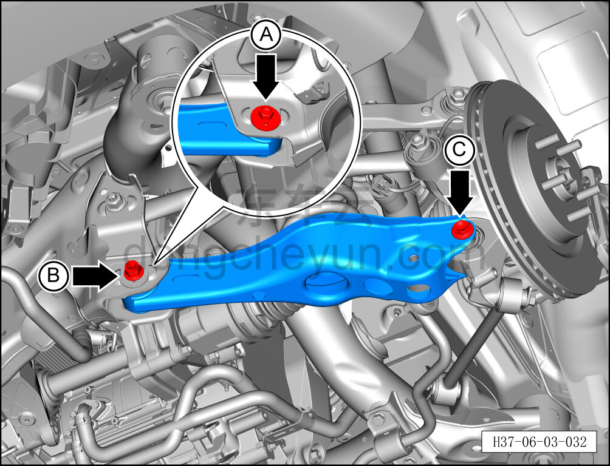
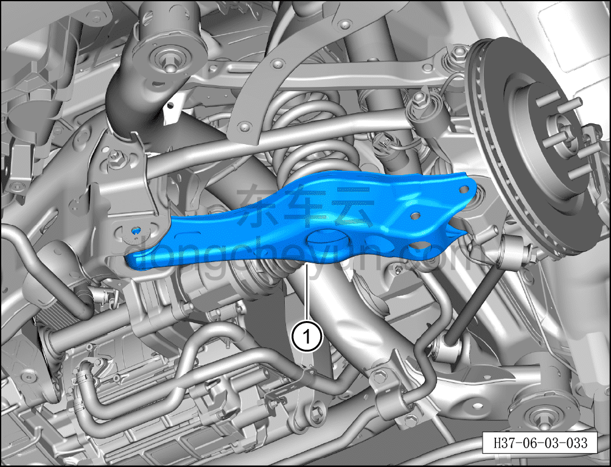

# Снятие и установка левого нижнего рычага задней подвески

> Система шасси › Система задней подвески › Задний рычаг подвески  
> Оригинал: `拆卸与安装后悬架左后下控制摆臂` · [dongcheyun 56746](https://dongcheyun.com/p/56746), страница `42387c62ce454fe5a62ea2aa2e899225` · [оглавление](../README.md)

**Порядок снятия**

**Примечание:**

**- Ниже описано снятие и установка левого нижнего рычага задней подвески; для правой стороны можно руководствоваться порядком для левой.**

1. Выключите все электроприборы, отключите питание.

2. Выполните обесточивание автомобиля для ремонта. См. [3.1.4.1 Обесточивание автомобиля](../03-техническое-обслуживание/005-обесточивание-автомобиля.md)

3. Снимите колесо. См. [6.5.8.1 Снятие и установка колеса](064-снятие-и-установка-колеса.md)

4. Поднимите автомобиль на подъёмнике на подходящую высоту.

5. Снимите заднюю нижнюю защитную панель. См. [8.6.4.4 Снятие и установка задней нижней защитной панели](../08-внутренняя-и-внешняя-отделка/194-снятие-и-установка-заднего-нижнего-защитного-щитка.md)

6. Снятие левого нижнего рычага задней подвески.

a. Используя гаечный ключ на 21 мм для фиксации крепёжного болта A соединения левой стойки заднего регулируемого амортизатора демпфирования в сборе с левым нижним рычагом задней подвески, используя торцевую головку на 21 мм, выверните крепёжную гайку B и извлеките крепёжный болт.

Момент затяжки гайки: 130 Н·м+90°

b. Установите высокую подъёмную опору под левый нижний рычаг задней подвески, слегка поднимите её, пока она не коснётся рычага подвески.

c. Используя гаечный ключ на 18 мм для фиксации эксцентрикового болта A соединения левого нижнего рычага задней подвески с задним подрамником, используя торцевую головку на 21 мм, выверните крепёжную гайку B и извлеките эксцентриковый болт.

d. Используя торцевую головку на 21 мм, выверните крепёжный болт C соединения левого нижнего рычага задней подвески с рулевым кулаком.

Момент затяжки болта: 130 Н·м+90°

Момент затяжки эксцентрикового болта: 180±10 Н·м

**Примечание:**

**- Перед снятием левого нижнего рычага задней подвески необходимо сначала подпереть его высокой подъёмной опорой, чтобы избежать выброса пружины подвески после снятия и травмирования людей или повреждения деталей.**

**- Перед снятием эксцентрикового болта нанесите маркировочные метки краской в местах установки эксцентрикового болта, эксцентриковой шайбы и заднего подрамника в сборе, чтобы облегчить последующую регулировку эксцентрикового болта при установке.**

e. Медленно опустите высокую подъёмную опору, извлеките левый нижний рычаг задней подвески①.

**Примечание:**

**- При извлечении левого нижнего рычага задней подвески одновременно извлеките заднюю пружину подвески.**

**Порядок установки**

Установка выполняется в обратном порядке.

**Внимание:**

**- После завершения установки необходимо выполнить развал-схождение;**

**- После завершения ремонта обязательно выполните дорожное испытание, убедитесь в отсутствии посторонних шумов со стороны шасси и явления увода.**
