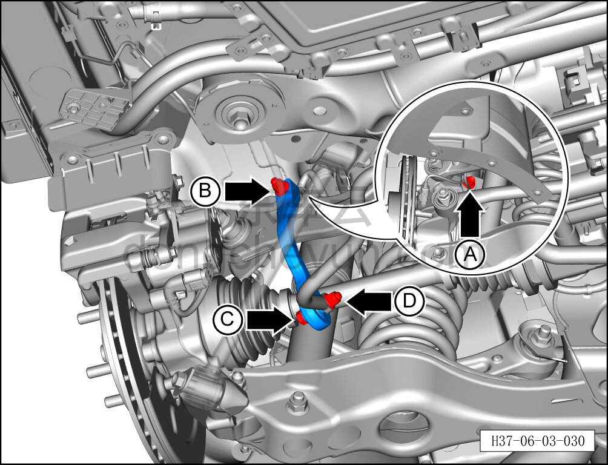
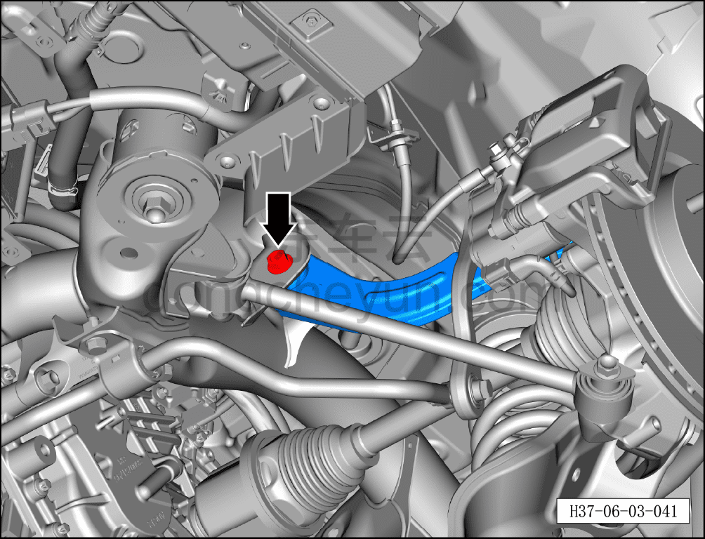
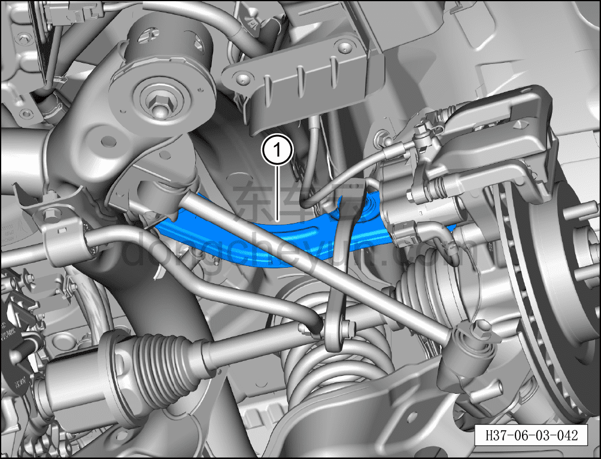

# Снятие и установка переднего верхнего рычага задней подвески

> Система шасси › Система задней подвески › Задний рычаг подвески  
> Оригинал: `拆卸与安装后悬架前上控制臂` · [dongcheyun 56746](https://dongcheyun.com/p/56746), страница `463af0b32bb54b9f872f33ee78b5221c` · [оглавление](../README.md)

**Порядок снятия**

**Примечание:**

**- Ниже описано снятие и установка переднего верхнего рычага задней подвески; для правой стороны можно руководствоваться порядком для левой.**

1. Выключите все электроприборы, отключите питание.

2. Выполните операцию обесточивания автомобиля для ремонта. См. [3.1.4.1 Обесточивание автомобиля](../03-техническое-обслуживание/005-обесточивание-автомобиля.md)

3. Снимите заднее колесо. См. [6.5.8.1 Снятие и установка колеса](064-снятие-и-установка-колеса.md)

4. Поднимите автомобиль на подъёмнике на подходящую высоту.

5. Снимите заднюю нижнюю защитную панель. См. [8.6.4.4 Снятие и установка задней нижней защитной панели](../08-внутренняя-и-внешняя-отделка/194-снятие-и-установка-заднего-нижнего-защитного-щитка.md)

6. Снимите левую стойку заднего регулируемого амортизатора демпфирования в сборе. См. [6.4.6.3 Снятие и установка левой стойки заднего регулируемого амортизатора демпфирования в сборе](048-снятие-и-установка-левой-задней-стойки-cdc.md)

7. Снятие переднего верхнего рычага задней подвески.

a. Используя гаечный ключ на 16 мм для фиксации крепёжного болта A соединения стойки заднего стабилизатора поперечной устойчивости с передним верхним рычагом задней подвески, используя торцевую головку на 15 мм, выверните крепёжную гайку B и извлеките крепёжный болт.

Момент затяжки гайки: 65±5 Н·м

b. Используя гаечный ключ на 16 мм для фиксации крепёжного болта C соединения стойки заднего стабилизатора поперечной устойчивости с задним стабилизатором поперечной устойчивости, используя торцевую головку на 15 мм, выверните крепёжную гайку D и извлеките крепёжный болт.

Момент затяжки гайки: 65±5 Н·м

c. Используя гаечный ключ на 18 мм для фиксации крепёжного болта A, используя торцевую головку на 18 мм, выверните крепёжную гайку B соединения переднего верхнего рычага задней подвески с рулевым кулаком и извлеките крепёжный болт.

Момент затяжки гайки: 70 Н·м+90°

d. Используя торцевую головку на 18 мм, выверните крепёжный болт соединения переднего верхнего рычага задней подвески с задним подрамником.

Момент затяжки болта: 70 Н·м+90°

e. Извлеките передний верхний рычаг задней подвески①.

**Порядок установки**

Установка выполняется в обратном порядке.

**Внимание:**

**- После завершения установки необходимо выполнить развал-схождение;**

**- После завершения ремонта обязательно выполните дорожное испытание, убедитесь в отсутствии посторонних шумов со стороны шасси и явления увода.**
