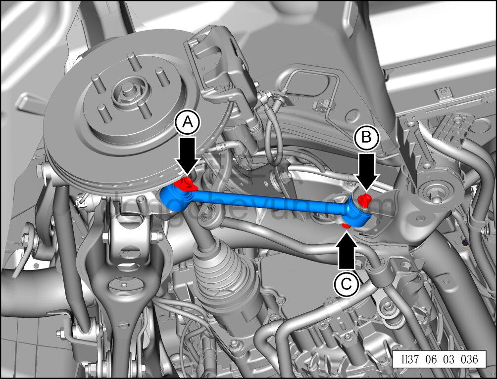
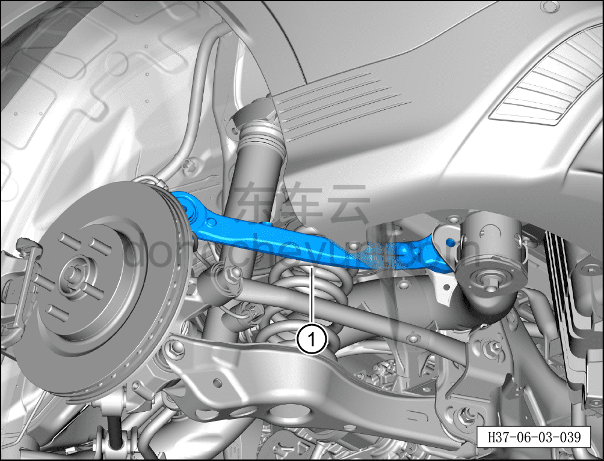

# Снятие и установка переднего нижнего рычага задней подвески

> Система шасси › Система задней подвески › Задний рычаг подвески  
> Оригинал: `拆卸与安装后悬架前下控制臂` · [dongcheyun 56746](https://dongcheyun.com/p/56746), страница `bf69d6404d7f493a86ed921eb2761166` · [оглавление](../README.md)

**Порядок снятия**

**Примечание:**

**- Ниже описано снятие и установка левого переднего нижнего рычага задней подвески; для правой стороны можно руководствоваться порядком для левой.**

1. Выключите все электроприборы, отключите питание.

2. Выполните операцию обесточивания автомобиля для ремонта. См. [3.1.4.1 Обесточивание автомобиля](../03-техническое-обслуживание/005-обесточивание-автомобиля.md)

3. Снимите заднее колесо. См. [6.5.8.1 Снятие и установка колеса](064-снятие-и-установка-колеса.md)

4. Поднимите автомобиль на подъёмнике на подходящую высоту.

5. Снимите заднюю нижнюю защитную панель. См. [8.6.4.4 Снятие и установка задней нижней защитной панели](../08-внутренняя-и-внешняя-отделка/194-снятие-и-установка-заднего-нижнего-защитного-щитка.md)

6. Снятие переднего нижнего рычага задней подвески.

a. Используя торцевую головку на 18 мм, выверните крепёжный болт A соединения переднего нижнего рычага задней подвески с рулевым кулаком.

Момент затяжки болта: 70 Н·м+90°

b. Используя гаечный ключ на 18 мм для фиксации крепёжного болта B соединения переднего нижнего рычага задней подвески с задним подрамником, используя торцевую головку на 21 мм, выверните крепёжную гайку C и извлеките крепёжный болт.

Момент затяжки гайки: 115±10 Н·м

c. Извлеките передний нижний рычаг задней подвески①.

**Порядок установки**

Установка выполняется в обратном порядке.

**Внимание:**

**- После завершения установки необходимо выполнить развал-схождение;**

**- После завершения ремонта обязательно выполните дорожное испытание, убедитесь в отсутствии посторонних шумов со стороны шасси и явления увода.**
