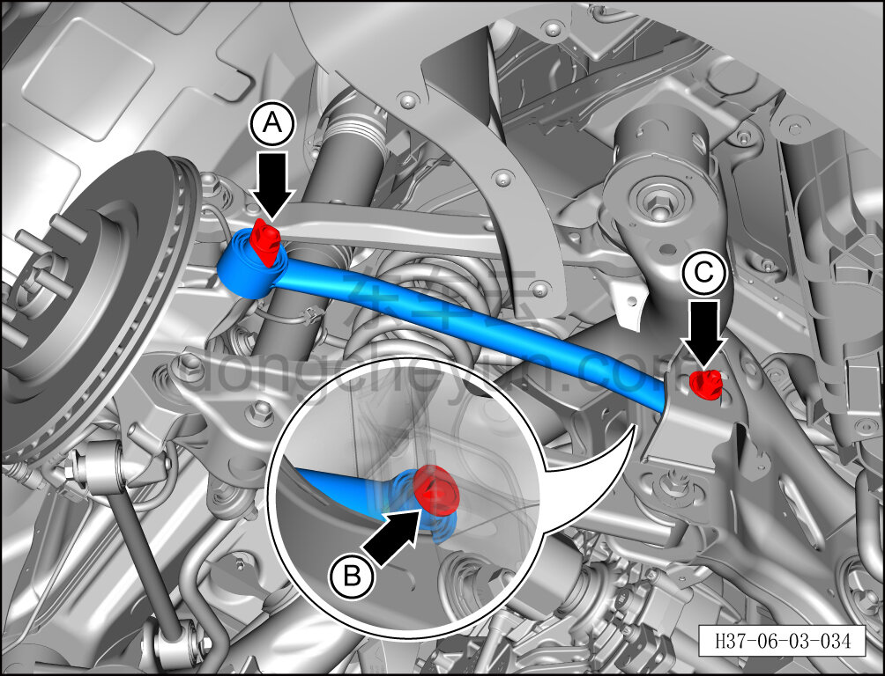
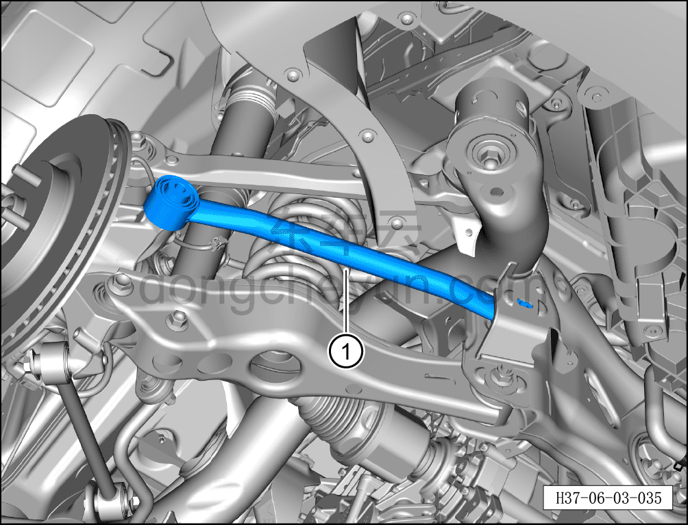

# Снятие и установка тяги схождения

> Система шасси › Система задней подвески › Задний рычаг подвески  
> Оригинал: `拆卸与安装前束连杆` · [dongcheyun 56746](https://dongcheyun.com/p/56746), страница `bbd085fbb9dd4593905ce74c468eaae4` · [оглавление](../README.md)

**Порядок снятия**

**Примечание:**

**- Ниже описано снятие и установка левой тяги схождения; для правой стороны можно руководствоваться порядком для левой.**

1. Выключите все электроприборы, отключите питание.

2. Выполните операцию обесточивания автомобиля для ремонта. См. [3.1.4.1 Обесточивание автомобиля](../03-техническое-обслуживание/005-обесточивание-автомобиля.md)

3. Снимите колесо. См. [6.5.8.1 Снятие и установка колеса](064-снятие-и-установка-колеса.md)

4. Поднимите автомобиль на подъёмнике на подходящую высоту.

5. Снятие тяги схождения.

a. Используя торцевую головку на 21 мм, выверните крепёжный болт A соединения тяги схождения с рулевым кулаком.

Момент затяжки болта: 130 Н·м+90°

b. Используя гаечный ключ на 21 мм для фиксации, выверните крепёжный болт B соединения тяги схождения с задним подрамником, используя торцевую головку на 21 мм, выверните крепёжную гайку C и извлеките эксцентриковый болт B.

Момент затяжки эксцентрикового болта: 115±10 Н·м

**Примечание:**

**- Перед снятием эксцентрикового болта нанесите маркировочные метки краской в местах установки эксцентрикового болта, эксцентриковой шайбы и заднего подрамника, чтобы облегчить последующую регулировку эксцентрикового болта при установке.**

b. Извлеките тягу схождения①.

**Порядок установки**

Установка выполняется в обратном порядке.

**Внимание:**

**- После завершения установки необходимо выполнить развал-схождение;**

**- После завершения ремонта обязательно выполните дорожное испытание, убедитесь в отсутствии посторонних шумов со стороны шасси и явления увода.**
