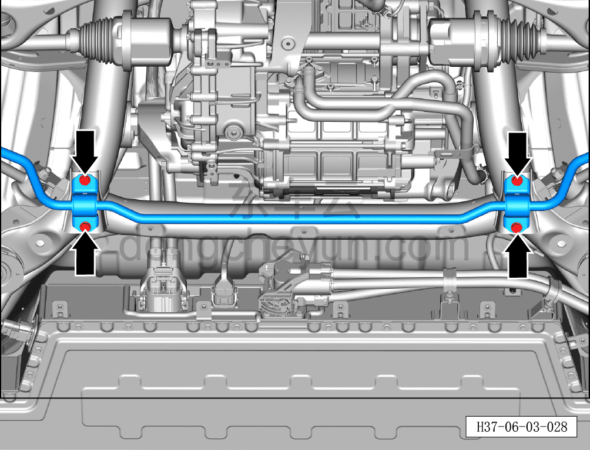
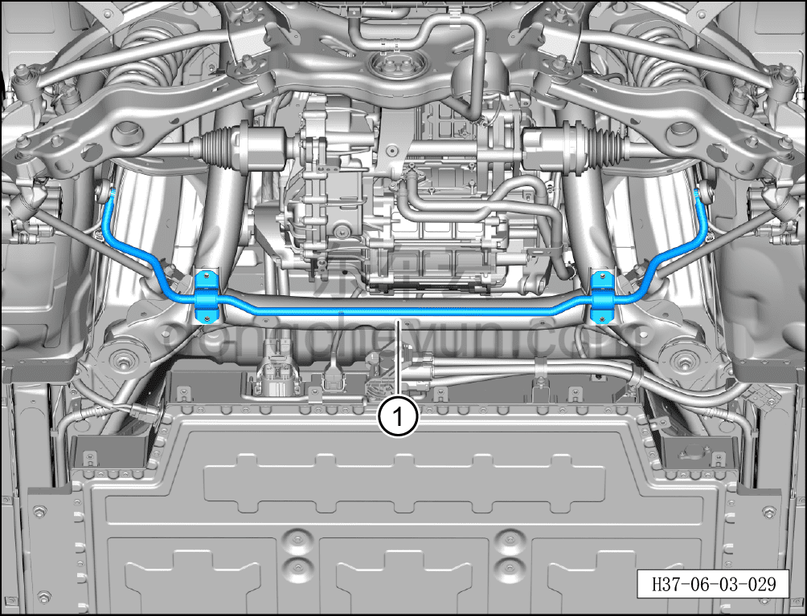

# Снятие и установка заднего стабилизатора поперечной устойчивости

> Система шасси › Система задней подвески › Задний стабилизатор поперечной устойчивости  
> Оригинал: `拆卸与安装后稳定杆` · [dongcheyun 56746](https://dongcheyun.com/p/56746), страница `ff77efd066b4402f8cec6447fed662d2` · [оглавление](../README.md)

**Порядок снятия**

1. Выключите все электроприборы, отключите питание.

2. Выполните операцию обесточивания автомобиля для ремонта. См. [3.1.4.1 Обесточивание автомобиля](../03-техническое-обслуживание/005-обесточивание-автомобиля.md)

3. Поднимите автомобиль на подъёмнике на подходящую высоту.

4. Снимите заднюю нижнюю защитную панель. См. [8.6.4.4 Снятие и установка задней нижней защитной панели](../08-внутренняя-и-внешняя-отделка/194-снятие-и-установка-заднего-нижнего-защитного-щитка.md)

5. Снимите болт стойки заднего стабилизатора поперечной устойчивости. См. [6.3.8.2 Снятие и установка стойки заднего стабилизатора поперечной устойчивости](038-снятие-и-установка-стойки-заднего-стабилизатора.md)

6. Снятие заднего стабилизатора поперечной устойчивости.

a. Используя торцевую головку на 16 мм, выверните 4 крепёжных болта заднего стабилизатора поперечной устойчивости.

Момент затяжки болтов: 65±5 Н·м

b. Извлеките задний стабилизатор поперечной устойчивости①.

**Порядок установки**

Установка выполняется в обратном порядке.

**Внимание:**

**- После завершения установки необходимо выполнить развал-схождение;**

**- После завершения ремонта обязательно выполните дорожное испытание, убедитесь в отсутствии посторонних шумов со стороны шасси и явления увода.**
