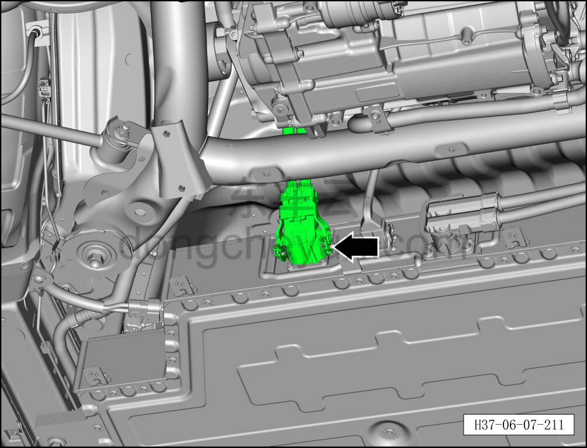
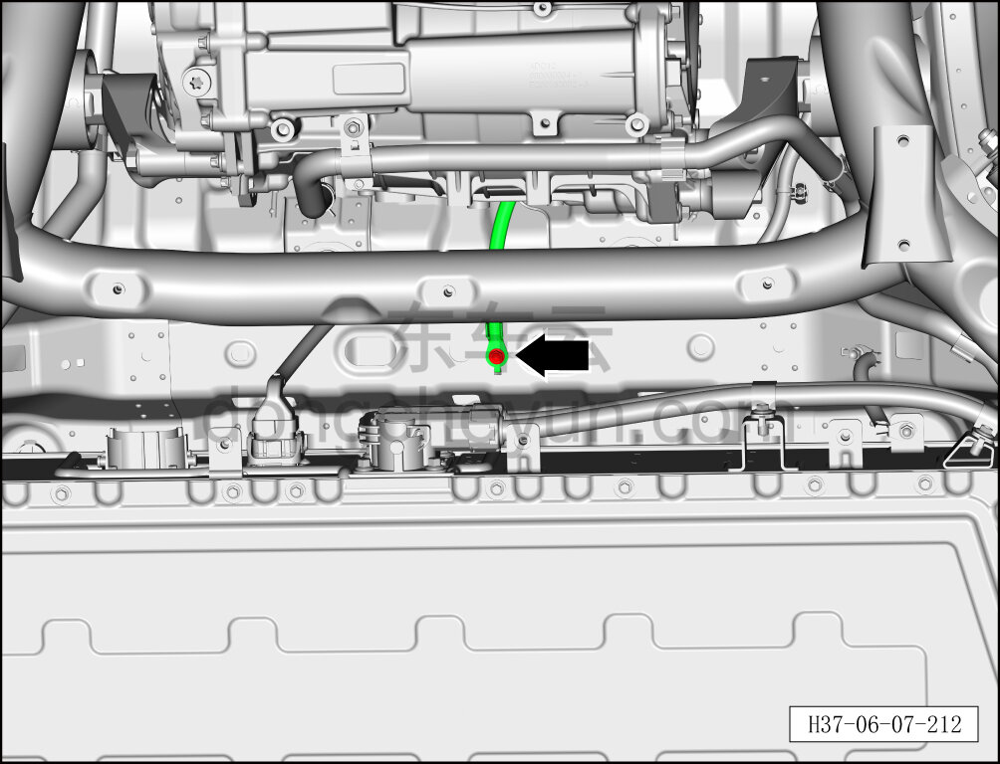
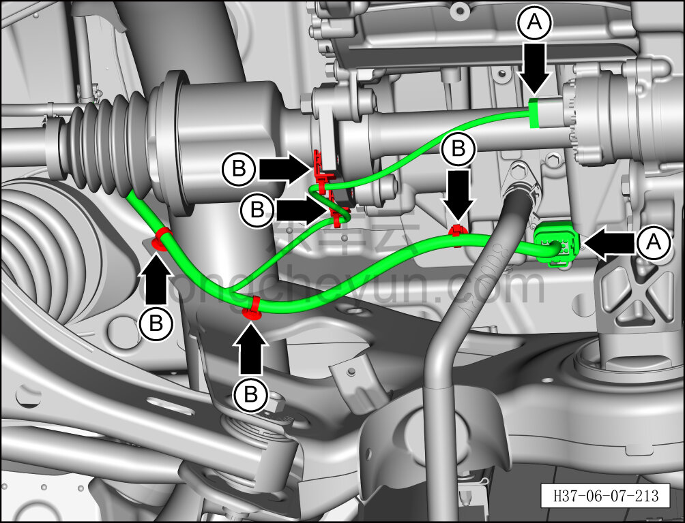
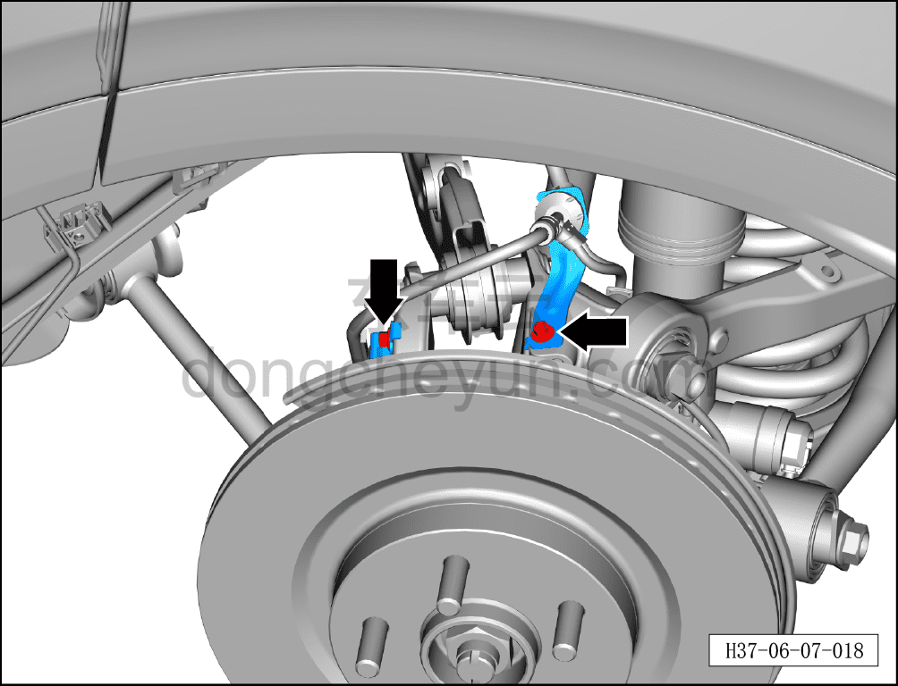
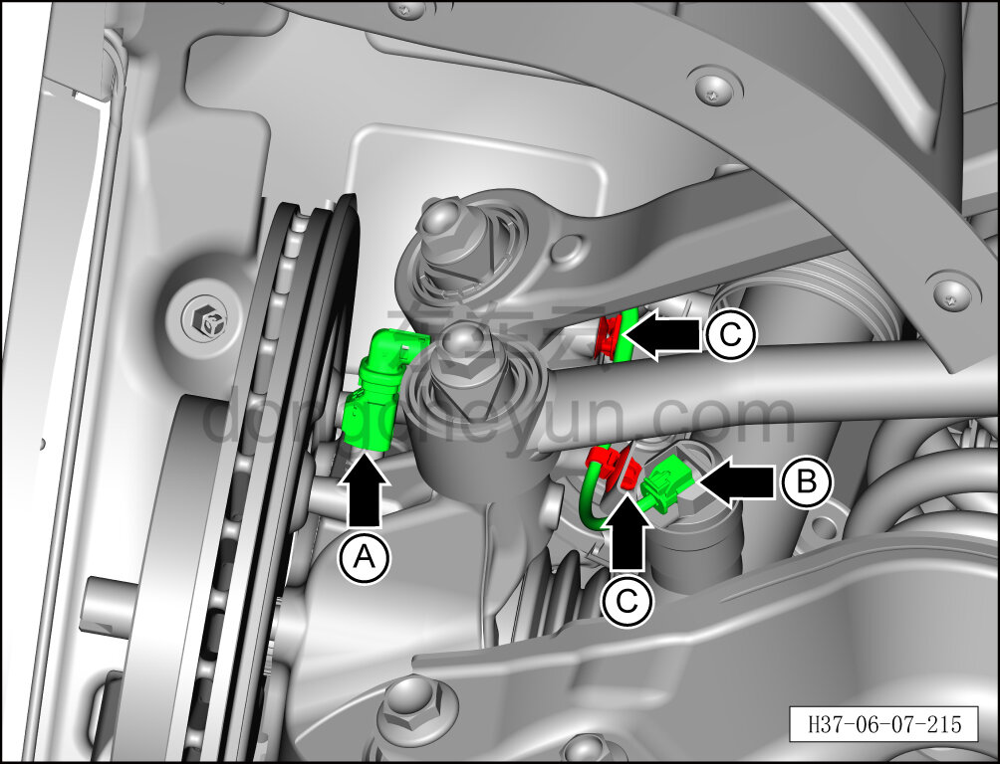
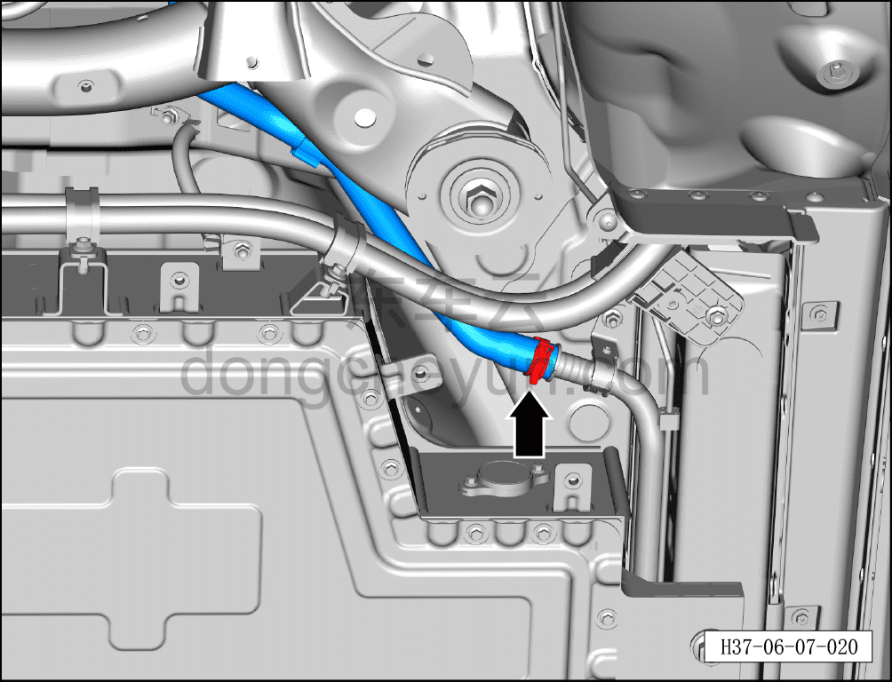
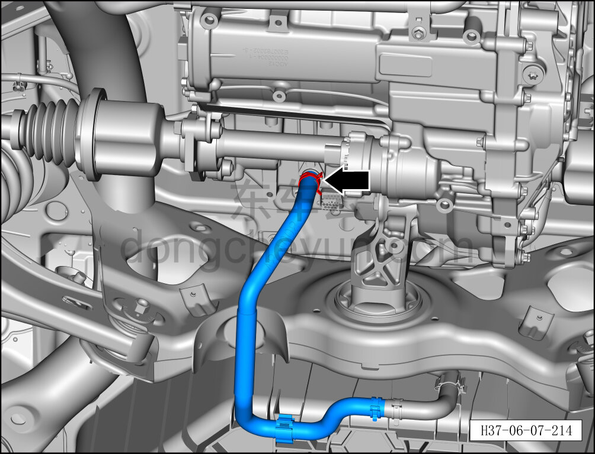
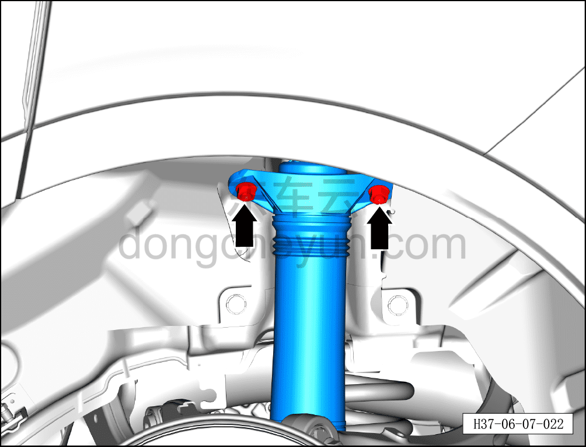
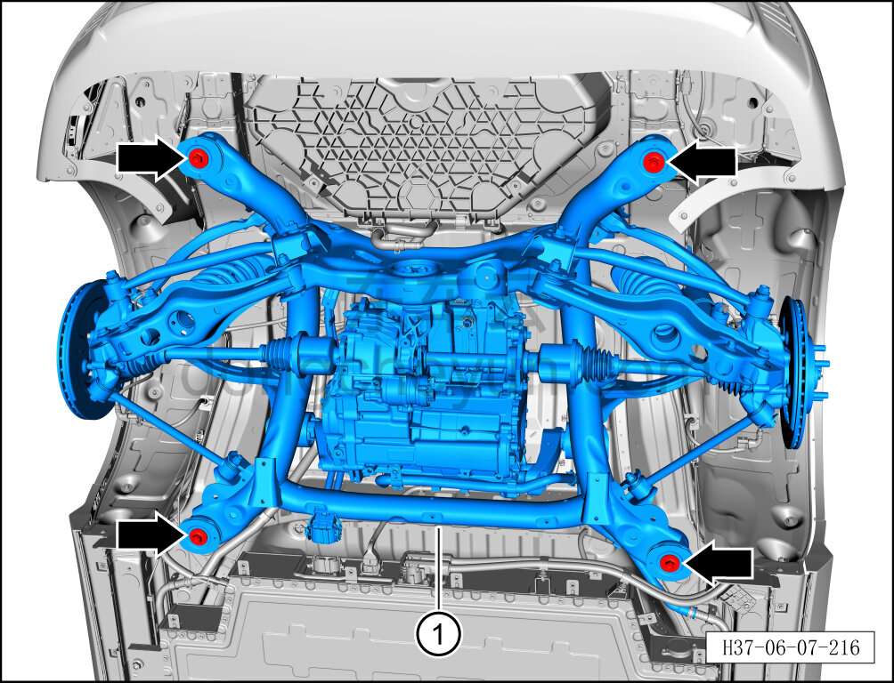

# Снятие и установка заднего подрамника и заднего тягового электродвигателя в сборе

> Система шасси › Система задней подвески › Задний подрамник  
> Оригинал: `拆卸与安装后副车架及后驱动电机总成` · [dongcheyun 56746](https://dongcheyun.com/p/56746), страница `33e7c50b593545529918c4756c6738a1` · [оглавление](../README.md)

**Порядок снятия**

**Примечание:**

**- Задний подрамник необходимо снимать вместе с задним тяговым электродвигателем, и только затем разделять их.**

**- При снятии заднего тормозного суппорта не требуется отворачивать крепёжный болт соединения тормозного шланга с суппортом.**

**- После снятия тормозного суппорта закрепите его стальной проволокой в месте, не мешающем снятию и не создающем натяжения тормозного шланга.**

1. Выключите все электроприборы, отключите питание.

2. Выполните обесточивание автомобиля для ремонта. См. [3.1.4.1 Обесточивание автомобиля](../03-техническое-обслуживание/005-обесточивание-автомобиля.md)

3. Поднимите автомобиль на подъёмнике на подходящую высоту.

4. Снимите заднее колесо, см. [6.5.8.1 Снятие и установка колеса](064-снятие-и-установка-колеса.md)

5. Снимите дополнительный кронштейн задней нижней защитной панели. См. [8.6.4.6 Снятие и установка дополнительного кронштейна задней нижней защитной панели](../08-внутренняя-и-внешняя-отделка/196-снятие-и-установка-вспомогательного-кронштейна-заднего.md)

6. Слейте охлаждающую жидкость тягового электродвигателя. См. [3.1.5.1 Замена охлаждающей жидкости тягового электродвигателя и тяговой батареи](../03-техническое-обслуживание/006-замена-охлаждающей-жидкости-тягового-электродвигателя.md)

7. Снимите задний тормозной суппорт. См. [6.6.6.2 Снятие и установка левого заднего тормозного суппорта](075-снятие-и-установка-левого-заднего-тормозного-суппорта.md)

8. Снимите стойку заднего стабилизатора поперечной устойчивости. См. [6.3.8.2 Снятие и установка стойки заднего стабилизатора поперечной устойчивости](038-снятие-и-установка-стойки-заднего-стабилизатора.md)

9. Снимите задний стабилизатор поперечной устойчивости. См. [6.3.8.1 Снятие и установка заднего стабилизатора поперечной устойчивости](037-снятие-и-установка-заднего-стабилизатора-поперечной.md)

10. Снятие заднего подрамника и заднего тягового электродвигателя в сборе.

a. Используя специальный инструмент (H52220000), выверните стопорную гайку ступицы колеса.

Момент затяжки гайки: 330±15 Н·м

**Примечание:**

**- При установке гайки не используйте пневматический инструмент — это может привести к повреждению резьбы гайки.**

b. Отсоедините разъём высоковольтного жгута заднего электродвигателя.

**Внимание:**

**- После снятия закройте высоковольтный порт, к которому подключается высоковольтный жгут заднего электродвигателя, чистой изолирующей защитной крышкой, чтобы предотвратить попадание посторонних предметов или случайное касание.**

c. Используя торцевую головку на 10 мм, выверните крепёжный болт жгута заземления.

d. Отсоедините разъём A жгута заднего тягового электродвигателя.

e. Отсоедините фиксирующую клипсу B жгута заднего тягового электродвигателя.

f. Используя торцевую головку на 8 мм, выверните 2 крепёжных болта кронштейна жгута датчика скорости заднего колеса.

**Примечание:**

**- Здесь описан порядок снятия 2 крепёжных болтов кронштейна жгута датчика скорости левого заднего колеса; для правой стороны можно руководствоваться порядком для левой.**

g. Отсоедините разъём A жгута датчика скорости колеса.

h. Отсоедините разъём B жгута заднего регулируемого амортизатора демпфирования.

i. Отсоедините 2 фиксирующие клипсы C жгута кузова, отведите жгут кузова в место, не мешающее снятию.

**Примечание:**

**- Здесь описан порядок отсоединения жгута кузова; для правой стороны можно руководствоваться порядком для левой.**

j. Используя клещи для хомутов шлангов, отсоедините фиксирующий хомут узла патрубка обратки заднего электродвигателя, отсоедините патрубок обратки заднего электродвигателя от жёсткой трубки обратки среднего канала заднего электродвигателя.

k. С помощью клещей для хомутов шлангов сместите хомут водяного шланга с места установки и отсоедините патрубок подачи охлаждающей жидкости заднего электродвигателя.

l. Используя торцевую головку на 16 мм, отверните 2 крепёжных болта стойки заднего CDC-амортизатора.

Момент затяжки болтов: 50 Н·м+45°

m. Установите стойку подъёмника под задним подрамником и, поднимая, подоприте задний подрамник и задний тяговый электродвигатель в сборе.

n. Используя торцевую головку на 21 мм, отверните 4 крепёжных болта заднего подрамника в сборе.

Момент затяжки болтов: 180 Н·м+120°

o. Медленно опустите стойку подъёмника и извлеките задний подрамник и задний тяговый электродвигатель в сборе ①.

**Внимание:**

**- При опускании заднего подрамника и заднего тягового электродвигателя в сборе необходимо следить за тем, не мешают ли фиксирующие клипсы жгутов проводов и трубопроводов, чтобы избежать повреждения жгутов проводов и трубопроводов.**

**- В процессе снятия подрамника и заднего тягового электродвигателя в сборе извлеките заднюю пружину подвески.**

**Порядок установки**

Установка выполняется в обратном порядке.

Внимание:

**- Охлаждающую жидкость нельзя использовать повторно, смешивать, а также нельзя заменять охлаждающей жидкостью другого цвета. Проверьте, находится ли уровень охлаждающей жидкости между отметками MAX (максимум) и MIN (минимум).**

**- Обязательно выполните удаление воздуха из системы.**

**- После завершения установки необходимо выполнить развал-схождение;**

**- После завершения ремонта обязательно выполните дорожное испытание, убедитесь в отсутствии посторонних шумов со стороны шасси и явления увода.**
