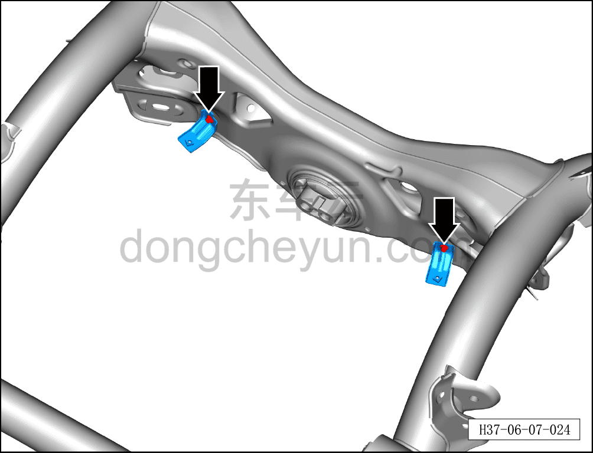
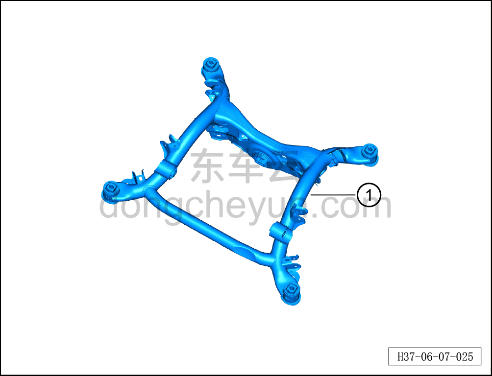

# Снятие и установка заднего подрамника

> Система шасси › Система задней подвески › Задний подрамник  
> Оригинал: `拆卸与安装后副车架` · [dongcheyun 56746](https://dongcheyun.com/p/56746), страница `3b45c5ca1cc14f50ac5ced08efe2785c` · [оглавление](../README.md)

**Порядок снятия**

1. Выключите все электроприборы, отключите питание.

2. Выполните обесточивание автомобиля для ремонта. См. [3.1.4.1 Обесточивание автомобиля](../03-техническое-обслуживание/005-обесточивание-автомобиля.md)

3. Снимите задний подрамник и задний тяговый электродвигатель в сборе. См. [6.3.9.1 Снятие и установка заднего подрамника и заднего тягового электродвигателя в сборе](039-снятие-и-установка-заднего-подрамника-и-заднего.md)

4. Снимите задний тяговый электродвигатель. См. [5.2.6.1 Снятие и установка заднего тягового электродвигателя](../05-силовая-система-на-новых-источниках/023-снятие-и-установка-заднего-тягового-электродвигателя.md)

5. Снимите заднюю стойку CDC-амортизатора в сборе. См. [6.4.6.3 Снятие и установка левой задней стойки CDC-амортизатора в сборе](048-снятие-и-установка-левой-задней-стойки-cdc.md)

6. Снимите задний поворотный кулак. См. [6.6.6.4 Снятие и установка левого заднего поворотного кулака](077-снятие-и-установка-левого-заднего-поворотного-кулака.md)

7. Снимите передний нижний рычаг задней подвески. См. [6.3.7.3 Снятие и установка переднего нижнего рычага задней подвески](034-снятие-и-установка-переднего-нижнего-рычага-задней.md)

8. Снимите передний верхний рычаг задней подвески. См. [6.3.7.2 Снятие и установка переднего верхнего рычага задней подвески](033-снятие-и-установка-переднего-верхнего-рычага-задней.md)

9. Снимите левый задний верхний рычаг задней подвески. См. [6.3.7.5 Снятие и установка левого заднего верхнего рычага задней подвески](036-снятие-и-установка-левого-верхнего-рычага-задней.md)

10. Снимите тягу схождения. См. [6.3.7.4 Снятие и установка тяги схождения](035-снятие-и-установка-тяги-схождения.md)

11. Задний нижний рычаг задней подвески. См. [6.3.7.1 Снятие и установка левого заднего нижнего рычага задней подвески](032-снятие-и-установка-левого-нижнего-рычага-задней.md)

12. Снимите задний подрамник.

a. Используя торцевую головку на 8 мм, отверните крепёжные болты кузовного кронштейна заднего нижнего защитного щитка и извлеките кузовной кронштейн заднего нижнего защитного щитка.

b. Извлеките задний подрамник ①.

**Порядок установки**

Установка выполняется в обратном порядке.

**Внимание:**

**- После завершения установки необходимо выполнить развал-схождение;**

**- После завершения ремонта обязательно выполните дорожное испытание, убедитесь в отсутствии посторонних шумов со стороны шасси и явления увода.**
