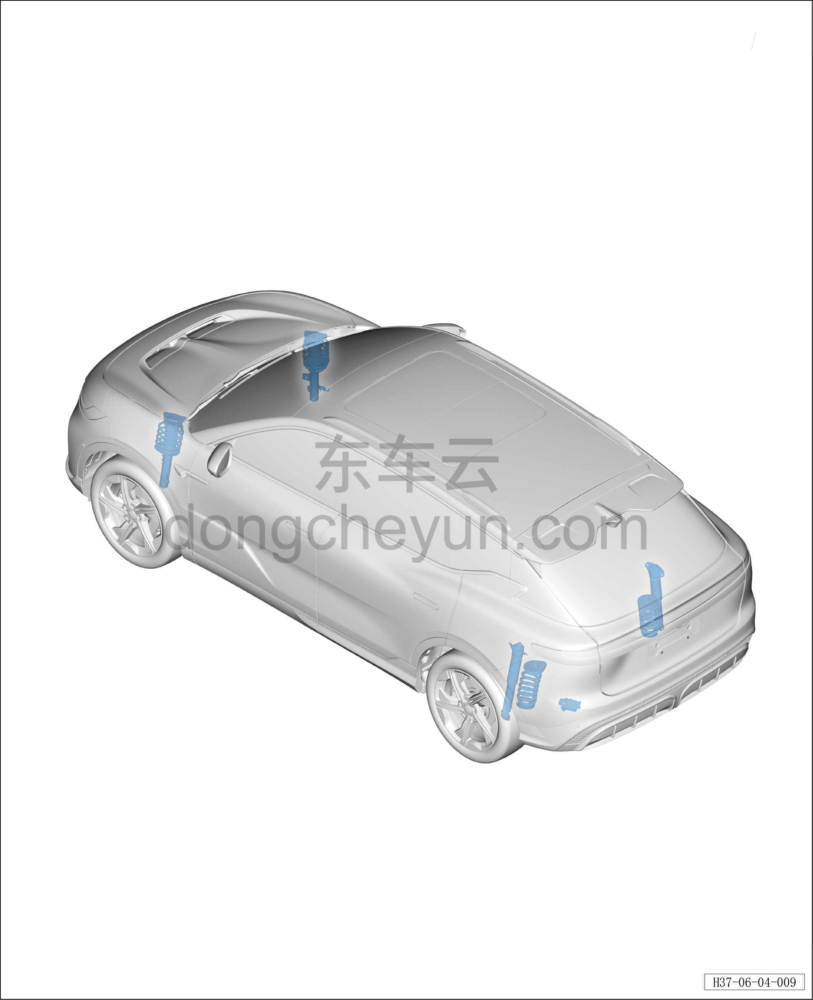

# Расположение компонентов

> Система шасси › Блок управления активной подвеской  
> Оригинал: `零部件位置图` · [dongcheyun 56746](https://dongcheyun.com/p/56746), страница `0dc02bc3b4b946c1a0bcabf1ad9ae82a` · [оглавление](../README.md)

