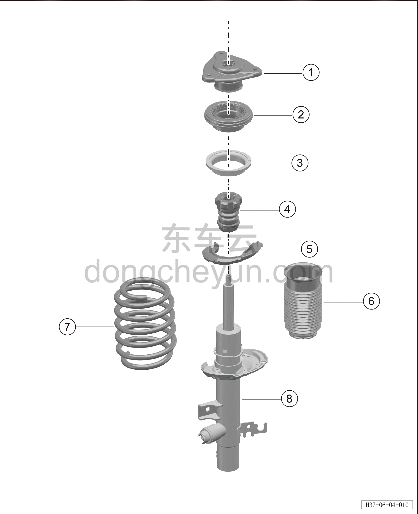
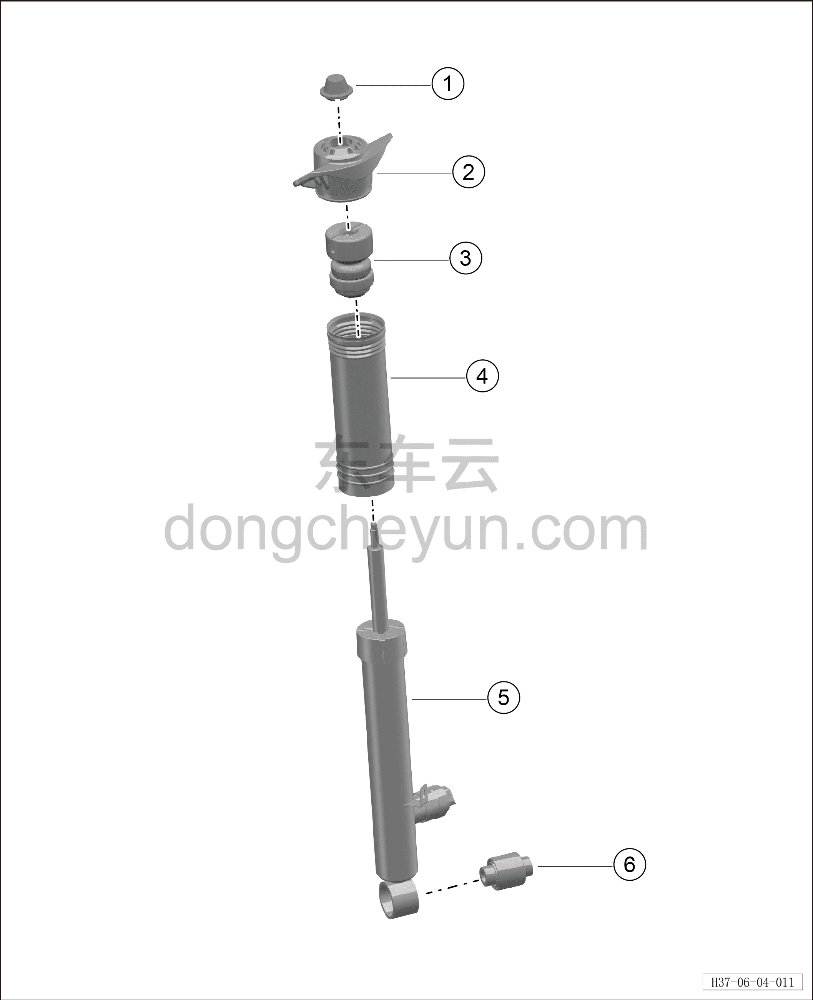

# Покомпонентный вид (деталировка)

> Система шасси › Блок управления активной подвеской  
> Оригинал: `结构分解图` · [dongcheyun 56746](https://dongcheyun.com/p/56746), страница `01cb3391168b44dd9aeb51cce2d5197b` · [оглавление](../README.md)

| № | Наименование детали | Кол-во на автомобиль | Примечание |
|---|---|---|---|
| 1 | Верхняя опора переднего амортизатора | 1 |   |
| 2 | Подшипник амортизатора | 1 |   |
| 3 | Верхняя проставка передней пружины подвески | 1 |   |
| 4 | Буфер переднего амортизатора | 1 |   |
| 5 | Нижняя проставка передней пружины подвески | 1 |   |
| 6 | Пылезащитный чехол переднего амортизатора | 1 |   |
| 7 | Передняя пружина подвески | 1 |   |
| 8 | Стойка переднего амортизатора в сборе | 1 |   |

| № | Наименование детали | Кол-во на автомобиль | Примечание |
|---|---|---|---|
| 1 | Защитный колпачок заднего амортизатора | 1 |   |
| 2 | Верхний кронштейн заднего амортизатора | 1 |   |
| 3 | Буфер заднего амортизатора | 1 |   |
| 4 | Пылезащитный чехол заднего амортизатора | 1 |   |
| 5 | Стойка заднего CDC-амортизатора | 1 |   |
| 6 | Нижняя втулка заднего амортизатора | 1 |   |
