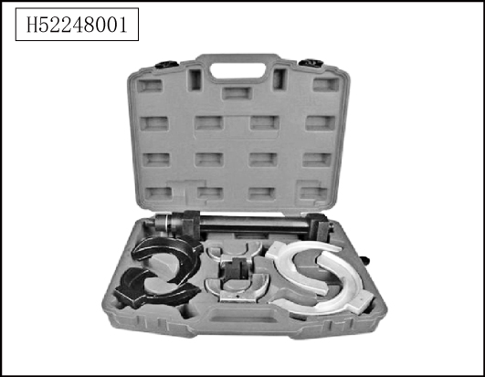
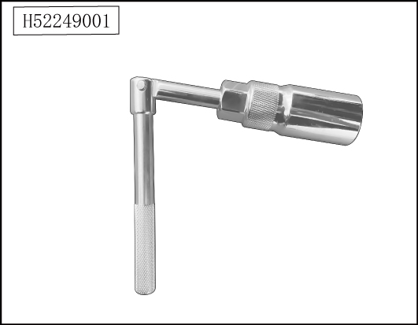

# Специальный инструмент

> Система шасси › Блок управления активной подвеской  
> Оригинал: `专用工具` · [dongcheyun 56746](https://dongcheyun.com/p/56746), страница `c295db685c1648cdbb2c4510013beb28` · [оглавление](../README.md)

| № | Иллюстрация | Номер инструмента | Наименование |
|---|---|---|---|
| 1 |  | H52248001 | Приспособление для сжатия пружины переднего амортизатора |
| 2 |  | H52249001 | Специальный инструмент для снятия и установки гайки переднего амортизатора |
