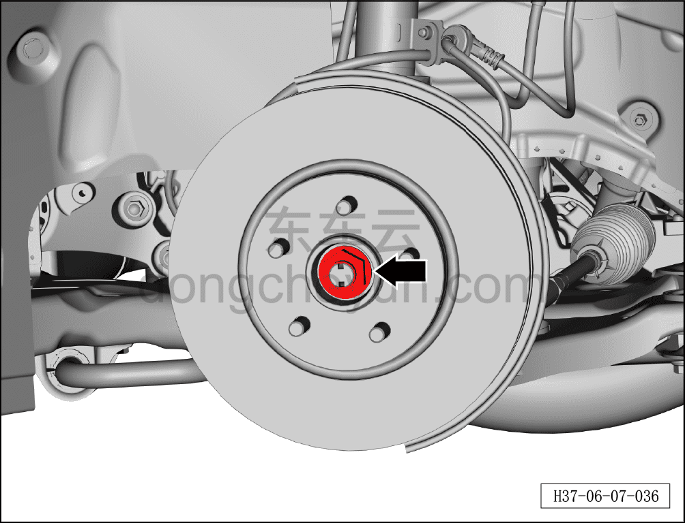
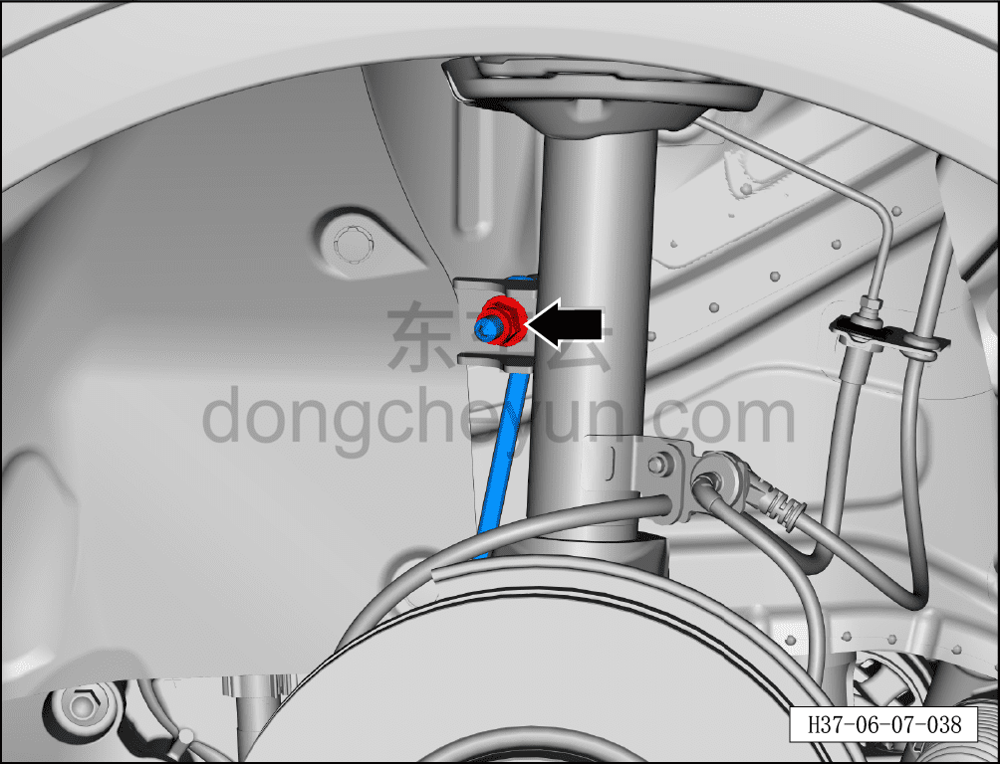
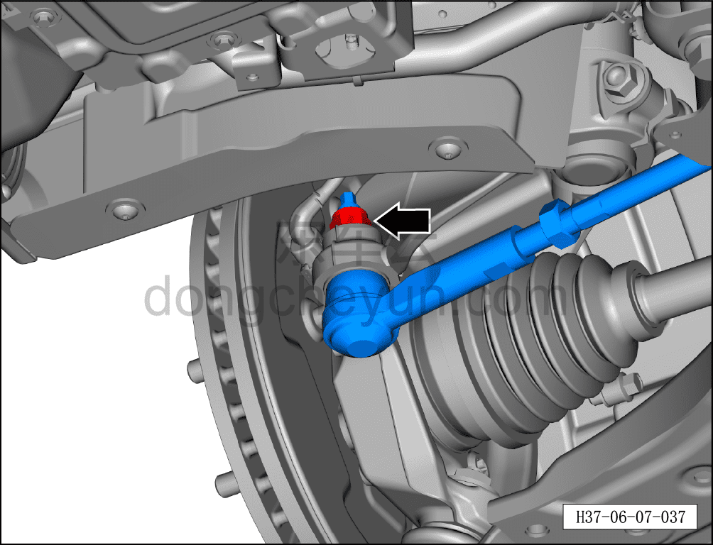
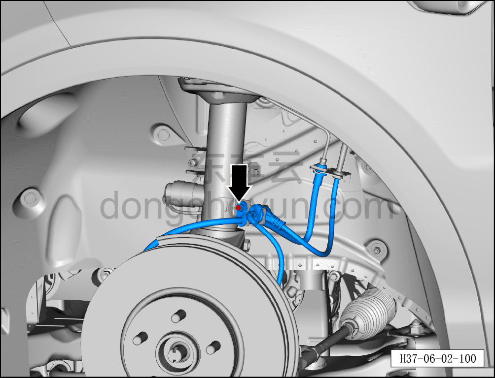
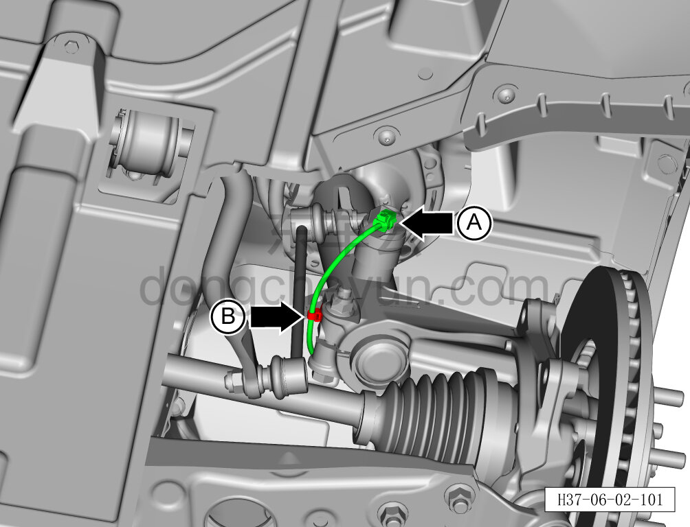
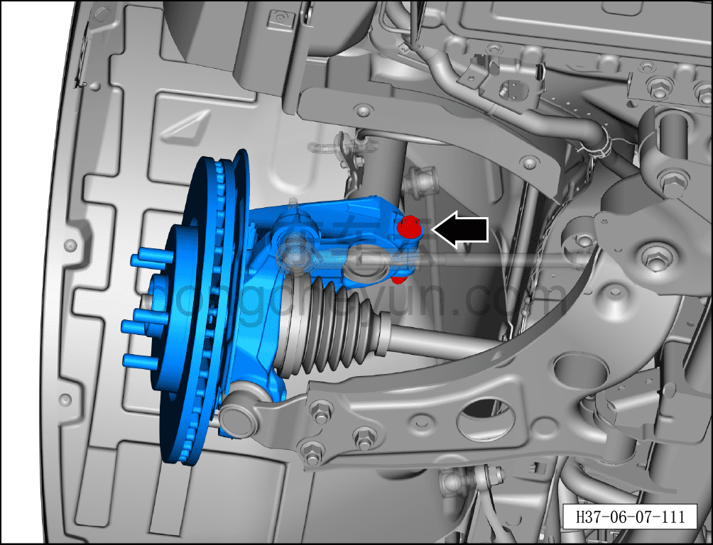
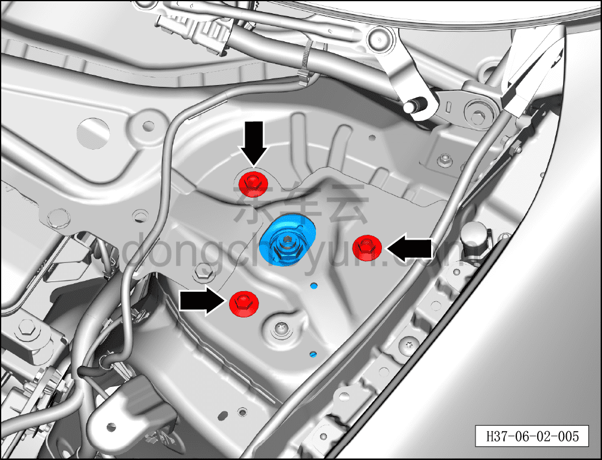
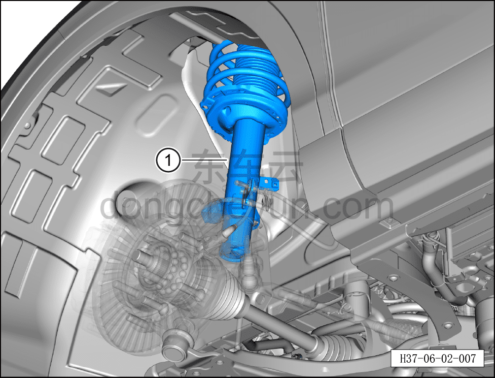

# Снятие и установка левой стойки переднего амортизатора в сборе

> Система шасси › Блок управления активной подвеской › CDC амортизатор  
> Оригинал: `拆卸和安装左前减振器支柱总成` · [dongcheyun 56746](https://dongcheyun.com/p/56746), страница `13db57e8e62e4cb3a25c79a9f364376a` · [оглавление](../README.md)

**Порядок снятия**

**Примечание:**

**- Снятие и установку переднего CDC-амортизатора необходимо выполнять силами двух человек. Чтобы амортизатор не упал и не травмировал персонал в процессе снятия, при снятии один человек должен удерживать передний амортизатор, а другой — отворачивать крепёжные болты переднего амортизатора к кузову.**

**- При снятии левого переднего тормозного суппорта не требуется отворачивать крепёжный болт соединения тормозного шланга с суппортом.**

**- После снятия тормозного суппорта закрепите его стальной проволокой в месте, не мешающем снятию и не создающем натяжения тормозного шланга.**

1. Выключите все электроприборы, отключите питание.

2. Выполните операцию обесточивания автомобиля для ремонта. См. [3.1.4.1 Обесточивание автомобиля](../03-техническое-обслуживание/005-обесточивание-автомобиля.md)

3. Снимите крышку в сборе стеклоочистителя (левую). См. [8.6.7.7 Снятие и установка крышки в сборе стеклоочистителя (левой)](../08-внутренняя-и-внешняя-отделка/244-снятие-и-установка-крышки-стеклоочистителя-в-сборе.md)

4. Снимите колесо. См. [6.5.8.1 Снятие и установка колеса](064-снятие-и-установка-колеса.md)

5. Поднимите автомобиль на подъёмнике на соответствующую высоту.

6. Снимите левый передний тормозной суппорт. См. [6.6.6.1 Снятие и установка левого переднего тормозного суппорта](074-снятие-и-установка-левого-переднего-тормозного-суппорта.md)

7. Снимите датчик ускорения колеса. См. [6.7.6.1 Снятие и установка датчика скорости колеса](104-снятие-и-установка-датчика-скорости-колеса.md)

8. Снимите левую стойку переднего амортизатора в сборе.

a. Используя усиленную торцевую головку на 36 мм, отверните гайку ступицы колеса.

Момент затяжки гайки: 330±15 Н·м

**Примечание:**

**- Необходимо зафиксировать тормозной диск с помощью инструмента.**

**- При установке гайки не используйте пневматический инструмент — это может привести к повреждению резьбы гайки.**

b. Удерживая насадкой TX30, отверните гаечным ключом на 18 мм крепёжную гайку тяги левого переднего стабилизатора.

Момент затяжки гайки: 60 Н·м+45°

c. Удерживая палец торцевой головкой на 8 мм, отверните гаечным ключом на 21 мм крепёжную гайку.

Момент затяжки гайки составляет: 120±12 Н·м

d. С помощью специального инструмента (H52246001) отсоедините левый наружный шаровой шарнир рулевого механизма от поворотного кулака.

e. Используя торцевую головку на 10 мм, отверните крепёжный болт тормозного шланга и переместите тормозной шланг и жгут проводов датчика скорости колеса в положение, не мешающее снятию.

f. Отсоедините разъём A жгута проводов стойки переднего амортизатора.

g. Отсоедините фиксирующую защёлку B жгута проводов стойки переднего амортизатора.

h. Удерживая крепёжный болт торцевой головкой на 15 мм, отверните торцевой головкой на 18 мм 3 крепёжные гайки шарового шарнира левого переднего нижнего рычага.

i. Отведите стойку переднего амортизатора в сборе и поворотный кулак в направлении стрелки до тех пор, пока шаровой шарнир левого переднего нижнего рычага не выйдет из установочного отверстия нижнего рычага.

j. Удерживая крепёжный болт гаечным ключом на 18 мм, отверните торцевой головкой на 18 мм крепёжную гайку и извлеките крепёжный болт.

Момент затяжки гайки: 60 Н·м+45°

k. Для извлечения поворотного кулака требуется помощь двух человек.

l. Используя торцевую головку на 18 мм, отверните 3 крепёжных болта левой стойки переднего амортизатора в сборе.

Момент затяжки болтов: 65±5 Н·м

m. Извлеките левую стойку переднего амортизатора в сборе ①.

**Порядок установки**

Установка выполняется в обратном порядке.

**Внимание:**

**- Поскольку левый задний рычаг передней подвески и шаровой палец являются одной сборочной единицей, соединительные болты шарового пальца с левым задним рычагом передней подвески имеют строгие требования к сборке. После снятия болтов необходимо заменить левый передний нижний рычаг с шаровым пальцем в сборе на новый, разборка при установке не допускается.**

**- После завершения установки необходимо выполнить развал-схождение;**

**- После завершения ремонта обязательно выполните дорожное испытание, убедитесь в отсутствии посторонних шумов со стороны шасси и явления увода.**
