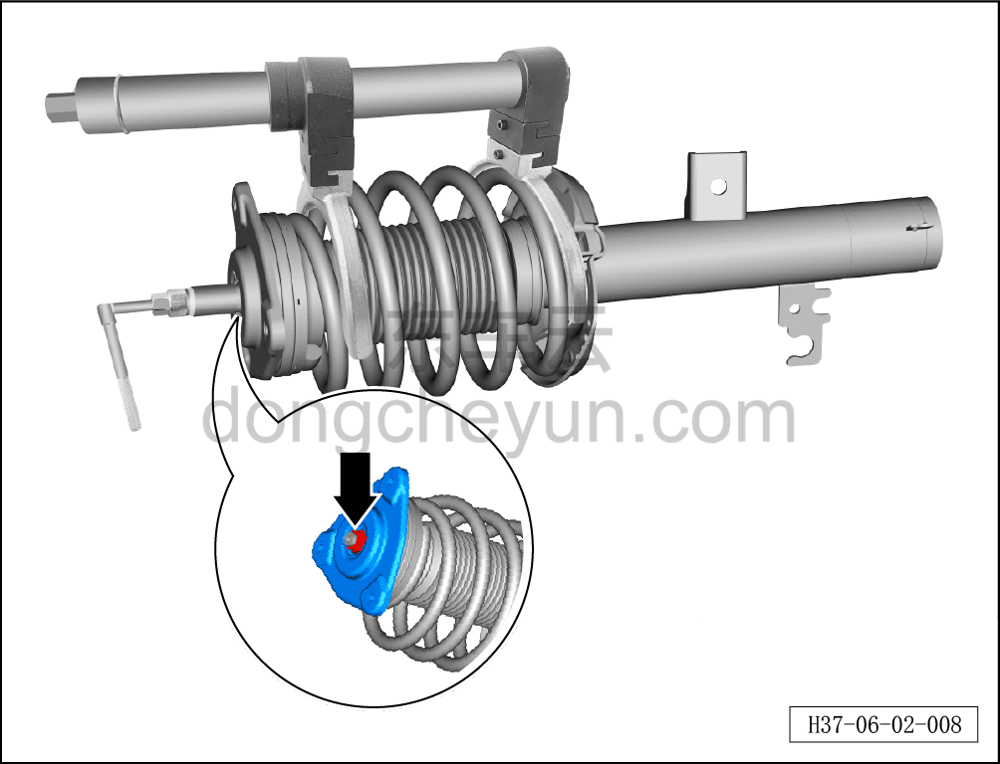
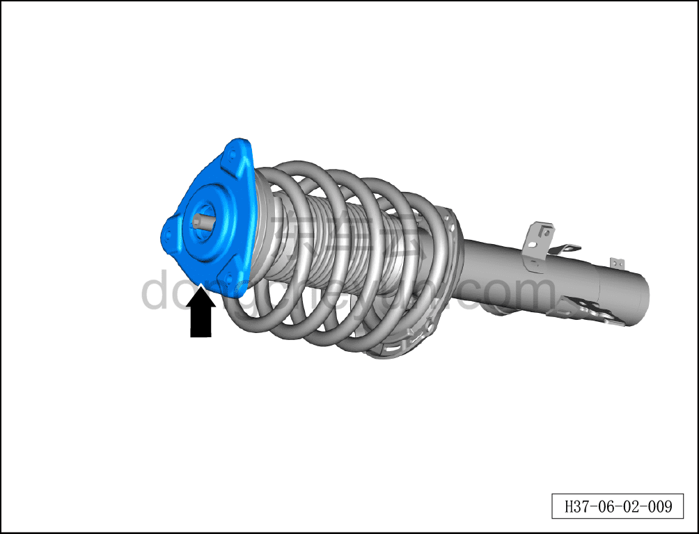
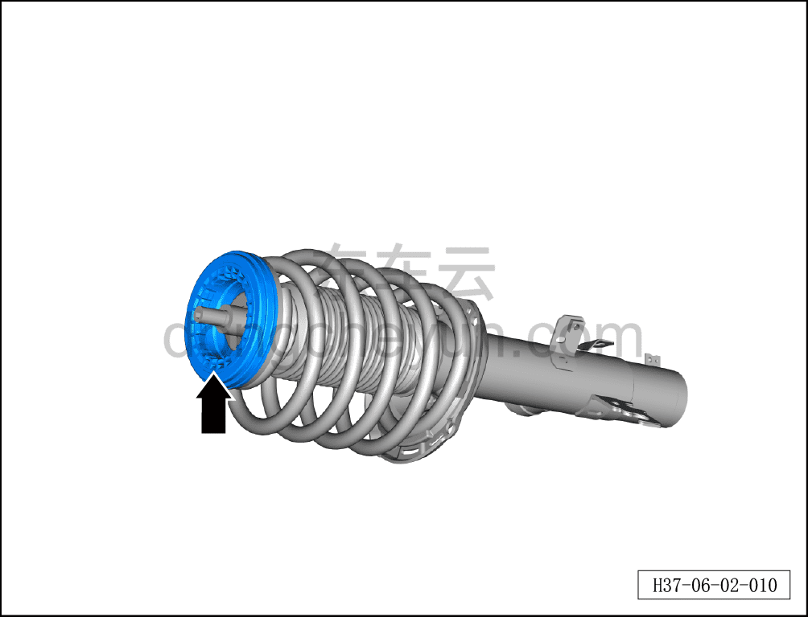
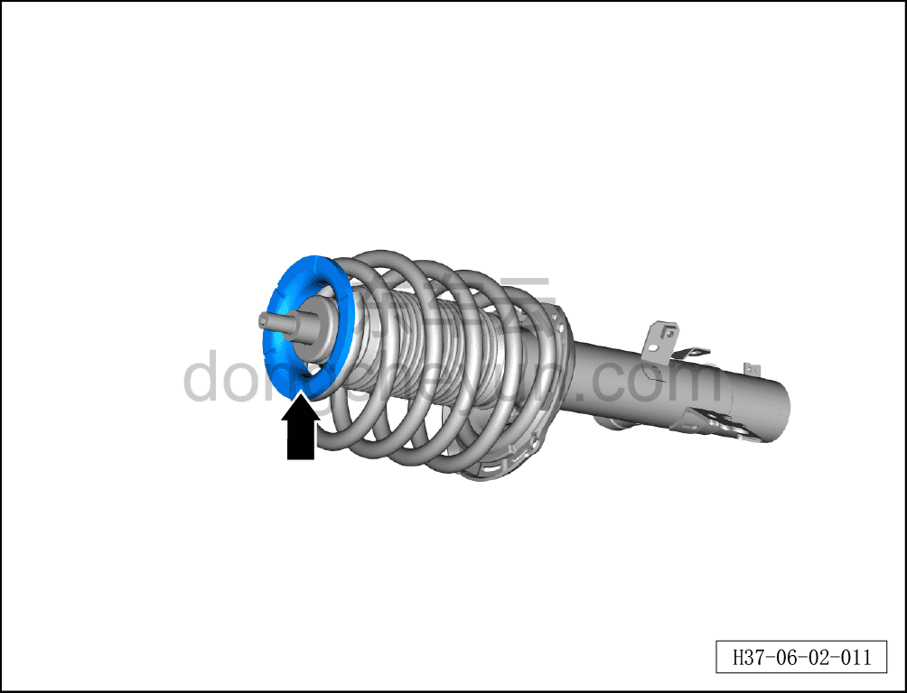
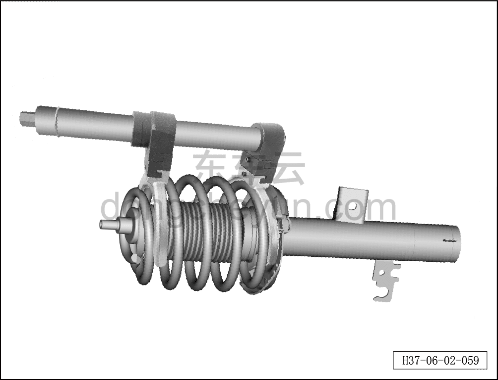
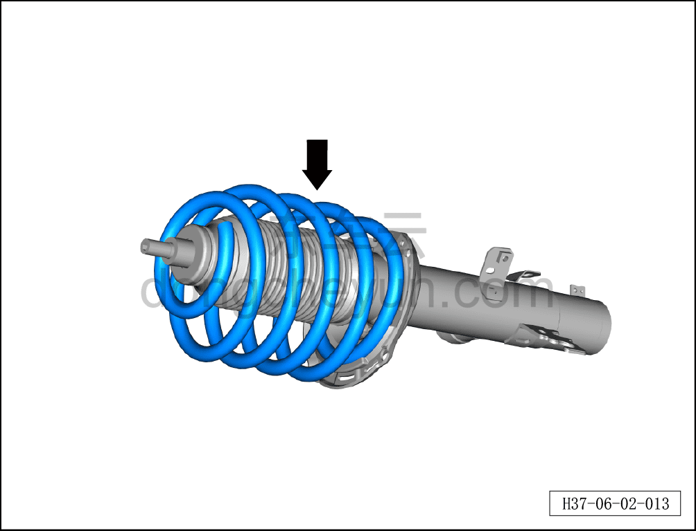
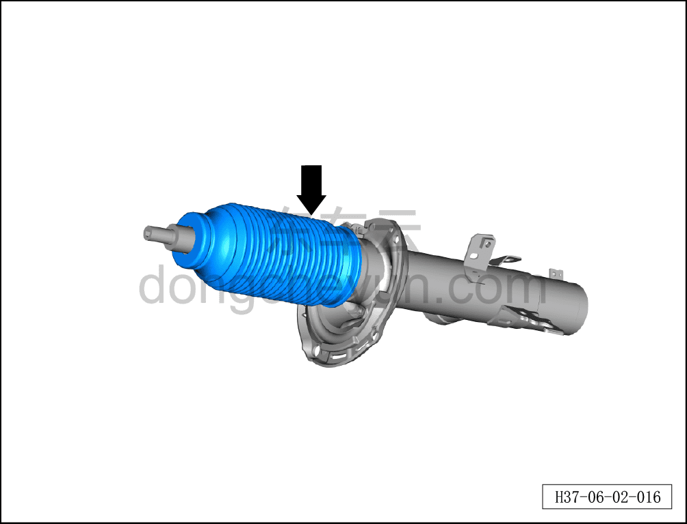
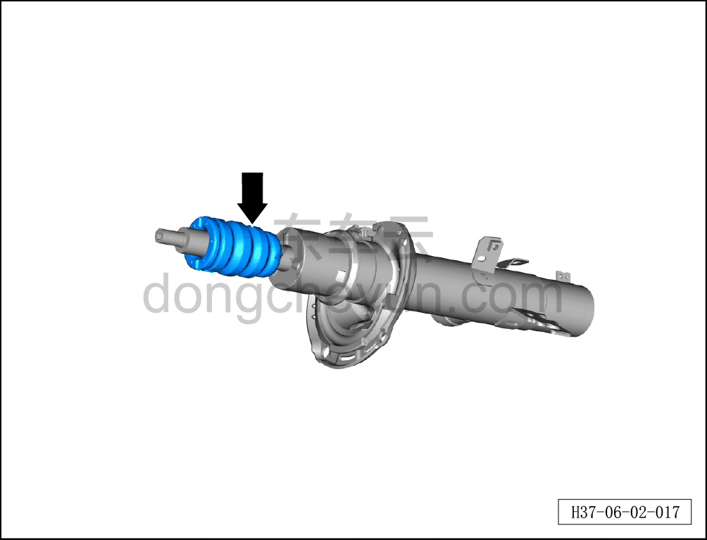
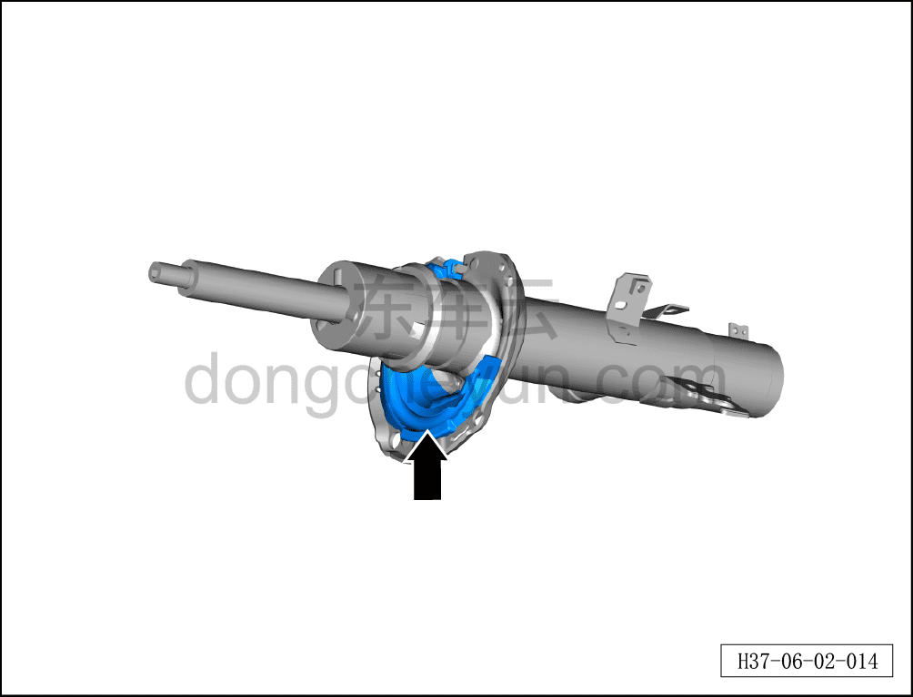
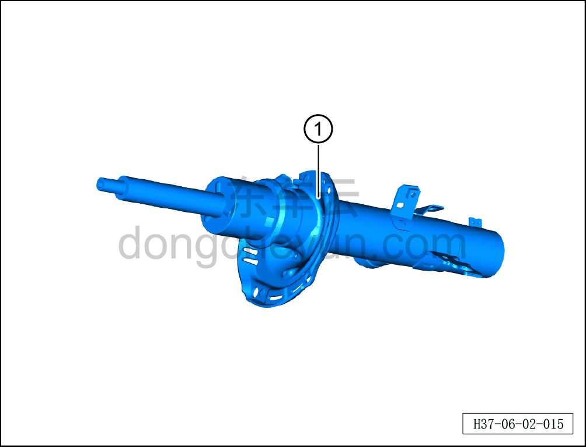

# Разборка и сборка стойки переднего амортизатора в сборе

> Система шасси › Блок управления активной подвеской › CDC амортизатор  
> Оригинал: `前减振器支柱总成拆解与组装` · [dongcheyun 56746](https://dongcheyun.com/p/56746), страница `e8c2741cee2c4f62b678559512dc25ea` · [оглавление](../README.md)

**Порядок снятия**

**Примечание:**

**- Ниже описана левая стойка переднего амортизатора в сборе, для правой стороны см. левую.**

1. Снимите левую стойку переднего амортизатора в сборе. См. [6.4.6.1 Снятие и установка левой стойки переднего амортизатора в сборе](046-снятие-и-установка-левой-стойки-переднего-амортизатора.md)

2. Разберите левую стойку переднего амортизатора в сборе.

a. Закрепите два фиксирующих захвата приспособления для сжатия пружины амортизатора на пружине амортизатора.

b. Используя торцевую головку на 21 мм, заворачивайте по часовой стрелке приспособление для сжатия пружины амортизатора до тех пор, пока пружина не сжмётся так, что между ней и верхней и нижней опорами образуется зазор.

c. Используя специальный инструмент для снятия и установки гайки переднего амортизатора, отверните самоблокирующуюся гайку амортизатора.

**Внимание:**

**- Разборку стойки амортизатора в сборе необходимо выполнять силами двух человек, убедившись, что приспособление для сжатия пружины амортизатора надёжно закреплено на пружине амортизатора, иначе это может привести к травмированию людей и повреждению деталей.**

d. Извлеките верхнюю опору переднего амортизатора в сборе.

e. Извлеките подшипник амортизатора.

**Примечание:**

**- Проверьте подшипник амортизатора на заклинивание или посторонний шум; при их наличии замените подшипник амортизатора на новый.**

f. Извлеките верхнюю проставку передней пружины подвески.

**Примечание:**

**- Проверьте верхнюю проставку передней пружины подвески на старение или повреждение; при их наличии замените проставку пружины подвески на новую.**

g. Используя торцевую головку на 22 мм, отворачивайте против часовой стрелки болт приспособления для сжатия пружины амортизатора до тех пор, пока пружина не освободится самостоятельно.

h. Извлеките переднюю пружину подвески.

**Примечание:**

**- Проверьте переднюю пружину подвески на наличие трещин; при их наличии замените пружину подвески на новую.**

i. Извлеките пылезащитный чехол переднего амортизатора.

**Примечание:**

**- Проверьте пылезащитный чехол переднего амортизатора на старение или повреждение; при их наличии замените его на новый.**

j. Извлеките буфер переднего амортизатора.

**Примечание:**

**- Проверьте буфер переднего амортизатора на старение или повреждение; при их наличии замените его на новый.**

k. Извлеките нижнюю проставку передней пружины подвески.

**Примечание:**

**- Проверьте нижнюю проставку передней пружины подвески на старение или повреждение; при их наличии замените её на новую.**

l. Извлеките верхнюю опору переднего амортизатора ①.

**Примечание:**

**- Проверьте верхнюю опору переднего амортизатора на наличие следов утечки масла.**

**- Проверьте плавность хода сжатия-отбоя верхней опоры переднего амортизатора; при заклинивании или прерывистом ходе замените верхнюю опору переднего амортизатора на новую.**

**Порядок установки**

Установка выполняется в обратном порядке.

**Внимание:**

**- После завершения установки необходимо выполнить развал-схождение;**

**- После завершения ремонта обязательно выполните дорожное испытание, убедитесь в отсутствии посторонних шумов со стороны шасси и явления увода.**
