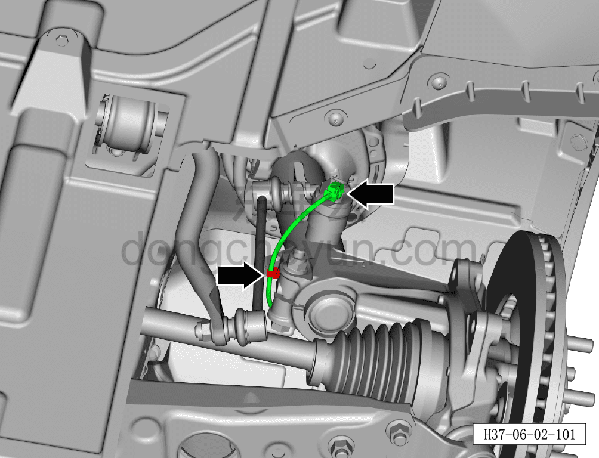
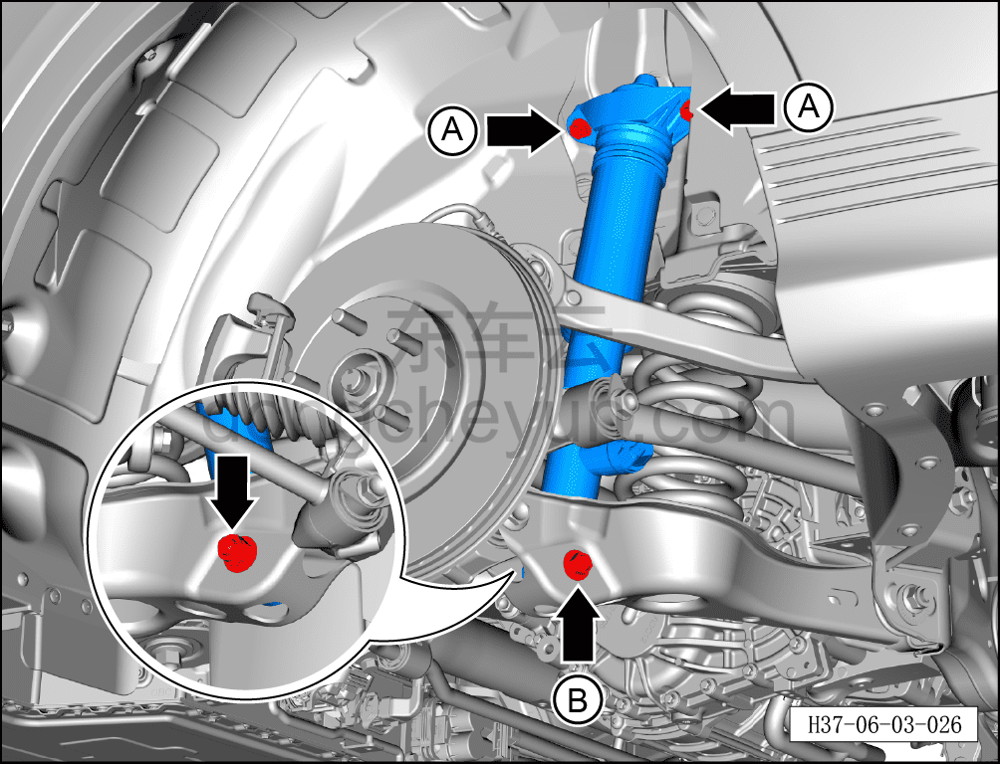
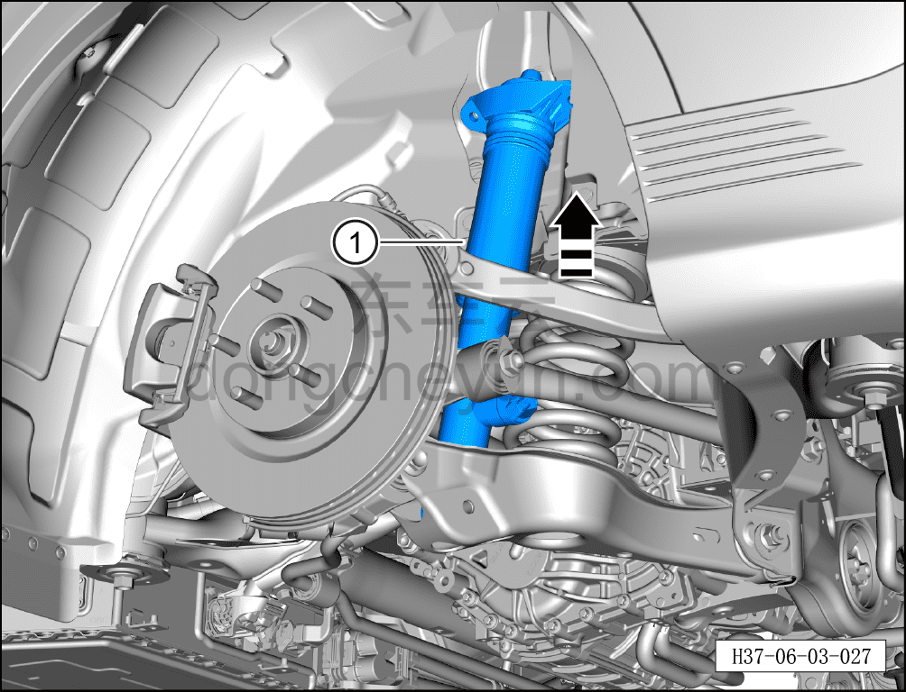

# Снятие и установка левой задней стойки CDC-амортизатора в сборе

> Система шасси › Блок управления активной подвеской › CDC амортизатор  
> Оригинал: `拆卸与安装左后阻尼可调减振器支柱总成` · [dongcheyun 56746](https://dongcheyun.com/p/56746), страница `e19189bf08764470893800a41cc8dc5a` · [оглавление](../README.md)

**Порядок снятия**

**Примечание:**

**- Ниже описаны снятие и установка левой задней стойки CDC-амортизатора в сборе, для правой стороны см. левую.**

1. Выключите все электроприборы, отключите питание.

2. Выполните операцию обесточивания автомобиля для ремонта. См. [3.1.4.1 Обесточивание автомобиля](../03-техническое-обслуживание/005-обесточивание-автомобиля.md)

3. Снимите заднее колесо. См. [6.5.8.1 Снятие и установка колеса](064-снятие-и-установка-колеса.md)

4. Поднимите автомобиль на подъёмнике на подходящую высоту.

5. Снимите заднюю нижнюю защитную панель. См. [8.6.4.4 Снятие и установка задней нижней защитной панели](../08-внутренняя-и-внешняя-отделка/194-снятие-и-установка-заднего-нижнего-защитного-щитка.md)

6. Снимите левую заднюю стойку CDC-амортизатора в сборе.

a. Отсоедините разъём жгута проводов левой задней стойки CDC-амортизатора в сборе.

b. Отсоедините фиксатор жгута проводов левой задней стойки CDC-амортизатора в сборе (на левом рисунке — автомобиль с CDC-амортизаторами).

b. Используя торцевую головку на 16 мм, отверните 2 крепёжных болта A левой задней стойки CDC-амортизатора в сборе.

Момент затяжки болта A: 50 Н·м + 45°

c. Удерживая гаечным ключом на 21 мм крепёжный болт B соединения левой задней стойки CDC-амортизатора в сборе с левым задним нижним рычагом задней подвески, отверните торцевой головкой на 21 мм крепёжную гайку и извлеките болт B.

Момент затяжки гайки B: 120±12 Н·м

d. Переместите левую заднюю стойку CDC-амортизатора в сборе в направлении стрелки, отсоединив её от левого заднего нижнего рычага задней подвески.

e. Извлеките левую заднюю стойку CDC-амортизатора в сборе ①.

**Порядок установки**

Установка выполняется в обратном порядке.

**Внимание:**

**- После завершения установки необходимо выполнить развал-схождение;**

**- После завершения ремонта обязательно выполните дорожное испытание, убедитесь в отсутствии посторонних шумов со стороны шасси и явления увода.**
