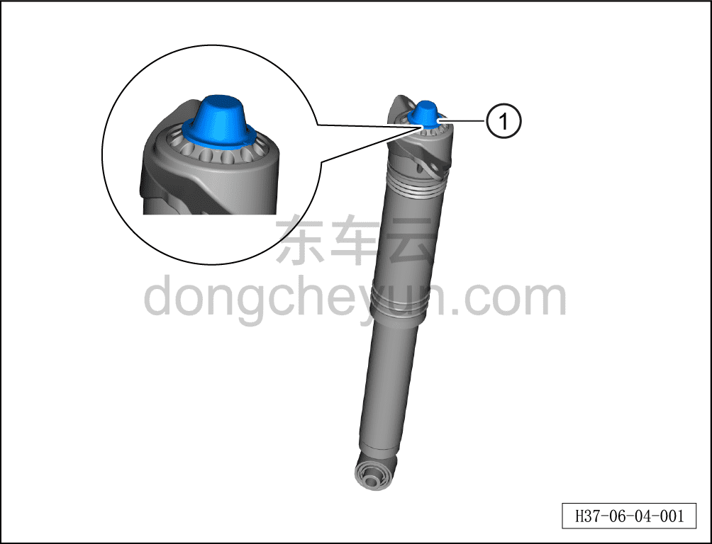
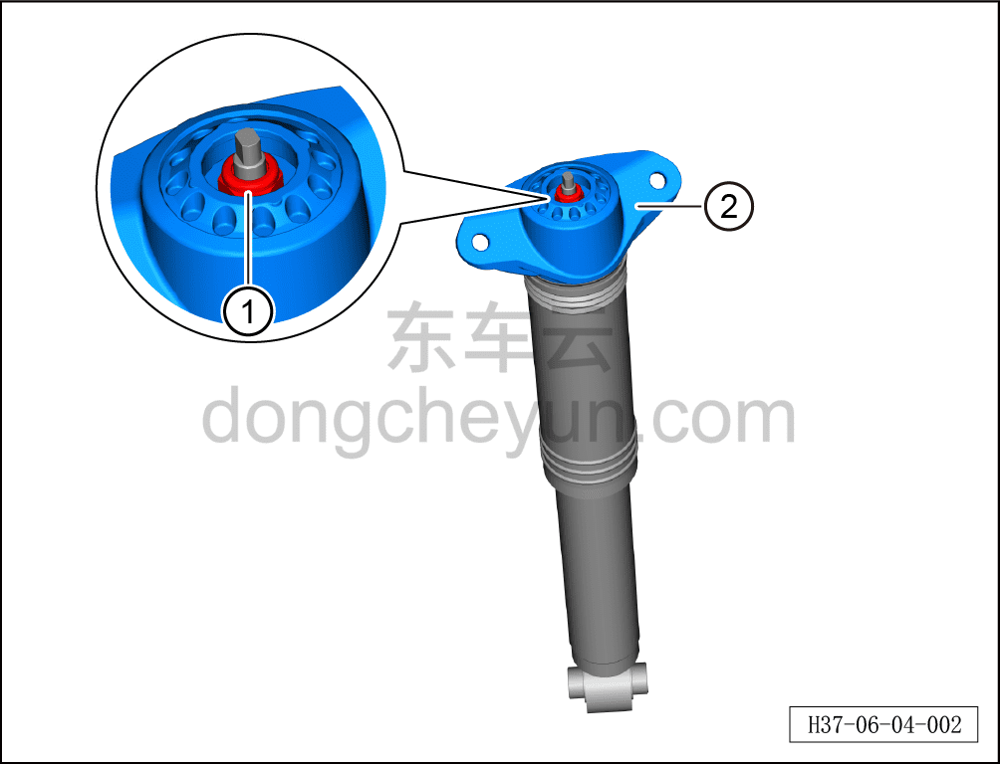
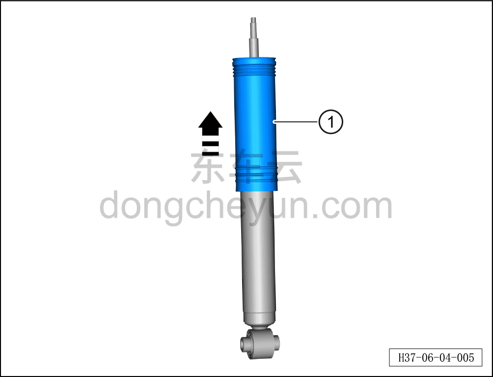
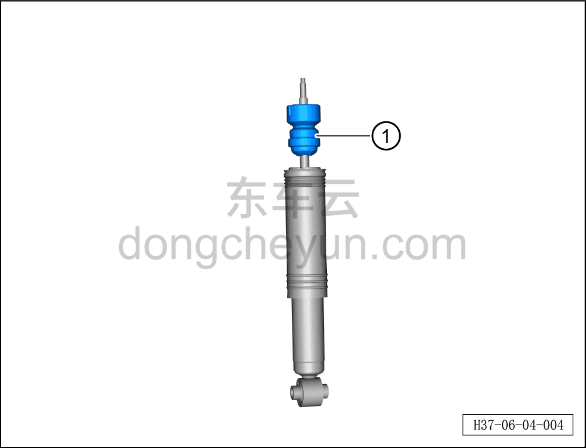
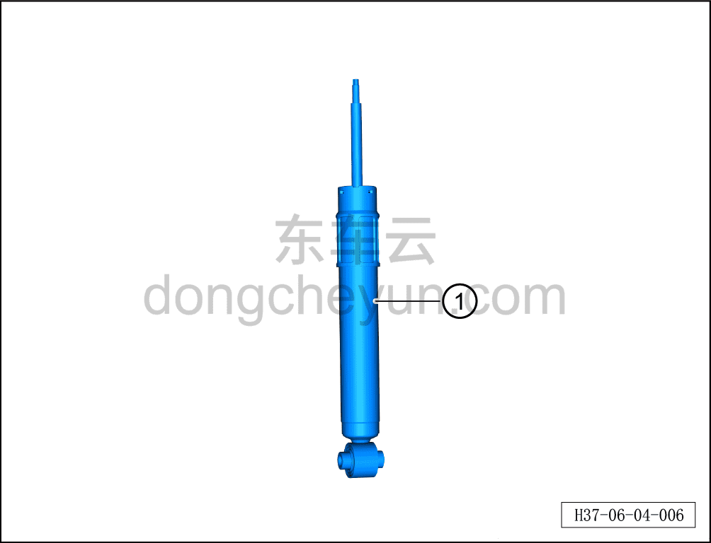
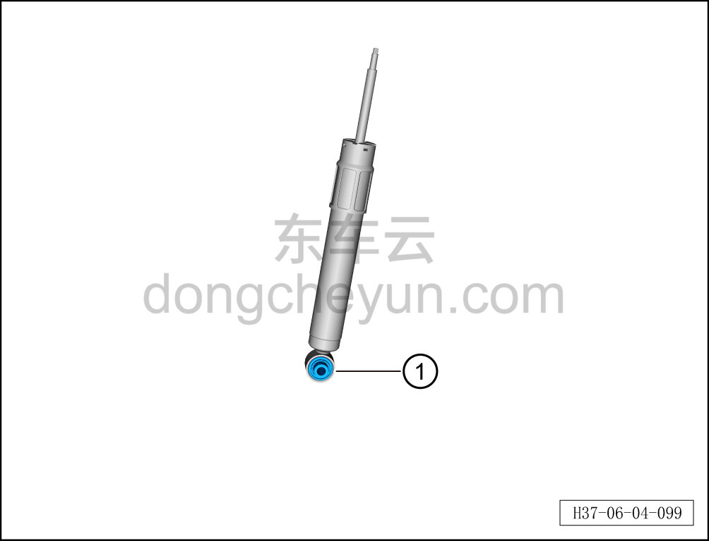

# Разборка и сборка задней стойки CDC-амортизатора в сборе

> Система шасси › Блок управления активной подвеской › CDC амортизатор  
> Оригинал: `后阻尼可调减振器支柱总成分解与组装` · [dongcheyun 56746](https://dongcheyun.com/p/56746), страница `1b05d3f6afbb445783c36d273d403048` · [оглавление](../README.md)

**Порядок снятия**

**Примечание:**

**- Ниже описаны разборка и сборка левой задней стойки CDC-амортизатора в сборе, для правой стороны см. левую.**

1. Снимите заднюю стойку CDC-амортизатора в сборе. См. [6.4.6.3 Снятие и установка левой задней стойки CDC-амортизатора в сборе](048-снятие-и-установка-левой-задней-стойки-cdc.md)

2. Разберите заднюю стойку CDC-амортизатора в сборе.

a. Используя плоскую отвёртку, отогните защитный колпачок левой задней стойки CDC-амортизатора в сборе ①.

**Внимание:**

**- На защитном колпачке предусмотрен небольшой вырез для установки инструмента при снятии.**

b. Зафиксируйте гаечным ключом левую заднюю стойку CDC-амортизатора в сборе и, используя гаечный ключ на 17 мм, отверните 1 гайку левой задней стойки CDC-амортизатора в сборе ①.

c. Извлеките верхнюю опору левого заднего амортизатора ②.

d. Извлеките в направлении стрелки пылезащитный чехол левого заднего амортизатора ①.

e. Снимите буфер левого заднего амортизатора ①.

f. Снимите левую заднюю стойку CDC-амортизатора ①.

**Внимание:**

**- Обращайтесь с задней стойкой CDC-амортизатора в сборе осторожно, избегая повреждения CDC амортизатора.**

**- Храните в сухом, хорошо вентилируемом помещении, чтобы не допустить повреждения электромагнитного клапана.**

g. Снимите нижнюю втулку заднего амортизатора ①.

**Порядок установки**

Установка выполняется в обратном порядке.

**Внимание:**

**- После завершения установки необходимо выполнить развал-схождение;**

**- После завершения ремонта обязательно выполните дорожное испытание, убедитесь в отсутствии посторонних шумов со стороны шасси и явления увода.**
