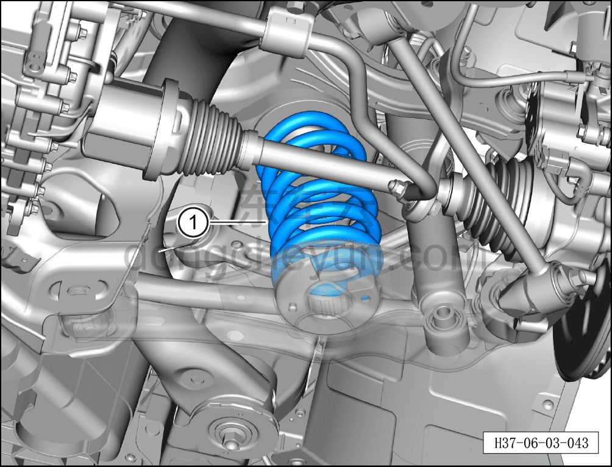
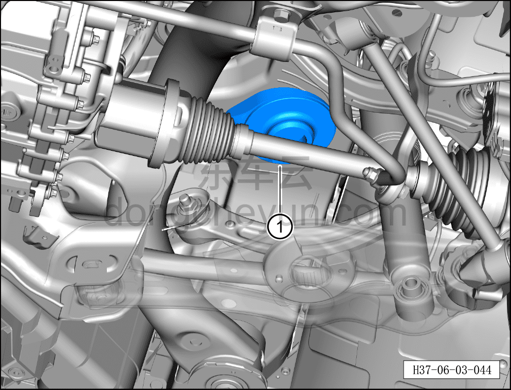
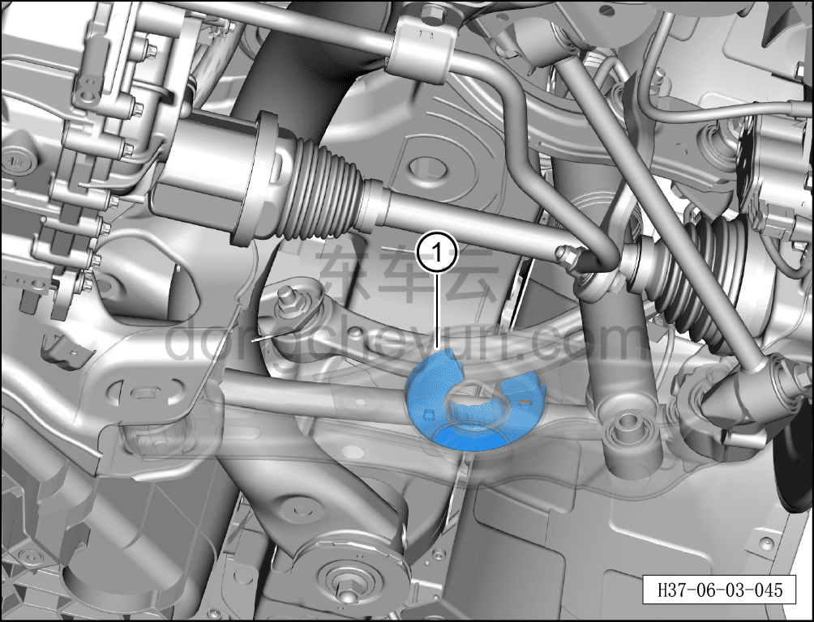

# Снятие и установка задней пружины подвески

> Система шасси › Блок управления активной подвеской › CDC амортизатор  
> Оригинал: `拆卸与安装后螺旋弹簧` · [dongcheyun 56746](https://dongcheyun.com/p/56746), страница `e2f4e08a015447158c9895765610f57a` · [оглавление](../README.md)

**Порядок снятия**

**Примечание:**

**- Ниже описаны снятие и установка левой задней пружины подвески, для правой стороны см. левую.**

1. Снимите колесо. См. [6.5.8.1 Снятие и установка колеса](064-снятие-и-установка-колеса.md)

2. Поднимите автомобиль на подъёмнике на соответствующую высоту.

3. Снимите левый задний нижний рычаг задней подвески. См. [6.3.7.1 Снятие и установка левого заднего нижнего рычага задней подвески](032-снятие-и-установка-левого-нижнего-рычага-задней.md)

4. Снимите заднюю пружину подвески.

a. Медленно опустите высокую стойку подъёмника, чтобы образовался зазор между левым задним нижним рычагом задней подвески ① и задним подрамником, поворотным кулаком.

**Примечание:**

**- Перед снятием левого заднего нижнего рычага задней подвески необходимо сначала поднять высокую стойку подъёмника и подпереть ею левый задний нижний рычаг задней подвески, чтобы после снятия пружина подвески не выскочила и не привела к травмированию людей и повреждению деталей.**

**- Перед снятием эксцентрикового болта нанесите маркером метки на местах установки эксцентрикового болта, эксцентриковой шайбы и заднего подрамника, чтобы облегчить последующую регулировку эксцентрикового болта при установке.**

b. Извлеките заднюю пружину подвески ①.

**Примечание:**

**- Проверьте заднюю пружину подвески на наличие трещин; при их наличии замените пружину подвески на новую.**

c. Извлеките верхнюю проставку задней пружины ①.

**Примечание:**

**- Проверьте верхнюю проставку задней пружины на старение или повреждение; при их наличии замените её на новую.**

d. Извлеките нижнюю проставку задней пружины ①.

**Примечание:**

**- Проверьте нижнюю проставку задней пружины на старение или повреждение; при их наличии замените её на новую.**

Порядок установки

Установка выполняется в обратном порядке.

**Внимание:**

**- После завершения установки необходимо выполнить развал-схождение;**

**- После завершения ремонта обязательно выполните дорожное испытание, убедитесь в отсутствии посторонних шумов со стороны шасси и явления увода.**
