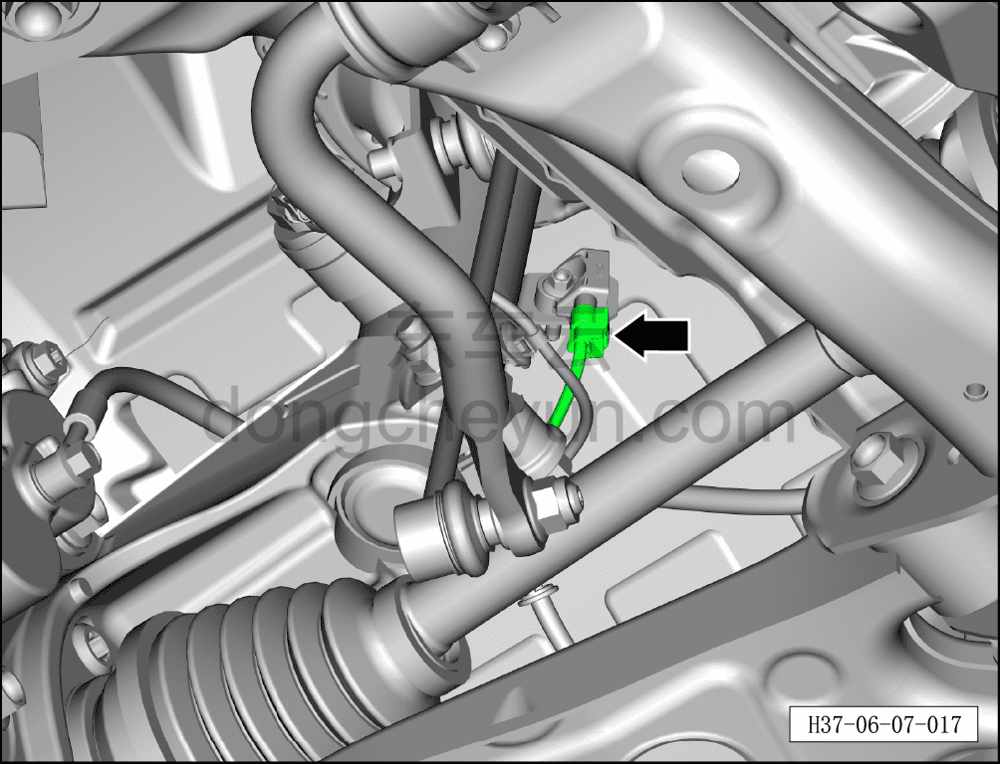
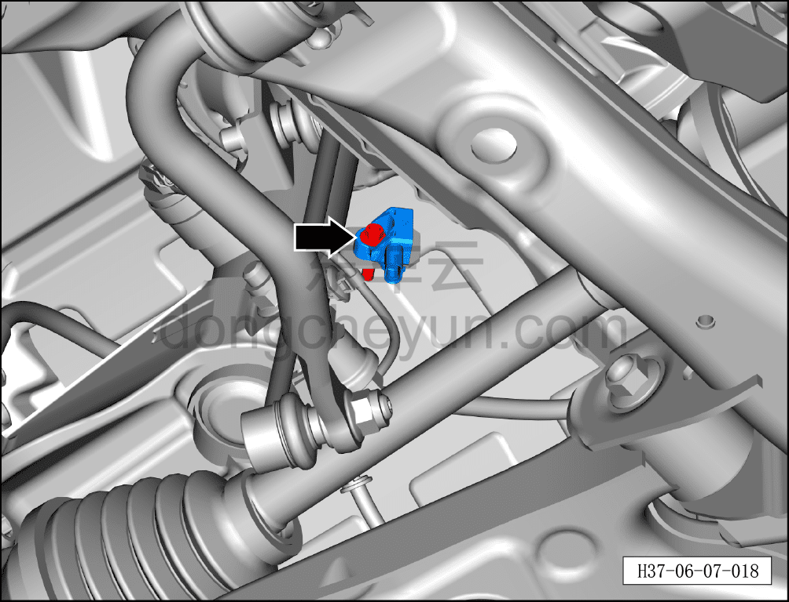
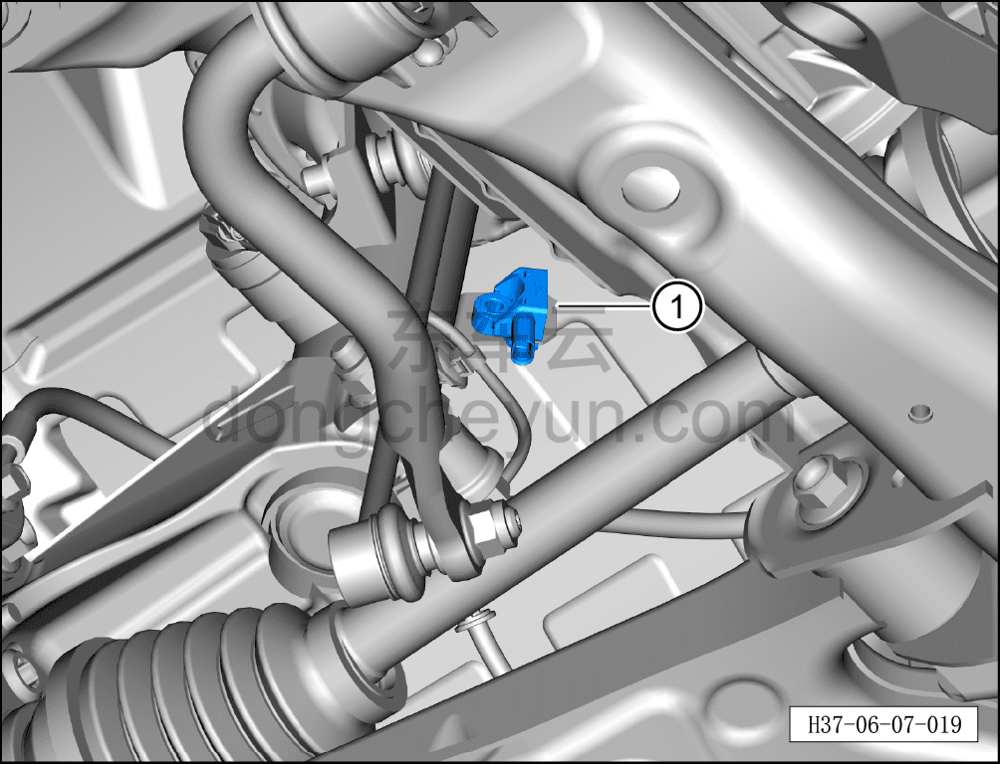

# Снятие и установка датчика ускорения колеса (полный привод)

> Система шасси › Блок управления активной подвеской › Датчик ускорения  
> Оригинал: `拆卸和安装车轮加速度传感器（四驱）` · [dongcheyun 56746](https://dongcheyun.com/p/56746), страница `fc1733bbd48443478be247785fb6e5bc` · [оглавление](../README.md)

**Порядок снятия**

**Примечание:**

**- Ниже описаны снятие и установка левого датчика ускорения колеса, для правой стороны см. левую.**

1. Выключите все электроприборы, отключите питание.

2. Выполните обесточивание автомобиля для ремонта. См. [3.1.4.1 Обесточивание автомобиля](../03-техническое-обслуживание/005-обесточивание-автомобиля.md)

3. Снимите колесо. См. [6.5.8.1 Снятие и установка колеса](064-снятие-и-установка-колеса.md)

4. Поднимите автомобиль на подъёмнике на подходящую высоту.

5. Снимите датчик ускорения колеса.

a. Отсоедините разъём жгута проводов датчика ускорения колеса.

b. Используя торцевую головку на 10 мм, отверните крепёжный болт датчика ускорения колеса.

Момент затяжки болта: 8±1 Н·м

c. Извлеките датчик ускорения колеса ①.

**Порядок установки**

Установка выполняется в обратном порядке.

**Внимание:**

**- Необходимо провести дорожное испытание и проверить исправность функционирования датчика ускорения колеса.**
