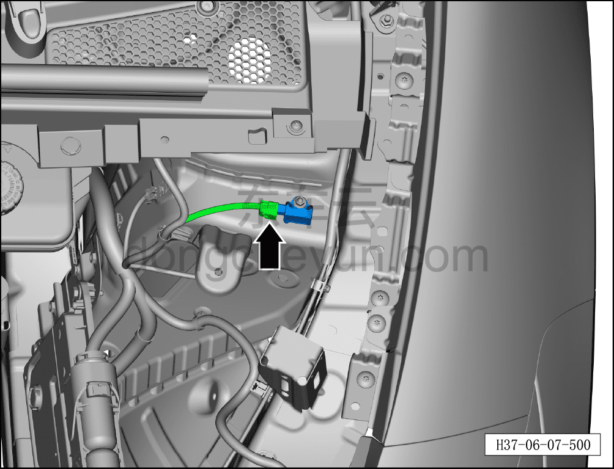
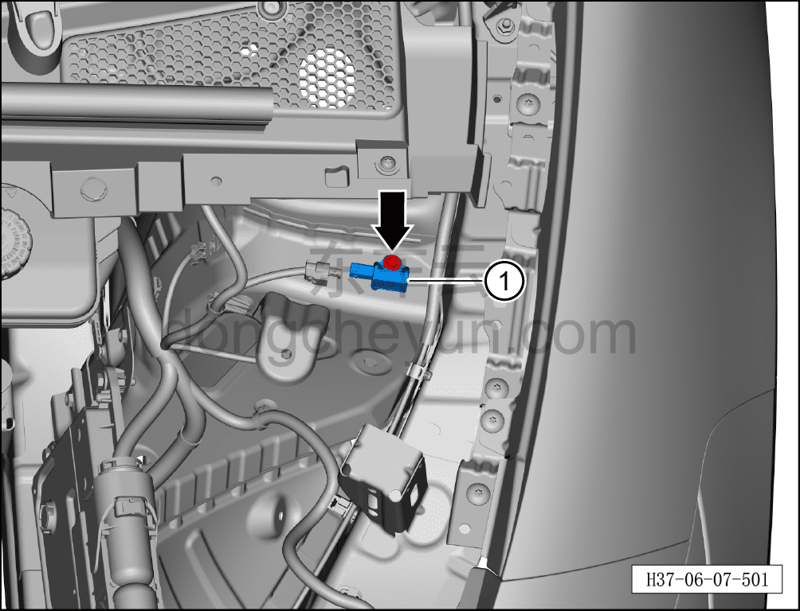

# Снятие и установка переднего датчика ускорения кузова (полный привод)

> Система шасси › Блок управления активной подвеской › Датчик ускорения  
> Оригинал: `拆卸和安装前车身加速度传感器（四驱）` · [dongcheyun 56746](https://dongcheyun.com/p/56746), страница `cc70d995a64b4215bcc54cbde5fd713a` · [оглавление](../README.md)

**Порядок снятия**

**Примечание:**

**- Ниже описаны снятие и установка левого переднего датчика ускорения кузова, для правой стороны см. левую.**

1. Выключите все электроприборы, отключите питание.

2. Выполните операцию обесточивания автомобиля для ремонта. См. [3.1.4.1 Обесточивание автомобиля](../03-техническое-обслуживание/005-обесточивание-автомобиля.md)

3. Снимите декоративную накладку моторного отсека. См. [8.6.6.10 Снятие и установка декоративной накладки моторного отсека](../08-внутренняя-и-внешняя-отделка/223-снятие-и-установка-декоративной-накладки-моторного.md)

4. Снимите левый передний датчик ускорения кузова.

a. Нажмите на фиксирующий зажим разъёма и отсоедините разъём левого переднего датчика ускорения кузова.

b. Используя торцевую головку на 8 мм, отверните крепёжный болт левого переднего датчика ускорения кузова.

Момент затяжки болтов: 10±1 Н·м

c. Снимите левый передний датчик ускорения кузова ①.

**Порядок установки**

Установка выполняется в обратном порядке.

**Внимание:**

**- После завершения установки проверьте исправность функционирования переднего датчика ускорения кузова, затем подключите диагностический сканер и проверьте наличие кодов неисправностей; если таковые имеются, найдите причину и удалите коды неисправностей.**
