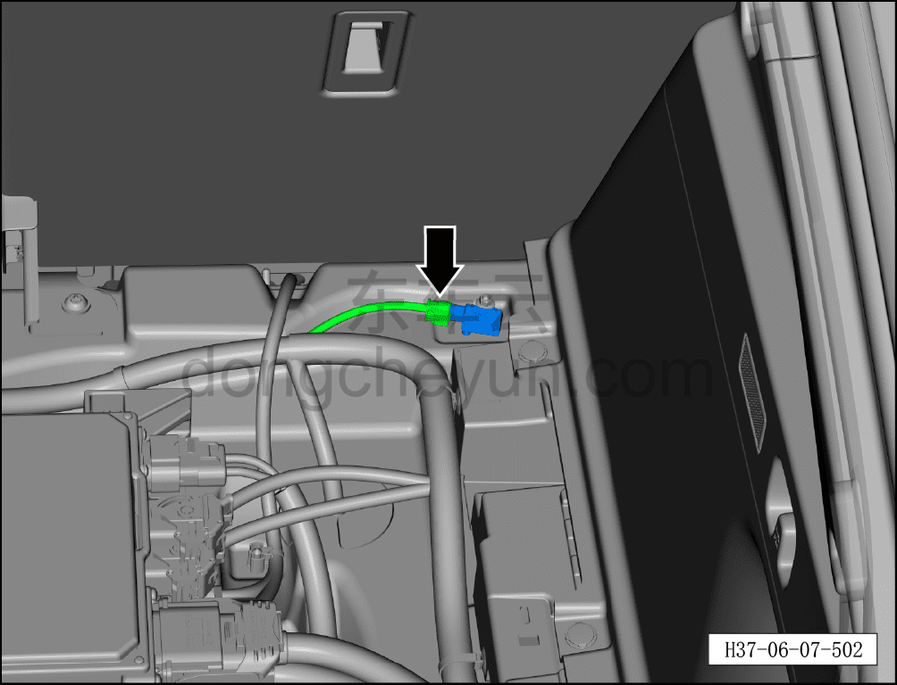
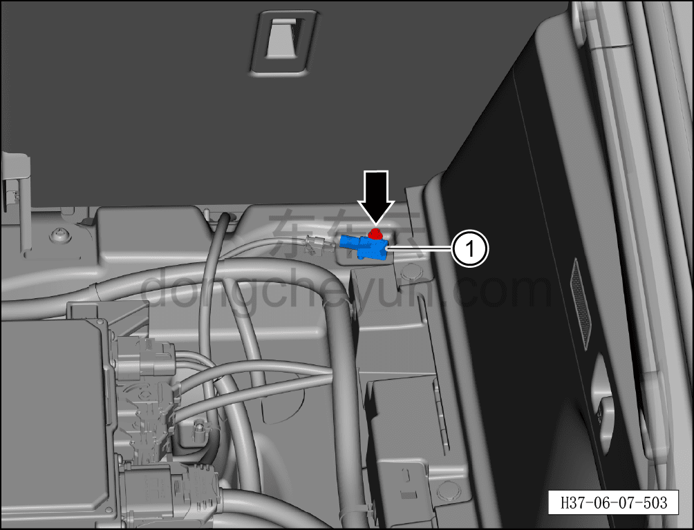

# Снятие и установка заднего датчика ускорения кузова (полный привод)

> Система шасси › Блок управления активной подвеской › Датчик ускорения  
> Оригинал: `拆卸和安装后车身加速度传感器（四驱）` · [dongcheyun 56746](https://dongcheyun.com/p/56746), страница `32f5067cd40c4a2d88dc0615d7b3b198` · [оглавление](../README.md)

**Порядок снятия**

1. Выключите все электроприборы, отключите питание.

2. Выполните операцию обесточивания автомобиля для ремонта. См. [3.1.4.1 Обесточивание автомобиля](../03-техническое-обслуживание/005-обесточивание-автомобиля.md)

3. Снимите крышку багажного отсека. См. [8.5.8.2 Снятие и установка крышки багажного отсека](../08-внутренняя-и-внешняя-отделка/147-снятие-и-установка-крышки-пола-багажника.md)

4. Снимите задний датчик ускорения кузова.

a. Нажмите на фиксирующий зажим разъёма и отсоедините разъём заднего датчика ускорения кузова.

b. Используя торцевую головку на 8 мм, отверните крепёжный болт заднего датчика ускорения кузова.

Момент затяжки болтов: 10±1 Н·м

c. Снимите задний датчик ускорения кузова ①.

**Порядок установки**

Установка выполняется в обратном порядке.

**Внимание:**

**- После завершения установки проверьте исправность функционирования заднего датчика ускорения кузова, затем подключите диагностический сканер и проверьте наличие кодов неисправностей; если таковые имеются, найдите причину и удалите коды неисправностей.**
