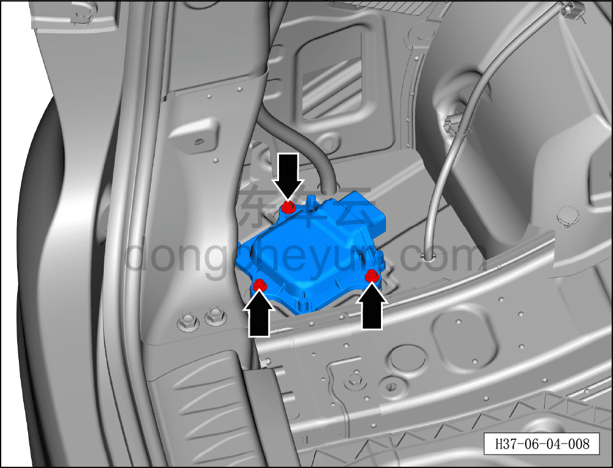
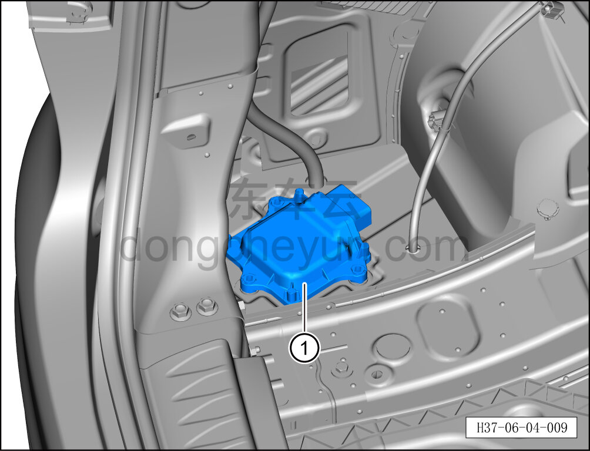

# Снятие и установка контроллера электронно-управляемых амортизаторов

> Система шасси › Блок управления активной подвеской › Блок управления активной подвеской  
> Оригинал: `拆卸与安装电控减振器控制器` · [dongcheyun 56746](https://dongcheyun.com/p/56746), страница `a79e150a45394e21952bec06eee10443` · [оглавление](../README.md)

**Порядок снятия**

1. Выключите все электроприборы, отключите питание.

2. Выполните операцию обесточивания автомобиля для ремонта. См. [3.1.4.1 Обесточивание автомобиля](../03-техническое-обслуживание/005-обесточивание-автомобиля.md)

3. Снимите колесо. См. [6.5.8.1 Снятие и установка колеса](064-снятие-и-установка-колеса.md)

4. Поднимите автомобиль на подъёмнике на подходящую высоту.

5. Снимите левую обивку боковины в сборе. См. [8.5.5.6 Снятие и установка левой обивки боковины](../08-внутренняя-и-внешняя-отделка/136-снятие-и-установка-левой-обивки-задней-боковины.md)

6. Снимите контроллер электронно-управляемых амортизаторов.

a. Отсоедините разъём контроллера электронно-управляемых амортизаторов.

b. Используя торцевую головку на 10 мм, отверните 3 крепёжных болта контроллера электронно-управляемых амортизаторов.

Момент затяжки болта: 8±1 Н·м

c. Снимите контроллер электронно-управляемых амортизаторов ①.

**Порядок установки**

Установка выполняется в обратном порядке.

**Внимание:**

**- Необходимо провести дорожное испытание и проверить исправность функционирования контроллера электронно-управляемых амортизаторов.**
