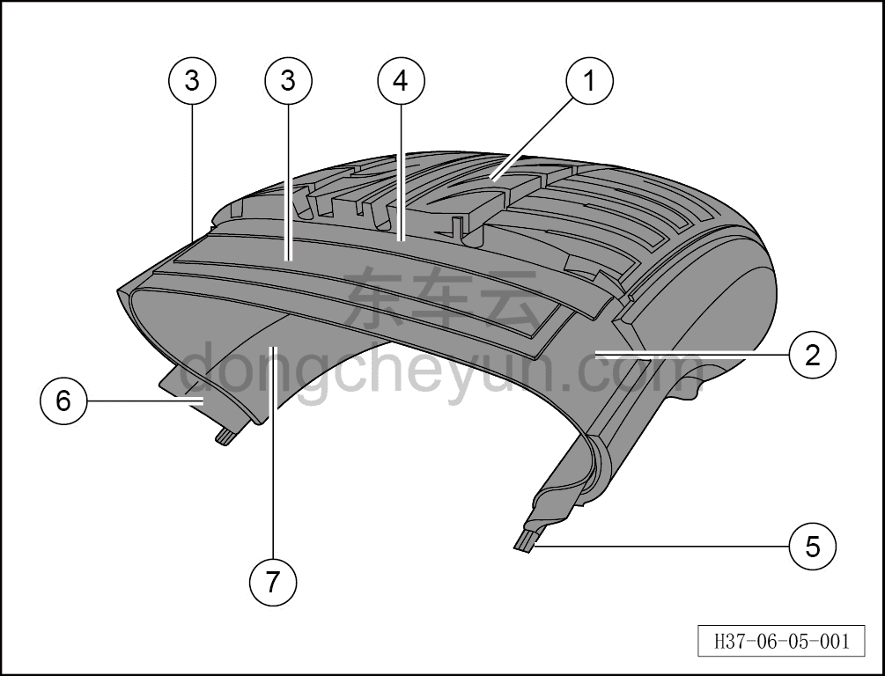

# Описание конструкции и принципа работы

> Система шасси › Ходовая часть  
> Оригинал: `结构与原理介绍` · [dongcheyun 56746](https://dongcheyun.com/p/56746), страница `d799f880327e42a9aa7f8c604a3b9987` · [оглавление](../README.md)

1. Протектор

a. Часть шины, контактирующая с дорожным покрытием; за счёт трения обеспечивает автомобилю такие характеристики, как тяга и торможение; должен обладать хорошей износостойкостью, стойкостью к проколам, ударопрочностью, теплоотводом и другими свойствами.

2. Каркас шины

a. Слои корда в шине — основной несущий элемент шины; должен быть ударопрочным и обладать хорошей стойкостью к изгибу при движении.

3. Брекерный слой

a. Слой стального корда между протектором и каркасом; защищает каркас, ограничивает деформацию протектора, поддерживает пятно контакта протектора с дорогой, повышает износостойкость и устойчивость при движении.

4. Бандажный слой

a. Специальный слой корда над брекерным слоем; при движении шины ограничивает смещение брекерного слоя, предотвращает его отслоение на высокой скорости и обеспечивает стабильность размеров шины при движении на высокой скорости.

5. Борт шины

a. Образован обмоткой обрезиненной стальной проволоки определённой формы (четырёхугольной или шестиугольной), обеспечивает посадку и фиксацию шины на диске.

6. Треугольный резиновый наполнительный шнур (эйпекс)

a. Заполняющий материал над стальным бортовым кольцом шины; предотвращает расхождение борта, снижает ударные нагрузки на борт, защищает борт, предотвращает попадание воздуха при формовании.

7. Герметизирующий слой

a. Элемент бескамерной шины, обеспечивающий герметичность; изготовлен из специальной резины и выполняет функцию, аналогичную камере.
